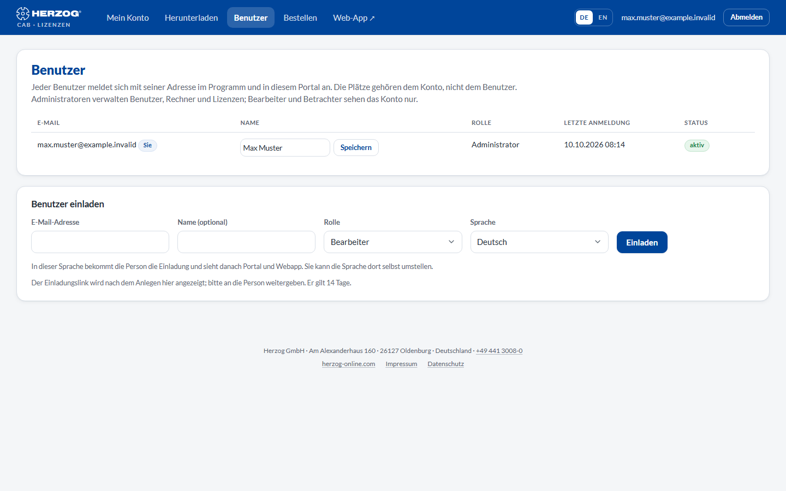

# Benutzer einladen und verwalten

!!! abstract "Referenz — Die Seite „Benutzer" im Lizenzportal: Kollegen einladen, Namen und Rollen ändern, Zugänge deaktivieren oder löschen"

## Wofür Sie diesen Bereich nutzen

Jeder, der sich in der Desktop-App, in der Web-App oder im Lizenzportal
anmelden soll, braucht einen **Benutzer im Kundenkonto**. Administratoren
laden hier Kollegen per E-Mail ein, legen ihre Rolle fest und schalten
ausgeschiedene Zugänge ab. Die Plätze gehören dem Konto, nicht dem
Benutzer. Sie können also beliebig viele Benutzer anlegen. Die Plätze
begrenzen nur, wie viele Personen gleichzeitig arbeiten, im Programm oder
im Browser.

## Der Bildschirm im Überblick

Oben steht die **Benutzerliste**, darunter das Formular **Benutzer
einladen**. Bearbeiter und Betrachter sehen die Liste nur; verwalten können
sie die Administratoren.

## Bedienelemente im Detail

### Benutzerliste

| Spalte | Bedeutung |
|---|---|
| **E-Mail** | Anmeldename des Benutzers. Ihr eigener Eintrag ist mit *Sie* markiert; Herzog-Mitarbeiter, die Ihrem Konto zur Betreuung zugeordnet sind, mit *Herzog-Zugang*. |
| **Name** | Anzeigename, so wie die Person im Programm, in der Web-App und im Portal erscheint. Administratoren ändern ihn direkt in der Zeile (siehe **Speichern** unten). Den Namen von Herzog-Zugängen ändern Sie hier nicht. |
| **Rolle** | **Administrator**, **Bearbeiter** oder **Betrachter** — Administratoren ändern sie direkt in der Zeile mit **Ändern**. Was die Rollen bedeuten, steht unter [Kundenkonto und Einladung](../setup/account.md#benutzer-und-rollen). |
| **Letzte Anmeldung** | Zeitpunkt der letzten Anmeldung (Portal, Desktop oder Web) oder *noch nie*. |
| **Status** | **aktiv**, **deaktiviert**, **Einladung offen bis &lt;Zeit&gt;** oder **Einladung abgelaufen**. Dazu das Kennzeichen **2FA**, wenn der Benutzer einen [zweiten Faktor](security.md#zweiter-faktor) eingerichtet hat. |

| Schaltfläche | Wirkung |
|---|---|
| **Speichern** (Name) | Speichert den Namen, den Sie in der Zeile eingetragen haben: höchstens 190 Zeichen, ein leeres Feld entfernt den Namen. Das Portal bestätigt *Der Name ist gespeichert.* Die Desktop-App übernimmt ihn bei der nächsten Anmeldung der Person. Den eigenen Namen ändert jeder Benutzer auch selbst unter [Passwort, zweiter Faktor und Name](security.md#name). |
| **Ändern** (Rolle) | Speichert die in der Zeile gewählte Rolle. Die neue Rolle gilt in der Web-App sofort, in der Desktop-App nach dem nächsten Start bzw. nach **Vom Kundenkonto aktualisieren** in der [Benutzerverwaltung](../admin/users.md). |
| **Einladung erneuern** | Schickt einer Person, die ihr Passwort noch nicht gesetzt hat, einen neuen Link, auch wenn die Einladung schon abgelaufen ist. Der neue Link gilt wieder 14 Tage, der alte gilt dann nicht mehr. Daneben wählen Sie die Sprache der Einladung. |
| **Deaktivieren** | Der Benutzer kann sich nirgends mehr anmelden; seine Daten und Zuweisungen bleiben erhalten. Rechner, auf denen er in der Desktop-App angemeldet war, verlangen eine neue Anmeldung. Mit Sicherheitsabfrage. |
| **Aktivieren** | Hebt die Deaktivierung auf. |
| **Löschen** | Löscht den Zugang endgültig, nach der Rückfrage *Zugang &lt;E-Mail&gt; endgültig löschen? Designs, Aufträge und Rechner bleiben beim Konto.* |

!!! info "Eingebaute Schutzmechanismen"
    Ihren eigenen Zugang können Sie weder deaktivieren noch löschen, und
    Ihre eigene Rolle ändert ein anderer Administrator. Der letzte aktive
    Administrator eines Kontos lässt sich weder deaktivieren noch löschen
    oder herabstufen.

### Benutzer einladen

| Feld | Bedeutung |
|---|---|
| **E-Mail-Adresse** | Anmeldename der neuen Person; muss im Konto eindeutig sein. |
| **Name (optional)** | Anzeigename. |
| **Rolle** | Rolle des neuen Benutzers (Standard: Bearbeiter). |
| **Sprache** | Deutsch oder English. In dieser Sprache bekommt die Person die Einladung und sieht danach Portal und Web-App; sie kann die Sprache dort selbst umstellen. Vorbelegt nach dem Land Ihres Kontos. |
| **Einladen** | Legt den Benutzer an und schickt die Einladung. |

So läuft die Einladung ab:

1. Die Person bekommt eine E-Mail mit einem Link und setzt ihr Passwort
   selbst (mindestens 10 Zeichen). Der Link gilt **14 Tage**.
2. Bis dahin steht der Benutzer in der Liste mit *Einladung offen bis …*.
3. Hat die Person nach drei Tagen noch nicht angenommen, schickt ihr das
   Portal einmal eine Erinnerung mit einem neuen Link. Der alte Link gilt
   dann nicht mehr. Öffnet sie einen abgelaufenen Link, kann sie sich dort
   selbst eine neue Einladung schicken.
4. Nach dem Setzen des Passworts ist der Zugang **aktiv** und gilt sofort
   für Portal, Desktop-App und Web-App.

!!! info "Benutzer im Testkonto"
    Mit der Testversion laden Sie so viele Benutzer ein, wie die
    Testversion Plätze hat. Unter dem Formular steht, wie viele noch frei
    sind. Ist die Zahl erreicht, steht statt des Formulars ein Hinweis. Mit
    einem Abo entfällt die Begrenzung.

!!! tip "Kein Mailversand möglich?"
    Konnte keine E-Mail verschickt werden (z. B. in einer Testumgebung),
    zeigt das Portal den Einladungslink direkt an — geben Sie ihn der
    Person auf einem anderen Weg weiter.

## Was die Rollen in den Programmen bewirken

| | Lizenzportal | Desktop-App | Web-App |
|---|---|---|---|
| **Administrator** | Verwaltet Benutzer, Rechner, Anfragen. | Globaler Administrator: alle Rechte in allen Profilen. | Alle Rechte; kann Rollen anlegen, Firma und Import verwalten. |
| **Bearbeiter** | Sieht das Konto. | Standardrolle *Bearbeiter*: Aufträge, Designs, Stammdaten anlegen und ändern. | dito. |
| **Betrachter** | Sieht das Konto. | Standardrolle *Betrachter*: lesen, berechnen, drucken, exportieren. | dito. |

In der Web-App können Administratoren zusätzlich **eigene Rollen** mit
einzelnen Rechten anlegen und Benutzern zuweisen — siehe
[Rollen (Web-App)](../web/roles.md) und
[Konto und Benutzer (Web-App)](../web/account.md). In der Desktop-App wird
je Profil (Arbeitsbereich) zugewiesen, siehe
[Benutzer verwalten](../admin/users.md).

## Verwandte Seiten

* [Kundenkonto und Einladung](../setup/account.md) — Einladung annehmen, Rollen
* [Benutzer und Rollen einrichten](../tasks/setup-users.md) — der Ablauf als Anleitung
* [Passwort, zweiter Faktor und Name](security.md) — was jeder Benutzer selbst einstellt
* [Mein Konto](licenses.md) — Plätze und Rechner
