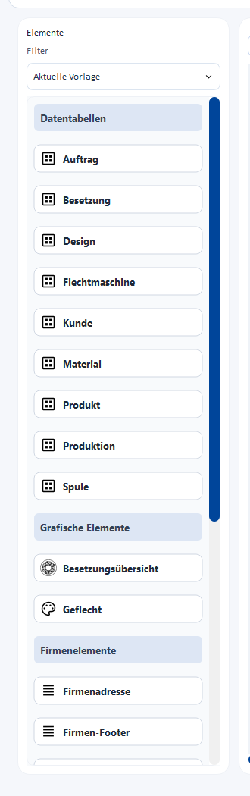

# Elemente (Text, Tabellen, Bilder)

Eine Vorlage setzt sich aus **Elementen** zusammen, die Sie aus der Palette auf
die Seite ziehen. Die Elemente sind in vier Gruppen gegliedert.

## Datentabellen

Vorgefertigte Tabellen, die die Daten des Auftrags automatisch füllen:

* **Auftrag** – Auftragsname, -nummer, Termine, Status
* **Kunde** – Adress- und Kontaktdaten
* **Flechtmaschine** – Maschinendaten
* **Material** und **Spule** – verwendete Materialien und Spulen
* **Produkt** und **Produktion** – Produktdaten und Produktionswerte
* **Besetzung** – Klöppelbelegung
* **Design** – Angaben zum verknüpften Design

## Grafische Elemente

* **Besetzungsübersicht** – grafische Darstellung der Klöppelbesetzung
* **Geflecht** – Vorschau des Flechtmusters

## Firmenelemente

* **Firmenadresse** – Ihre Anschrift (aus den Firmendaten)
* **Firmen-Footer** – Fußzeile mit Firmenangaben
* **Firmenlogo** – Ihr Logo

## Freie Elemente

* **Textfeld** – frei platzierbarer Text
* **Tabelle** – eigene Tabelle
* **Bild** – beliebiges Bild
* **Datum/Zeit** – Datums-/Zeitangabe

!!! info "Datentabellen füllen sich automatisch"
    Datentabellen und Firmenelemente werden beim Druck mit den echten Daten des
    jeweiligen Auftrags bzw. Ihrer Firmendaten befüllt – Sie gestalten nur
    Position und Aussehen.
