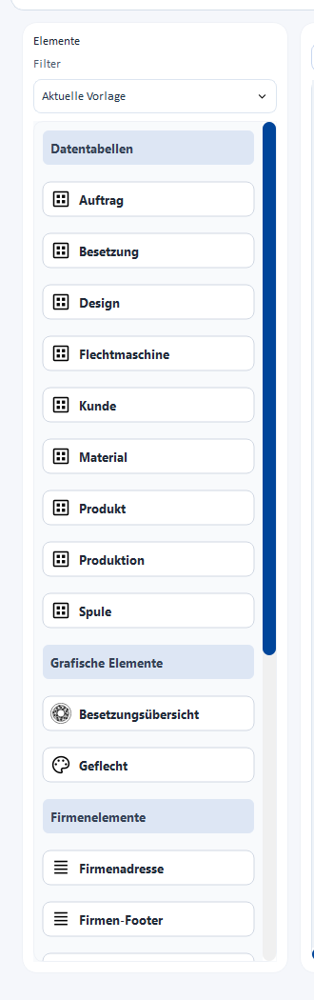

# Elemente und Platzhalter

!!! abstract "Referenz — Alle Bausteine der Element-Palette und wie Sie sie mit Programmwerten füllen"

## Wofür Sie diesen Bereich nutzen

Eine Druckvorlage setzt sich aus **Elementen** zusammen, die Sie aus der
Element-Palette (links im [Druck-Editor](editor.md)) auf die Seite ziehen. Die
Palette ist in sechs Gruppen gegliedert. Diese Seite erklärt jedes Element,
zeigt, für welche Vorlagen-**Verwendung** (Berechnung / Design / Auftrag) es
jeweils zur Verfügung steht, und wie Sie festlegen, welcher Programmwert
tatsächlich gedruckt wird.

!!! info "Nur ein Ausschnitt"
    Der Screenshot zeigt den Grundaufbau der Palette. Seit Version 1.4.5 kommen
    zwei weitere Datentabellen-Gruppen für die Flechterei und die Spulerei
    hinzu (siehe unten) — ein aktueller Screenshot mit allen sechs Gruppen
    fehlt noch.

## Die sechs Element-Gruppen

### Datentabellen

Auftragsart-neutrale Tabellen sowie die Tabellen für Berechnungs-Vorlagen.

| Element | Zeigt | Verwendung |
|---|---|---|
| **Auftrag** | Auftragsnummer, -name, Termine, Status | Auftrag |
| **Kunde** | Adress- und Kontaktdaten des Kunden | Auftrag |
| **Material** | Daten der im Auftrag verwendeten Materialien | Auftrag |
| **Spule** | Daten der verwendeten Spulen | Auftrag |
| **Eingabetabelle** | Eingabewerte der aktiven Berechnung | Berechnung |
| **Ergebnistabelle** | Ergebniswerte der aktiven Berechnung | Berechnung |

### Datentabellen Flechterei

| Element | Zeigt | Verwendung |
|---|---|---|
| **Flechtmaschine** | Maschinenname, -typ, Geflechtsart, Kopfanzahl, aktive Klöppel | Auftrag |
| **Produkt** | Produktdaten (z. B. Durchmesser, Geflechtsdichte) | Auftrag |
| **Produktion** | Produktionswerte (z. B. genutzte Köpfe) | Auftrag |
| **Design** | Angaben zum verknüpften Design | Design, Auftrag |
| **Besetzung** | Klöppelbesetzung als Tabelle (Rundgeflecht oder Litze) | Design, Auftrag |

### Datentabellen Spulerei

Neu seit Version 1.4.5, für Vorlagen zum Spulauftrag.

| Element | Zeigt | Verwendung |
|---|---|---|
| **Spulerei** | Spulwerte des Spulauftrags — u. a. Zielspulenzahl, Länge je Spule, Gesamtlänge, Fadengeschwindigkeit, Spindeldrehzahl, Changierhub, Fadenspannung | Auftrag |
| **Farbaufschlüsselung** | Die Farbpositionen des Spulauftrags: Farbmuster, Name/Code/Pantone, Klöppelanzahl und Spulenanzahl je Farbe | Auftrag |

### Grafische Elemente

| Element | Zeigt | Verwendung |
|---|---|---|
| **Geflecht** | Vorschaubild des Flechtmusters | Design, Auftrag |
| **Besetzungsübersicht** | Grafische Übersicht der Klöppelbesetzung | Design, Auftrag |

### Firmenelemente

Werden aus den [Firmendaten](../admin/company.md) befüllt und stehen in jeder
Vorlage zur Verfügung, unabhängig von der Verwendung.

| Element | Zeigt |
|---|---|
| **Firmenlogo** | Ihr Firmenlogo als Bild |
| **Firmenadresse** | Anschrift und Kontaktdaten der Firma |
| **Firmen-Footer** | Kompakte Fußzeile mit Firmenangaben |

### Freie Elemente

Ebenfalls in jeder Vorlage verfügbar.

| Element | Zeigt |
|---|---|
| **Datum/Zeit** | Aktuelles Datum bzw. Uhrzeit zum Druckzeitpunkt |
| **Tabelle** | Frei definierbare Tabelle mit beliebig vielen Zeilen und Spalten |
| **Textfeld** | Frei platzierbarer Text, auch mit eingebetteten Platzhaltern |
| **Bild** | Ein beliebiges Bild, wahlweise aus der [Mediathek](../master-data/media.md) oder von der Festplatte |

!!! tip "Nicht jedes Element ist überall verfügbar"
    Welche Elemente in der Palette erscheinen, hängt von der **Verwendung**
    der aktuell geöffneten Vorlage ab — eine Berechnungs-Vorlage zeigt z. B.
    keine Flechtmaschinen-Tabelle. Wie Sie die Anzeige über den Filter
    **Aktuelle Vorlage** steuern, steht unter
    [Element-Palette](editor.md#element-palette-links).

## Inhalte festlegen: Doppelklick öffnet den Bearbeitungsdialog

Ein bereits platziertes Element bearbeiten Sie per **Doppelklick** auf der
Seiten-Canvas. Je nach Elementtyp öffnet sich ein anderer Dialog:

!!! warning "📷 Screenshot fehlt"
    **Motiv:** Der Bearbeitungsdialog einer Datentabelle (z. B. „Auftrag“)
    mit der Zeilen-Werkzeugleiste links und dem Feldvorlagen-Picker rechts.
    **So erzeugen:** Druck-Editor öffnen, eine Datentabelle wie „Auftrag“ auf
    die Seite ziehen, per Doppelklick öffnen.
    **Ziel-Datei:** `assets/screenshots/print-templates/tabelle-bearbeiten.png`

### Datentabellen mit wählbaren Zeilen

Bei **Auftrag**, **Kunde**, **Flechtmaschine**, **Material**, **Spule**,
**Produkt**, **Produktion**, **Design** und **Spulerei** bestimmen Sie
**selbst**, welcher Programmwert in welcher Zeile erscheint:

* Über die Zeilen-Werkzeugleiste fügen Sie Zeilen hinzu oder entfernen sie und
  ändern die Reihenfolge (Pfeile hoch/runter).
* Für die markierte Zeile wählen Sie rechts im **Feldvorlagen-Picker** den
  gewünschten Programmwert (siehe unten) und übernehmen ihn mit
  **Feld einfügen**.

Jede dieser Tabellen startet mit einer sinnvollen Vorbelegung, die Sie bei
Bedarf anpassen oder ergänzen.

### Freie Tabelle

Die **Tabelle** aus den Freien Elementen bearbeiten Sie zellenweise: Zeilen-
und Spaltenzahl legen Sie in der Werkzeugleiste über den Feldern **Zeilen**
und **Spalten** fest, Ausrichtung und Textfarbe über die Symbole daneben.
Jede Zelle kann freien Text und/oder Platzhalter enthalten — auch hier steht
Ihnen rechts der Feldvorlagen-Picker zur Seite.

### Textfeld

Öffnet einen Text-Editor mit Ausrichtung und Textfarbe sowie demselben
Feldvorlagen-Picker. Sie tippen Text und Platzhalter gemischt ein, z. B.
„Auftrag {order.number}“.

### Bild

Öffnet die Auswahl für Bilddateien — wahlweise aus der zentralen
[Mediathek](../master-data/media.md) oder von der Festplatte.

### Besetzung

Statt einzelner Zeilen legen Sie hier fest, **wie** die Klöppelbesetzung
dargestellt wird:

| Feld | Auswahl |
|---|---|
| **Geflechtsart** | **Automatisch**, **Rund**, **Litze**, **Pro Bahn (mehrspaltig)**. *Automatisch* wählt für Rundgeflecht die zwei Spalten Linkslauf/Rechtslauf, für Litze eine durchlaufende Spalte und für Packungs- und Spiralflechter **eine Spalte je Gangbahn** (Kopf *Bahn 1*, *Bahn 2*, …; Zeilennummer je Bahn ab 1). *Litze* erzwingt stattdessen eine einzelne Spalte. |
| **Angezeigte Läufe** | Beide Spalten, Nur linker Lauf, Nur rechter Lauf (nur bei Rundgeflecht wählbar) |
| **Angezeigter Wert** | Farb-ID, Farbname, Hex-Wert, Pantone |
| **Zellendarstellung** | **Farbfläche**: Zelle vollflächig in der Klöppelfarbe (klassisch). **Farbfeld + Nummer**: weiße Zelle mit Nummer und Wert links und einem kleinen, abgerundeten Farbfeld rechts — kompakte Zeilen, Zebra-Streifen, helles Gitter und der Kopf im Herzog-Blau, wie die übrigen Datentabellen. |

!!! info "Direktdruck ohne Vorlage"
    Drucken Sie ein Design direkt aus dem Designer ohne Vorlage, nutzt
    Herzog CAB immer die **Farbfläche** und wählt die Spalten automatisch.
    Die Umschalter gibt es nur am Vorlagen-Element.

### Automatisch befüllte Elemente ohne eigenen Dialog

**Farbaufschlüsselung**, **Eingabetabelle** und **Ergebnistabelle** zeigen
beim Druck immer den vollständigen, aktuellen Datensatz (alle Farbpositionen
des Spulauftrags bzw. alle Eingabe-/Ergebniswerte der Berechnung). Sie
platzieren und skalieren diese Elemente nur — eine Zeilenauswahl gibt es
hier nicht.

## Platzhalter setzen: der Feldvorlagen-Picker

Rechts im Bearbeitungsdialog (siehe oben) grenzen Sie die verfügbaren
Programmwerte ein und übernehmen sie:

| Feld | Bedeutung |
|---|---|
| **Suche** | Freitextsuche über Bezeichnung, technischen Namen und Beschreibung. |
| **Bereich** | Schränkt die Liste auf einen Bereich ein: *Alle Bereiche*, Auftrag, Kunde, Maschine, Material, Spule, Produkt, Produktion, Design, Berechnungen oder Firma. |
| **Liste** | Die zum Suchbegriff/Bereich passenden Programmwerte mit Bezeichnung und – sofern vorhanden – Einheit. Ein Klick zeigt darunter den aktuellen Wert und eine kurze Beschreibung. |
| **Feld einfügen** | Übernimmt den markierten Programmwert in die aktuell gewählte Zeile bzw. Textstelle. Ein Doppelklick auf einen Listeneintrag tut dasselbe. |

!!! warning "📷 Screenshot fehlt"
    **Motiv:** Der Feldvorlagen-Picker (Suche, Bereich-Auswahl, Liste,
    Schaltfläche „Feld einfügen“) im geöffneten Zustand mit ein paar
    Suchtreffern.
    **So erzeugen:** Bearbeitungsdialog einer Datentabelle öffnen, im Suchfeld
    einen Begriff eintippen (z. B. „Durchmesser“).
    **Ziel-Datei:** `assets/screenshots/print-templates/feldvorlagen-picker.png`

### Zwei Arten von Platzhaltern

* **Bei Datentabellen mit wählbaren Zeilen** übernimmt „Feld einfügen“ den
  reinen Programmwert direkt in die Zeile (z. B. `design.name`) — ohne
  Klammern, da die Zeile ohnehin genau einen Wert zeigt.
* **Bei der freien Tabelle und im Textfeld** wird derselbe Wert in
  geschweiften Klammern eingefügt, z. B. `{order.number}`. So lassen sich
  Platzhalter mit freiem Text mischen, etwa „Auftrag Nr. {order.number} vom
  {order.date}“.

!!! tip "Platzhalter auch direkt eintippen"
    In Textfeld und freier Tabelle erscheint bereits beim Eintippen einer
    öffnenden geschweiften Klammer `{` eine Vorschlagsliste passender
    Platzhalter — Sie müssen den Feldvorlagen-Picker also nicht zwingend
    öffnen.

## Verwandte Seiten

* [Editor-Aufbau](editor.md) – Element-Palette, Filter, Seiteneinstellungen
* [Vorlagen verwalten](manage.md) – Vorlagen anlegen, wählen, löschen
* [Vorschau und Druck](preview-and-print.md) – Seitenformat, Vorschau, Ausgabe
* [Eine Druckvorlage erstellen](../tasks/create-print-template.md) – Schritt-für-Schritt-Anleitung
* [Aufträge → Drucken](../orders/print.md) – wo Auftrags-Vorlagen zum Einsatz kommen
* [Designer → Speichern und Drucken](../designer/save-print.md) – wo Design-Vorlagen zum Einsatz kommen
* [Medien](../master-data/media.md) – zentrale Bildablage für das Element „Bild“
