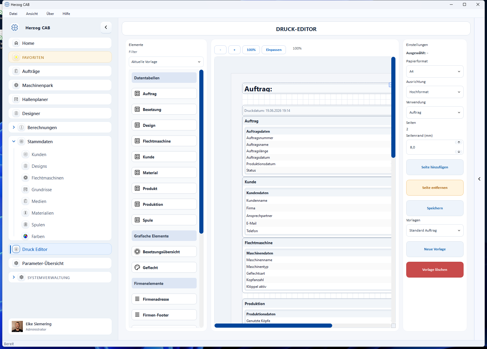

# Druckvorlagen

!!! abstract "Referenz — Übersicht über Druckvorlagen und den Druck-Editor"

## Wofür Sie diesen Bereich nutzen

**Druckvorlagen** bestimmen, wie Ausdrucke aus Herzog CAB aussehen – z. B. ein
Produktionsbegleitschein für den Auftrag, eine Materialliste, ein Etikett oder
ein Berechnungsprotokoll. Sie gestalten die Vorlagen einmal im
**Druck-Editor** und verwenden sie danach beliebig oft beim tatsächlichen
Drucken.

Sie erreichen den Druck-Editor über den Navigationspunkt **Druck Editor**.
Vorlagen sind zentral pro Workspace abgelegt (unter `Printouts/templates/`)
und stehen damit allen Bedienern desselben Workspace zur Verfügung.

## In diesem Kapitel

- :material-file-cog-outline: **Vorlagen verwalten**

    ---

    Vorlage wählen, anlegen, speichern und löschen.

    [:octicons-arrow-right-24: Vorlagen verwalten](manage.md)

- :material-view-dashboard-outline: **Editor-Aufbau**

    ---

    Element-Palette, Seiten-Canvas und Eigenschaften/Seiteneinstellungen.

    [:octicons-arrow-right-24: Editor-Aufbau](editor.md)

- :material-shape-plus-outline: **Elemente und Platzhalter**

    ---

    Alle Bausteine der Palette – von Datentabellen bis Farbaufschlüsselung –
    und wie Sie sie mit Programmwerten füllen.

    [:octicons-arrow-right-24: Elemente und Platzhalter](elements.md)

- :material-printer-eye: **Vorschau und Druck**

    ---

    Seitenformat einstellen, Live-Vorschau und wo Sie den tatsächlichen
    Ausdruck bzw. PDF-Export starten.

    [:octicons-arrow-right-24: Vorschau und Druck](preview-and-print.md)

## Eine Vorlage gilt für genau eine Verwendung

Jede Vorlage hat eine **Verwendung**: Berechnung, Design oder Auftrag. Sie
bestimmt, in welchem Auswahldialog die Vorlage später erscheint und welche
Elemente in der Palette zur Verfügung stehen. Details dazu unter
[Editor-Aufbau](editor.md).

!!! warning "Berechtigung erforderlich"
    Vorlagen ansehen können Sie mit der Berechtigung **Druckvorlagen
    anzeigen**; zum Bearbeiten und Speichern benötigen Sie zusätzlich
    **Druckvorlagen bearbeiten**. Mehr dazu unter [Rollen](../admin/roles.md).

## Verwandte Seiten

* [Eine Druckvorlage erstellen](../tasks/create-print-template.md) – Schritt-für-Schritt-Anleitung
* [Aufträge → Drucken](../orders/print.md) – Produktionsbegleitschein und Vorlagen im Auftrag
* [Designer → Speichern und Drucken](../designer/save-print.md) – Design-Vorlagen drucken
* [Parameter-Übersicht](../parameter-overview/index.md) – alle Programmwerte im Detail nachschlagen
