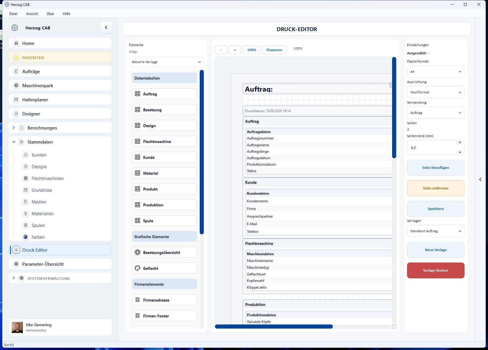

# Vorlagen verwalten

Den Druck-Editor öffnen Sie über den Navigationspunkt **Druck Editor**. Oben
wählen Sie die zu bearbeitende Vorlage; rechts finden Sie die Aktionen zum
Verwalten.

## Vorlage wählen

Über das Auswahlfeld (z. B. *Standard Auftrag*) wechseln Sie zwischen den
vorhandenen Vorlagen. Die gewählte Vorlage wird sofort im Editor angezeigt.

## Aktionen

| Aktion | Wirkung |
|---|---|
| **Neue Vorlage** | Legt eine neue, leere Vorlage an. |
| **Speichern** | Sichert die aktuelle Vorlage. |
| **Vorlage löschen** | Entfernt die aktuelle Vorlage (mit Sicherheitsabfrage). |
| **Verwendung** | Legt fest, wofür die Vorlage gilt (z. B. *Auftrag*). |

## Speicherort

Alle Vorlagen liegen als JSON-Datei unter `Printouts/templates/` im aktiven
Workspace. Dadurch lassen sie sich auch sichern oder zwischen Arbeitsplätzen
austauschen, die denselben Workspace nutzen.

!!! tip "Mit einer Kopie starten"
    Statt bei Null anzufangen, gehen Sie von der mitgelieferten Vorlage
    *Standard Auftrag* aus: anpassen, unter neuem Namen speichern – fertig.
