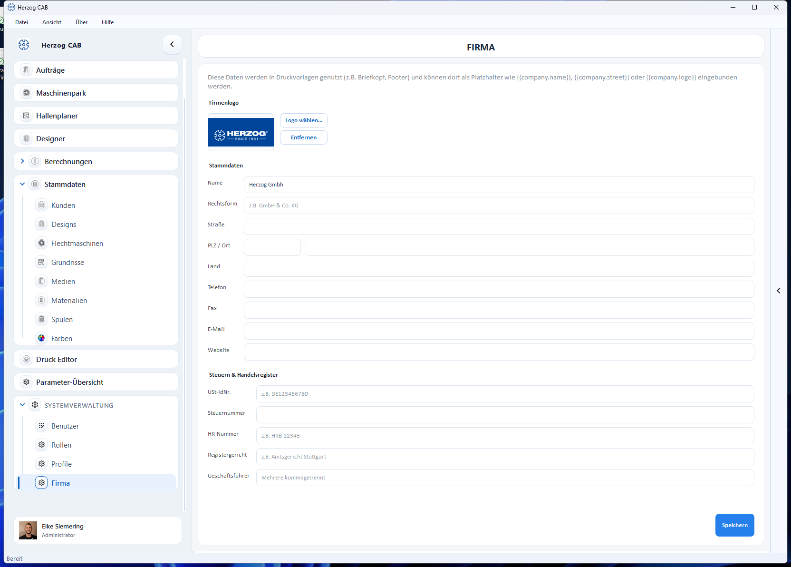

# Firma

Unter **Systemverwaltung → Firma** pflegen Sie Ihre Firmenstammdaten. Diese
Angaben werden in [Druckvorlagen](../print-templates/index.md) verwendet – z. B.
als Briefkopf oder Fußzeile – und stehen dort als Platzhalter wie
`{{company.name}}`, `{{company.street}}` oder `{{company.logo}}` zur Verfügung.

## Firmenlogo

Über **Logo wählen…** hinterlegen Sie Ihr Firmenlogo (z. B. für den Briefkopf);
mit **Entfernen** löschen Sie es wieder.

## Stammdaten

| Feld | Beschreibung |
|---|---|
| **Name** | Firmenname. |
| **Rechtsform** | z. B. GmbH & Co. KG. |
| **Straße**, **PLZ / Ort**, **Land** | Anschrift. |
| **Telefon**, **Fax**, **E-Mail**, **Website** | Kontaktdaten. |

## Steuern & Handelsregister

| Feld | Beschreibung |
|---|---|
| **USt-IdNr.** | Umsatzsteuer-Identifikationsnummer. |
| **Steuernummer** | Steuernummer. |
| **HR-Nummer** | Handelsregisternummer (z. B. HRB 12345). |
| **Registergericht** | Zuständiges Amtsgericht. |
| **Geschäftsführer** | Mehrere durch Komma getrennt. |

!!! info "Berechtigung erforderlich"
    Die Firmendaten dürfen nur Bediener mit dem Recht **Firmendaten verwalten**
    ändern (siehe [Rollen und Berechtigungen](../users/roles.md)).
