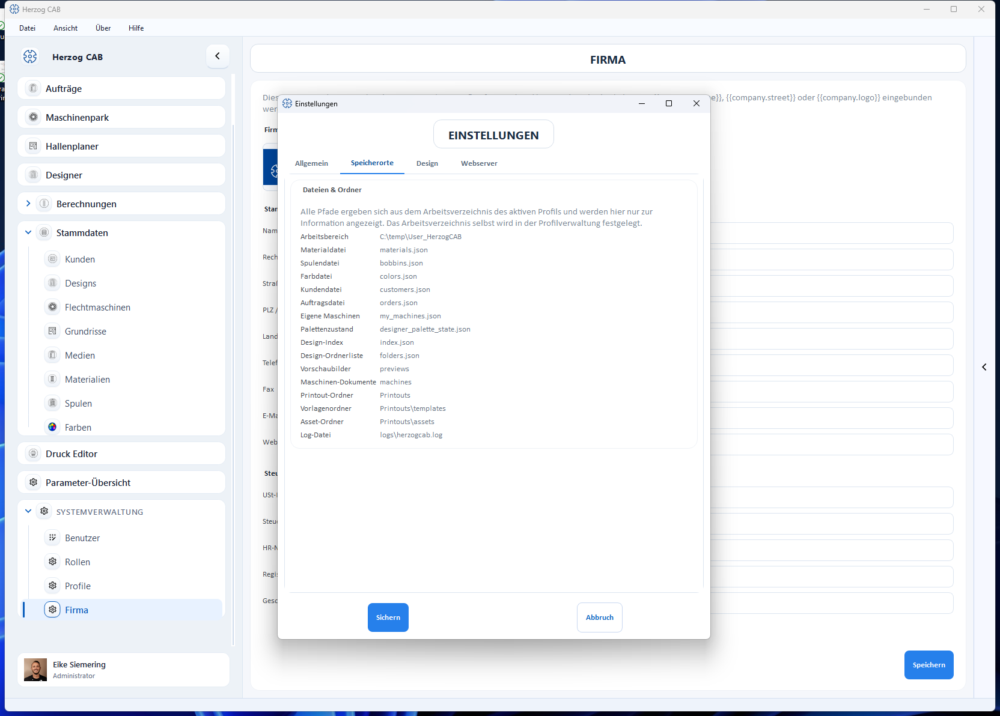

# Speicherorte

Der Tab **Speicherorte** (Datei → Einstellungen → Speicherorte) zeigt – nur zur
Information – wo Herzog CAB die einzelnen Dateien und Ordner ablegt. Die Pfade
ergeben sich aus dem **Arbeitsverzeichnis** des aktiven Profils.

## Typische Speicherorte (im Arbeitsverzeichnis)

| Inhalt | Datei / Ordner |
|---|---|
| Materialien | `materials.json` |
| Spulen | `bobbins.json` |
| Farben | `colors.json` |
| Kunden | `customers.json` |
| Aufträge | `orders.json` |
| Maschinen | `my_machines.json` |
| Designs (Index / Ordner) | `index.json`, `folders.json`, `previews/` |
| Maschinen-Dokumente | `machines/` |
| Druckvorlagen | `Printouts/`, `Printouts/templates/`, `Printouts/assets/` |
| Protokoll | `logs/herzogcab.log` |

!!! info "Arbeitsverzeichnis ändern"
    Das Arbeitsverzeichnis selbst wird nicht hier, sondern in der
    [Profilverwaltung](../workspace/change-path.md) festgelegt. Benutzer- und
    Profilbild-Daten liegen dagegen maschinenweit unter `%ProgramData%`.
