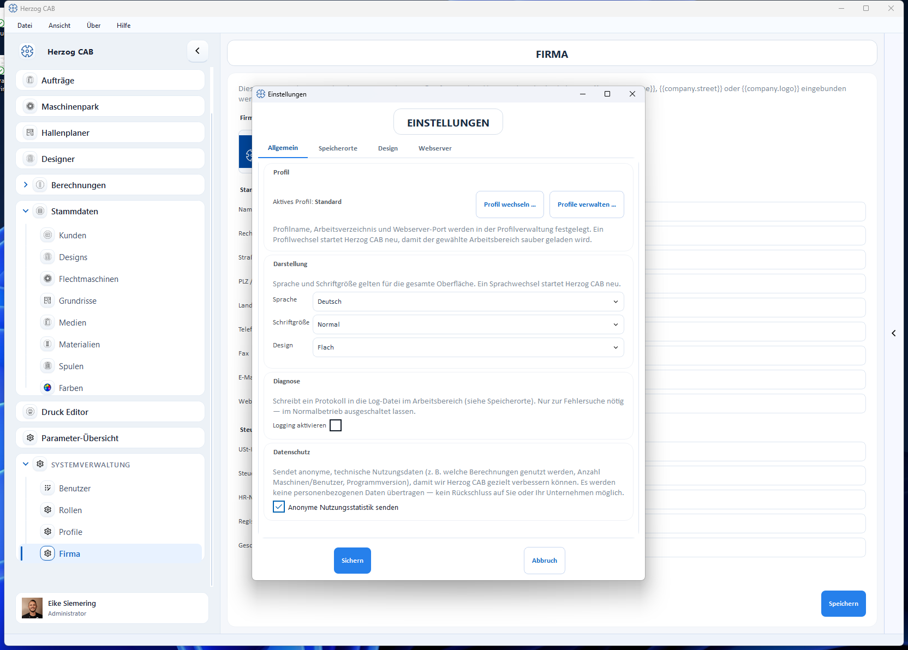

# Sprache und Schriftgröße

Sprache, Schriftgröße und Erscheinungsbild stellen Sie unter
**Datei → Einstellungen → Allgemein** ein. Die Einstellungen gelten für die
gesamte Oberfläche.

| Einstellung | Optionen | Wirkung |
|---|---|---|
| **Sprache** | Deutsch, Englisch u. a. | Sprache der gesamten Oberfläche. |
| **Schriftgröße** | z. B. Normal, Groß | Größere Schrift für bessere Lesbarkeit an großen oder weit entfernten Bildschirmen. |
| **Design** | z. B. Flach | Erscheinungsbild der Oberfläche. |

!!! info "Sprachwechsel startet Herzog CAB neu"
    Ein Wechsel der Sprache startet das Programm neu, damit alle Texte vollständig
    in der neuen Sprache geladen werden.

!!! tip "Diagnose nur bei Bedarf"
    Im selben Tab lässt sich das **Protokoll** (Log-Datei im Arbeitsbereich)
    aktivieren. Das ist nur zur Fehlersuche nötig – im Normalbetrieb
    ausgeschaltet lassen.
