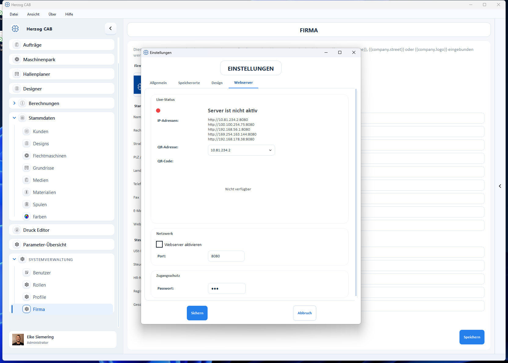

# Webserver und QR-Code

Der eingebaute **Webserver** stellt Auftrags- und Maschinendaten im Browser
bereit – z. B. am Smartphone direkt an der Maschine. Der Zugang erfolgt bequem
über einen [QR-Code](../orders/qr-code.md).

## Einstellungen im Tab „Webserver"

| Einstellung | Bedeutung |
|---|---|
| **Status** | Zeigt, ob der Server aktiv ist. |
| **Adressen** | Liste der erreichbaren URLs (je Netzwerkadapter), z. B. `http://192.168.178.38:8080`. |
| **IP-Adresse** | Auswahl der Adresse, die für den QR-Code verwendet wird (manche Rechner haben mehrere). |
| **QR-Code** | Wird angezeigt, **sobald der Server aktiv ist** (bei inaktivem Server: *Nicht verfügbar*). |
| **Webserver aktivieren** / **Port** | Server starten und Port festlegen (Standard 8080). |

Port, Auto-Start und **Passwort** werden pro Profil in der
[Profilverwaltung](../workspace/concept.md) festgelegt.

!!! warning "Sicherheits-Hinweis"
    Ein offener Webserver im Werks-Netz kann sensible Auftragsdaten preisgeben.
    Aktivieren Sie immer den **Passwortschutz** und wählen Sie eine IP-Adresse
    im internen Netz.

!!! tip "Richtige IP wählen"
    Hat der Rechner mehrere Netzwerkadapter, prüfen Sie, dass die im QR-Code
    verwendete IP auch vom Smartphone erreichbar ist (gleiches WLAN/Netz).
