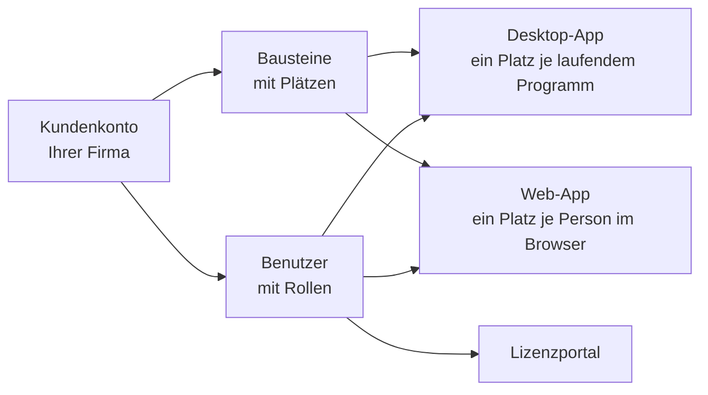

# Kundenkonto und Einladung

!!! info "Konzept — Was das Kundenkonto ist, wie Sie hineinkommen und was Bausteine und Plätze bedeuten"

Seit Version 2.0 bezieht Herzog CAB seine Lizenz normalerweise aus einem
**Kundenkonto** auf dem Herzog-Lizenzserver. Das Konto gehört Ihrer Firma;
darin stehen die gekauften **Bausteine** mit ihren **Plätzen**, die
angemeldeten **Rechner** und die **Benutzer**, die sich anmelden dürfen. Ein
Rechner braucht keinen Dongle mehr — er meldet sich beim Start am Konto an
und zieht sich seine Lizenz aus dem Vorrat.

Das Konto verwalten Sie im **Lizenzportal** unter
[license.herzog-cab.com](https://license.herzog-cab.com). Dieselben
Zugangsdaten gelten für die Desktop-App und für die
[Web-App](../web/index.md) — **ein Login für alles**.

## So kommen Sie ins Konto

Ein Konto legt **Herzog** für Ihre Firma an. Den ersten Benutzer lädt Herzog
per E-Mail ein; jeder weitere Benutzer wird von einem **Administrator Ihres
Kontos** im Lizenzportal eingeladen (siehe
[Benutzer einladen und verwalten](../portal/users.md)).

1. Sie erhalten eine E-Mail mit dem Betreff *Ihr Zugang zum Herzog CAB
   Lizenzportal* und einem Link. Bei einer Testversion heißt der Betreff
   *Ihre Testversion von Herzog CAB ist bereit*. Der Link gilt
   **14 Tage**.
2. Klicken Sie auf den Link. Die Seite **Passwort setzen** des Lizenzportals
   öffnet sich mit Ihrer E-Mail-Adresse.
3. Vergeben Sie ein Passwort mit **mindestens 10 Zeichen** und wiederholen
   Sie es.
4. Danach sind Sie im Lizenzportal angemeldet und können sich mit derselben
   E-Mail-Adresse und demselben Passwort in der Desktop-App und in der
   Web-App anmelden.

!!! tip "Zweiter Faktor"
    Im Lizenzportal können Sie über Ihre E-Mail-Adresse rechts oben eine
    **Authenticator-App** hinterlegen. Dann verlangt jede Anmeldung — auch in
    der Desktop-App und der Web-App — zusätzlich den sechsstelligen Code.
    Empfohlen für Administratoren. Dort ändern Sie auch Ihren Namen. Siehe
    [Passwort, zweiter Faktor und Name](../portal/security.md).

!!! warning "Einladung abgelaufen?"
    Haben Sie die Einladung nach drei Tagen noch nicht angenommen, schickt
    Ihnen das Lizenzportal einmal eine **Erinnerung** mit einem neuen
    Link. Ab dann gilt nur noch der Link aus der Erinnerung.

    Ist der Link älter als 14 Tage, öffnen Sie ihn trotzdem. Die Seite
    *Diese Einladung ist abgelaufen* bietet **Neue Einladung schicken**
    an; die neue Einladung geht an Ihre eigene E-Mail-Adresse. Ebenso
    kann ein Administrator Ihres Kontos die Einladung im Lizenzportal
    unter **Benutzer** erneuern.

    Ein vergessenes Passwort setzen Sie selbst über **Passwort vergessen**
    auf der Anmeldeseite des Portals zurück.

## Bausteine

Ein **Baustein** ist ein lizenzierter Funktionsumfang. Welche Bausteine Ihr
Konto hat, sehen Sie im Lizenzportal unter **Mein Konto** und in der
Desktop-App unter *Einstellungen > Lizenz*.

| Baustein | Umfang | Laufzeit |
|---|---|---|
| **Herzog CAB Vollversion** | Das komplette Programm, auf dem Rechner und im Browser. | Jahresabo |
| **Herzog CAB Designer** | Nur der Geflechts-Designer, auf dem Rechner und im Browser. | Jahresabo |
| **Herzog CAB Testversion** | 30 Tage auf dem Rechner und im Browser, mit den [Mengenbegrenzungen der Testversion](../basics/trial-quotas.md). Legt Herzog auf Anfrage an, siehe [Testphase](../web/trial.md). | 30 Tage |
| **Herzog CAB Web Testphase** | 30 Tage nur im Browser. Entsteht nur bei der [Selbstregistrierung](../web/trial.md#selbstregistrierung), wenn Herzog sie freigeschaltet hat. | 30 Tage |

Das Jahresabo bestellen, verlängern oder um Plätze erweitern Sie unter
[Abo und Bestellung](../web/subscription.md).

!!! info "Ein Abo für Programm und Web-App"
    Das Jahresabo gilt für das Programm auf dem Rechner und für die
    [Web-App](../web/index.md). Im Lizenzportal steht beim Baustein dann
    *Programm und Web*. Beide teilen sich die Plätze des Abos.

!!! info "Ältere Freischaltungen"
    * Eine **Vollversion oder Designer-Version ohne Enddatum** (Lebenszeit,
      auch als Dongle-Ersatz) gilt nur für das Programm, nicht für die
      Web-App. Im Portal steht *nur Programm*. Sie hat eigene Plätze.
    * Die früheren Bausteine **Herzog CAB Web** und **Herzog CAB Web
      Designer** gelten nur für die Web-App. Im Portal steht *nur Web*. Sie
      werden nicht mehr verkauft, weil das Jahresabo die Web-App enthält.

## Plätze

Jeder Baustein hat eine Anzahl **Plätze**. Ein Platz ist eine **Person,
die gerade arbeitet**. Beliebig viele Mitarbeiter teilen sich die Plätze,
nur nicht gleichzeitig. Programm und Web-App teilen sich die Plätze eines
Abos.

| | Programm auf dem Rechner | Web-App |
|---|---|---|
| Belegt wird … | beim Programmstart, ein Platz je Rechner. | bei der Anmeldung im Browser, ein Platz je Person. |
| Frei wird … | beim Beenden des Programms. Nach einem Absturz spätestens nach **15 Minuten**. Mit einer **Offline-Miete** bleibt der Platz bis zu 30 Tage belegt. Sofort frei über **Von diesem Rechner abmelden** in den Einstellungen oder **Plätze freigeben** im Portal. | beim Abmelden oder nach **15 Minuten** ohne Aktivität. |
| Wenn alles belegt ist … | zeigt Herzog CAB beim Start den Dialog **Alle Plätze belegt** mit der Liste, wer gerade arbeitet. | meldet die Web-App *Alle Plätze dieses Kontos sind gerade belegt.* |

Wer im Programm und im Browser zugleich arbeitet, belegt **zwei** Plätze.
Mehrere Browserfenster derselben Person belegen nur einen. Melden sich am
selben Rechner mehrere Bediener nacheinander an, belegt der Rechner
ebenfalls nur **einen** Platz.

Wer gerade arbeitet, sehen Sie im Lizenzportal unter
[Mein Konto](../portal/licenses.md#wer-gerade-arbeitet). In der Desktop-App
zeigt *Einstellungen > Lizenz* in der Zeile **Plätze**, wie viele belegt
sind.

!!! info "Programmversionen bis 2.0.0"
    Bis Version 2.0.0 hält ein Rechner seinen Platz sieben Tage, auch wenn
    das Programm geschlossen ist. Erst ab Version 2.1.0 wird der Platz beim
    Beenden frei. Aktualisieren Sie deshalb alle Rechner auf die aktuelle
    Version.

## Benutzer und Rollen

Jeder Benutzer im Konto hat eine **E-Mail-Adresse** (Anmeldename), ein
**Passwort** und eine **Rolle**:

| Rolle im Konto | Im Lizenzportal | In Desktop- und Web-App |
|---|---|---|
| **Administrator** | Verwaltet Benutzer, Rechner, Lizenzen und Anfragen. | Alle Rechte. |
| **Bearbeiter** | Sieht das Konto nur. | Darf Aufträge, Designs, Stammdaten anlegen und ändern (Standard für Benutzer ohne Rolle). |
| **Betrachter** | Sieht das Konto nur. | Darf lesen, berechnen, drucken und exportieren, aber nichts ändern. |

Die Rollen gelten in der Desktop-App und in der Web-App gleichermaßen. In
der Web-App können Administratoren zusätzlich eigene Rollen mit einzelnen
Rechten anlegen — siehe [Rollen (Web-App)](../web/roles.md). In der
Desktop-App kommen Benutzer und Rollen aus dem Konto; lokal bleibt nur die
Zuweisung zu Arbeitsbereichen (siehe
[Benutzer verwalten](../admin/users.md)).

!!! info "Bestandskunden mit Dongle"
    Wer weiterhin mit **CmDongle** oder **CmAct-Lizenz** arbeitet, braucht
    kein Kundenkonto. Die lokale Benutzerverwaltung der Desktop-App
    (inklusive Microsoft Entra ID und LDAP) bleibt für diese Installationen
    unverändert — siehe [Anmelden und Lizenz beziehen](activate-license.md).

## Nächster Schritt

Ist das Passwort gesetzt, laden Sie im Lizenzportal unter **Herunterladen**
den aktuellen Installer und [installieren Herzog CAB](installer.md). Beim
ersten Start [melden Sie den Rechner am Konto an](activate-license.md).

## Verwandte Seiten

* [Lizenzportal](../portal/index.md) — Konto, Benutzer, Rechner und Anfragen verwalten
* [Web-App](../web/index.md) — Herzog CAB im Browser
* [Lizenz und Cloud (Einstellungen)](../admin/settings/license.md) — Lizenzstatus in der Desktop-App
* [Lizenzprobleme](../help/license-problems.md) — wenn die Anmeldung am Konto scheitert
