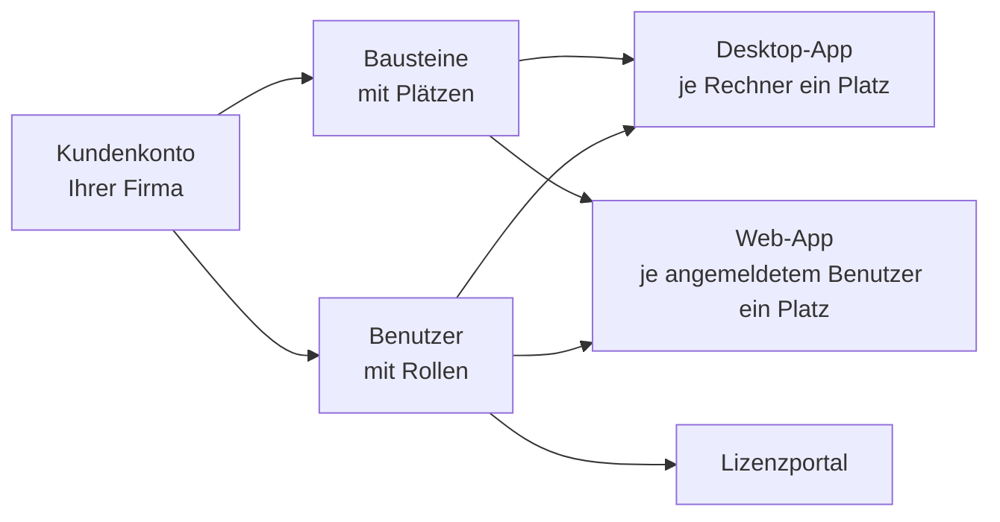

# Kundenkonto und Einladung

!!! info "Konzept — Was das Kundenkonto ist, wie Sie hineinkommen und was Bausteine und Plätze bedeuten"

Seit Version 2.0 bezieht Herzog CAB seine Lizenz normalerweise aus einem
**Kundenkonto** auf dem Herzog-Lizenzserver. Das Konto gehört Ihrer Firma;
darin stehen die gekauften **Bausteine** mit ihren **Plätzen**, die
angemeldeten **Rechner** und die **Benutzer**, die sich anmelden dürfen. Ein
Rechner braucht keinen Dongle mehr — er meldet sich beim Start am Konto an
und zieht sich seine Lizenz aus dem Vorrat.

Das Konto verwalten Sie im **Lizenzportal** unter
[license.herzog-cab.com](https://license.herzog-cab.com). Dieselben
Zugangsdaten gelten für die Desktop-App und für die
[Web-App](../web/index.md) — **ein Login für alles**.

## So kommen Sie ins Konto

Ein Konto legt **Herzog** für Ihre Firma an. Den ersten Benutzer lädt Herzog
per E-Mail ein; jeder weitere Benutzer wird von einem **Administrator Ihres
Kontos** im Lizenzportal eingeladen (siehe
[Benutzer einladen und verwalten](../portal/users.md)).

1. Sie erhalten eine E-Mail mit dem Betreff *Ihr Zugang zum Herzog CAB
   Lizenzportal* und einem Link. Der Link gilt **drei Tage**.
2. Klicken Sie auf den Link. Die Seite **Passwort setzen** des Lizenzportals
   öffnet sich mit Ihrer E-Mail-Adresse.
3. Vergeben Sie ein Passwort mit **mindestens 10 Zeichen** und wiederholen
   Sie es.
4. Danach sind Sie im Lizenzportal angemeldet und können sich mit derselben
   E-Mail-Adresse und demselben Passwort in der Desktop-App und in der
   Web-App anmelden.

!!! tip "Zweiter Faktor"
    Im Lizenzportal können Sie unter *Passwort und zweiter Faktor* eine
    **Authenticator-App** hinterlegen. Dann verlangt jede Anmeldung — auch in
    der Desktop-App und der Web-App — zusätzlich den sechsstelligen Code.
    Empfohlen für Administratoren. Siehe
    [Passwort und zweiter Faktor](../portal/security.md).

!!! warning "Einladung abgelaufen?"
    Ist der Link älter als drei Tage, kann ein Administrator Ihres Kontos im
    Lizenzportal unter **Benutzer** die Einladung erneuern. Ein vergessenes
    Passwort setzen Sie selbst über **Passwort vergessen** auf der
    Anmeldeseite des Portals zurück.

## Bausteine

Ein **Baustein** ist ein lizenzierter Funktionsumfang. Welche Bausteine Ihr
Konto hat, sehen Sie im Lizenzportal unter **Mein Konto** und in der
Desktop-App unter *Einstellungen > Lizenz*.

| Baustein | Umfang | Laufzeit |
|---|---|---|
| **Herzog CAB Vollversion** | Das komplette Desktop-Programm. Entspricht der bisherigen Dongle-Vollversion. | Lebenszeit oder befristet |
| **Herzog CAB Designer** | Nur der Geflechts-Designer in der Desktop-App (Designer-Edition). | Lebenszeit oder befristet |
| **Herzog CAB Testversion** | 30 Tage Desktop-App mit den [Mengenbegrenzungen der Testversion](../basics/trial-quotas.md). | 30 Tage |
| **Flechtsimulator** | Zusatzbaustein für die Vollversion; wird gesondert freigeschaltet. | Abo |
| **Herzog CAB Web** | Das komplette Programm im Browser unter app.herzog-cab.com. | Abo |
| **Herzog CAB Web Designer** | Nur der Designer im Browser. | Abo |
| **Herzog CAB Web Testphase** | 30 Tage Web-App mit Mengenbegrenzungen, siehe [Testphase und Registrierung](../web/trial.md). | 30 Tage |

!!! info "Desktop und Web sind getrennte Bausteine"
    Die Desktop-Vollversion enthält die Web-App **nicht** automatisch und
    umgekehrt. Wer beides nutzen möchte, braucht beide Bausteine — fragen Sie
    im Lizenzportal einfach [eine Erweiterung an](../portal/requests.md).

## Plätze

Jeder Baustein hat eine Anzahl **Plätze**. Was ein Platz ist, unterscheidet
sich zwischen Desktop und Web:

| | Desktop-App | Web-App |
|---|---|---|
| Ein Platz ist … | ein **Rechner**, auf dem Herzog CAB angemeldet ist — je Baustein einer. | ein **gleichzeitig angemeldeter Benutzer**. |
| Belegt wird … | beim Anmelden des Rechners am Konto (erster Programmstart). | beim Anmelden im Browser. |
| Frei wird … | von selbst nach **sieben Tagen** ohne Programmstart, bei *Offline arbeiten* nach bis zu 30 Tagen; sofort über **Von diesem Rechner abmelden** in den Einstellungen oder **Plätze freigeben** im Portal. | nach **15 Minuten** ohne Aktivität oder beim Abmelden. |
| Wenn alles belegt ist … | meldet Herzog CAB *Kein freier Platz* — ein Administrator gibt im Portal einen Rechner frei oder fragt weitere Plätze an. | meldet die Web-App, dass gerade alle Plätze belegt sind. |

Mehrere Bediener können sich am selben Rechner nacheinander anmelden — der
Rechner belegt trotzdem nur **einen** Platz.

## Benutzer und Rollen

Jeder Benutzer im Konto hat eine **E-Mail-Adresse** (Anmeldename), ein
**Passwort** und eine **Rolle**:

| Rolle im Konto | Im Lizenzportal | In Desktop- und Web-App |
|---|---|---|
| **Administrator** | Verwaltet Benutzer, Rechner, Lizenzen und Anfragen. | Alle Rechte. |
| **Bearbeiter** | Sieht das Konto nur. | Darf Aufträge, Designs, Stammdaten anlegen und ändern (Standard für Benutzer ohne Rolle). |
| **Betrachter** | Sieht das Konto nur. | Darf lesen, berechnen, drucken und exportieren, aber nichts ändern. |

Die Rollen gelten in der Desktop-App und in der Web-App gleichermaßen. In
der Web-App können Administratoren zusätzlich eigene Rollen mit einzelnen
Rechten anlegen — siehe [Rollen (Web-App)](../web/roles.md). In der
Desktop-App kommen Benutzer und Rollen aus dem Konto; lokal bleibt nur die
Zuweisung zu Arbeitsbereichen (siehe
[Benutzer verwalten](../admin/users.md)).

!!! info "Bestandskunden mit Dongle"
    Wer weiterhin mit **CmDongle** oder **CmAct-Lizenz** arbeitet, braucht
    kein Kundenkonto. Die lokale Benutzerverwaltung der Desktop-App
    (inklusive Microsoft Entra ID und LDAP) bleibt für diese Installationen
    unverändert — siehe [Anmelden und Lizenz beziehen](activate-license.md).

## Nächster Schritt

Ist das Passwort gesetzt, laden Sie im Lizenzportal unter **Herunterladen**
den aktuellen Installer und [installieren Herzog CAB](installer.md). Beim
ersten Start [melden Sie den Rechner am Konto an](activate-license.md).

## Verwandte Seiten

* [Lizenzportal](../portal/index.md) — Konto, Benutzer, Rechner und Anfragen verwalten
* [Web-App](../web/index.md) — Herzog CAB im Browser
* [Lizenz und Cloud (Einstellungen)](../admin/settings/license.md) — Lizenzstatus in der Desktop-App
* [Lizenzprobleme](../help/license-problems.md) — wenn die Anmeldung am Konto scheitert
