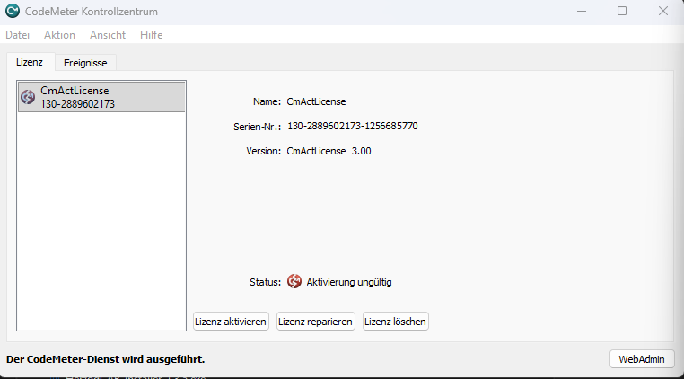
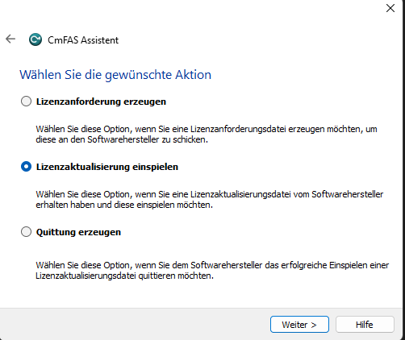

# Anmelden und Lizenz beziehen

!!! example "Anleitung — Herzog CAB auf diesem Rechner freigeschaltet: über das Kundenkonto oder über eine CodeMeter-Lizenz"

Ohne gültige Lizenz lässt sich Herzog CAB nicht starten. Seit Version 2.0
gibt es dafür zwei Wege — Herzog CAB erkennt beim Start selbst, welcher
zutrifft:

| Weg | Für wen | Was Sie brauchen |
|---|---|---|
| **Kundenkonto** (Regelfall) | Alle Neukunden ab Version 2.0 und alle, die vom Dongle auf das Konto umgestellt haben. | Ihren Benutzer im [Kundenkonto](account.md) und eine Internetverbindung beim ersten Start. |
| **CodeMeter** (Bestandskunden) | Kunden mit **CmDongle** oder **CmAct-Software-Lizenz** aus Version 1.x. | Die [CodeMeter-Runtime](codemeter.md) und den Dongle bzw. die Lizenzdateien. |

!!! info "Beides vorhanden?"
    Findet Herzog CAB einen CodeMeter-Container mit gültiger Lizenz, nutzt
    es diesen — das Kundenkonto kommt nur zum Zug, wenn **kein** Container
    vorhanden ist. Bestandskunden ändern also nichts.

---

## Regelfall: Anmeldung am Kundenkonto

**Voraussetzungen:** Sie haben die [Einladung ins Kundenkonto](account.md)
angenommen und ein Passwort gesetzt; Herzog CAB ist
[installiert](installer.md); der Rechner ist online.

### Schritt 1: Ersten Start abwarten

Starten Sie Herzog CAB. Auf einem Rechner, der noch nicht freigeschaltet
ist, erscheint der Dialog **Herzog CAB – Anmeldung am Kundenkonto** mit dem
Hinweis *„Herzog CAB ist auf diesem Rechner noch nicht freigeschaltet."*

!!! warning "📷 Screenshot fehlt"
    **Motiv:** Dialog „Herzog CAB – Anmeldung am Kundenkonto" mit
    Erklärtext, den Feldern **E-Mail-Adresse** und **Passwort** sowie den
    Schaltflächen **Anmelden** und **Beenden**.
    **So erzeugen:** Kunden-Build auf einem Rechner ohne `license.json`
    starten (oder vorher unter *Einstellungen > Lizenz* **Von diesem Rechner
    abmelden** wählen).
    **Ziel-Datei:** `assets/screenshots/setup/konto-anmeldung-geraet.png`

### Schritt 2: Anmelden

| Feld / Schaltfläche | Bedeutung |
|---|---|
| **E-Mail-Adresse** | Die Adresse Ihres Benutzers im Kundenkonto (dieselbe wie im Lizenzportal). |
| **Passwort** | Ihr Konto-Passwort (verdeckte Eingabe). |
| **Code (Authenticator-App)** | Erscheint erst nach dem Klick auf **Anmelden**, wenn für Ihren Benutzer die [Zwei-Faktor-Anmeldung](../portal/security.md) eingerichtet ist. Tragen Sie den aktuellen sechsstelligen Code ein und klicken Sie erneut auf **Anmelden**. |
| **Anmelden** | Prüft die Zugangsdaten am Lizenzserver, meldet den Rechner am Konto an und zieht je Baustein einen Platz. |
| **Beenden** | Schließt Herzog CAB ohne Anmeldung. |

Nach erfolgreicher Anmeldung startet Herzog CAB direkt — **Sie sind mit
demselben Benutzer auch im Programm angemeldet**, ein zweiter
Anmeldedialog folgt nicht. Beim allerersten Start auf einem Rechner richten
Sie anschließend noch das [Arbeitsverzeichnis](first-run.md) ein.

!!! tip "Passwort-Manager"
    Windows-Passwort-Manager füllen diesen Dialog nicht automatisch aus.
    Mit **Auto-Type** (z. B. 1Password: ++ctrl+shift+space++, KeePass:
    ++ctrl+alt+a++) tippt der Manager E-Mail und Passwort in das Feld, das
    gerade den Fokus hat — ein Klick in das Feld **E-Mail-Adresse** markiert
    dafür den vorausgefüllten Inhalt.

### Schritt 3: Prüfen

Unter *Datei > Einstellungen*, Tab **Lizenz**, sehen Sie jetzt Ihr Konto,
den angemeldeten Benutzer, die Edition, die freigeschalteten Bausteine und
die Miete mit Ablaufdatum — siehe
[Lizenz und Cloud](../admin/settings/license.md).

### Was danach passiert

* **Regelmiete:** Der Rechner hält seine Plätze als *Miete*, die sich bei
  jedem Programmstart und alle sechs Stunden von selbst verlängert. Ohne
  Verbindung läuft Herzog CAB normalerweise **sieben Tage** weiter.
* **Länger offline:** Wer länger ohne Netz arbeitet (Messe, Baustelle),
  zieht vorher unter *Einstellungen > Lizenz* eine **Offline-Miete** für
  bis zu 30 Tage.
* **Weitere Bediener am selben Rechner:** Beim nächsten Start erscheint der
  kürzere Dialog **Herzog CAB – Anmelden**. Jeder Kollege meldet sich dort
  mit seinem eigenen Kontobenutzer an; der Rechner belegt trotzdem nur einen
  Platz. Siehe [Anmelden und Abmelden](../admin/login.md).
* **Rechner abgeben oder neu aufsetzen:** Vorher **Von diesem Rechner
  abmelden** (Tab Lizenz) — dann sind die Plätze sofort wieder frei.
  Vergessen ist nicht schlimm: Ein Administrator kann die Plätze im
  [Lizenzportal](../portal/licenses.md) jederzeit freigeben, und nach sieben
  Tagen ohne Start werden sie ohnehin frei.

### Meldungen bei der Anmeldung

| Meldung | Bedeutung / Abhilfe |
|---|---|
| *E-Mail-Adresse oder Passwort stimmen nicht.* | Zugangsdaten prüfen; Passwort über **Passwort vergessen** im Lizenzportal zurücksetzen. |
| *Für diesen Benutzer ist die Zwei-Faktor-Anmeldung eingerichtet …* | Kein Fehler — den Code aus der Authenticator-App eintragen. |
| *Der Code stimmt nicht.* | Uhrzeit des Handys prüfen, neuen Code abwarten. |
| *Kein freier Platz für: …* | Alle Plätze des Bausteins sind belegt — im Lizenzportal einen Rechner freigeben oder [Plätze anfragen](../portal/requests.md). |
| *Dieser Benutzer ist deaktiviert.* | Ein Administrator hat den Benutzer im Portal deaktiviert. |
| *Zu viele Fehlversuche. Bitte später erneut versuchen.* | Der Lizenzserver bremst nach mehreren Fehlversuchen — ein paar Minuten warten. |
| *Der Lizenzserver ist nicht erreichbar …* | Internetverbindung, Proxy und Firewall prüfen (Ziel: `license.herzog-cab.com`, Port 443). Für die **erste** Anmeldung eines Rechners ist eine Verbindung Pflicht. |

Weitere Fälle: [Lizenzprobleme](../help/license-problems.md).

---

## Bestandskunden: Dongle oder CmAct-Lizenz

Herzog CAB nutzt für diese Lizenzen **Wibu CodeMeter**.

!!! info "Voraussetzung"
    Die [CodeMeter-Runtime](codemeter.md) muss bereits installiert sein.

### Lizenztyp

| Typ            | Artikel  | Product Code | Umfang                                              |
|----------------|----------|--------------|-----------------------------------------------------|
| Vollversion    | 88805    | 200006       | Alle Funktionen, unbefristet                        |
| Designer-Edition | 88805  | 200006, Feature Code 4 | Nur der Designer                          |

Der Firmencode bei Wibu CodeMeter ist immer **6001037** (Herzog GmbH).

### Bezugswege

| Bezugsweg                       | Wann?                                                                 |
|---------------------------------|-----------------------------------------------------------------------|
| **CmDongle** (USB-Lizenzstick)  | Wenn Sie einen physischen Dongle bestellt haben.                      |
| **CmActLicense** (Software-Lizenz) | Wenn Ihre Lizenz an den **Fingerabdruck** des Rechners gebunden ist. |

### Variante A - Lizenz per USB-Dongle

Sie haben mit Ihrer Bestellung einen kleinen Wibu-Dongle erhalten. Die
Lizenz ist bereits auf dem Dongle vorinstalliert.

1. Schließen Sie das Programm Herzog CAB, falls es läuft.
2. Stecken Sie den **CmDongle** in einen freien USB-Anschluss.
3. Warten Sie kurz - Windows erkennt den Stick und CodeMeter liest die
   Lizenz automatisch ein.

Sie erkennen den Erfolg am **CodeMeter-Tray-Icon** unten rechts in der
Taskleiste: es wechselt von grau auf blau.

!!! warning "📷 Screenshot fehlt"
    **Motiv:** CodeMeter-Tray-Icon im Windows-Infobereich vor und nach dem
    Einstecken des Dongles (Farbwechsel grau → blau).
    **So erzeugen:** Dongle abgezogen fotografieren, dann einstecken und
    nach ein paar Sekunden erneut fotografieren.
    **Ziel-Datei:** `assets/screenshots/activate-license/tray-icon-farbwechsel.png`

4. Öffnen Sie das **CodeMeter Kontrollzentrum** (Doppelklick auf das
   Tray-Symbol) und prüfen Sie, dass eine Lizenz mit Firmencode
   **6001037** und Artikel **88805** (Vollversion) angezeigt wird.

!!! warning "📷 Screenshot fehlt"
    **Motiv:** CodeMeter Kontrollzentrum mit erkanntem CmDongle, Firmencode
    6001037 und Artikel 88805 in der Lizenzliste.
    **So erzeugen:** Dongle einstecken, CodeMeter Kontrollzentrum öffnen,
    Lizenzliste zeigen.
    **Ziel-Datei:** `assets/screenshots/activate-license/kontrollzentrum-dongle-erkannt.png`

!!! warning "Dongle muss eingesteckt bleiben"
    Der Dongle muss während des Betriebs von Herzog CAB **eingesteckt
    bleiben** - sonst wird die Lizenz nicht gefunden. Ziehen Sie ihn
    erst nach dem Beenden des Programms wieder ab.

!!! tip "Mehrere Arbeitsplätze"
    Wenn Sie nur einen Dongle haben, können Sie ihn zwischen mehreren
    Rechnern wechseln - aber immer nur an einem Rechner zur gleichen
    Zeit.

### Variante B - Software-Lizenz per CmAct-Dateiaustausch

Software-Lizenzen sind an den **Fingerabdruck** Ihres Rechners
(Hardware-Merkmale) gebunden. Die Aktivierung läuft über einen
mehrstufigen Dateiaustausch zwischen Ihnen und der Herzog GmbH.

#### Überblick

```text
1. Empty.WibuCmLif      Herzog GmbH  →  Sie    (leerer Lizenz-Container)
2. Request.WibuCmRaC    Sie          →  Herzog (Anforderung mit Fingerabdruck)
3. Update.WibuCmRaU     Herzog GmbH  →  Sie    (gültige Lizenz)
4. Receipt.WibuCmRaC    Sie          →  Herzog (Quittung)
```

Der Vorteil: Ihr Rechner braucht **keine direkte Internetverbindung**
zu Wibu - der Austausch läuft per E-Mail. Der Nachteil: ein bisschen
Hin-und-Her, planen Sie ungefähr einen Arbeitstag ein.

#### Schritt 1 - Leeren Container einspielen

Sie erhalten von Herzog GmbH per E-Mail eine Datei mit dem Namensschema

```
Herzog-CAB-Container_CmActLicense_6001037.WibuCmLif
```

1. Speichern Sie die Datei auf dem Zielrechner ab.
2. **Doppelklick** auf die Datei genügt - das CodeMeter Kontrollzentrum
   öffnet sich automatisch und richtet einen leeren Container für den
   Hersteller *Herzog GmbH* ein.
3. Alternativ: CodeMeter Kontrollzentrum öffnen und die `.WibuCmLif`-Datei
   mit der Maus in das Fenster ziehen.

Im Kontrollzentrum erscheint jetzt unter *Lizenz* ein Eintrag
**CmActLicense** für die Firma *Herzog GmbH*. Der Status zeigt
**„Aktivierung ungültig"** - das ist nach diesem Schritt korrekt, die
Aktivierung folgt erst in Schritt 3.

!!! warning "📷 Screenshot fehlt"
    **Motiv:** CodeMeter Kontrollzentrum direkt nach dem Doppelklick auf
    den `.WibuCmLif`-Container — Eintrag „Herzog GmbH", Status
    „Aktivierung ungültig".
    **So erzeugen:** `.WibuCmLif`-Datei doppelklicken, Kontrollzentrum
    fotografieren.
    **Ziel-Datei:** `assets/screenshots/activate-license/kontrollzentrum-leerer-container.png`

#### Schritt 2 - Lizenzanforderung erzeugen

1. Öffnen Sie das **CodeMeter Kontrollzentrum**.
2. Wählen Sie den Container *Herzog GmbH* aus.
3. Klicken Sie unten auf **Lizenz aktivieren** (in älteren Versionen
   *„Lizenzaktualisierung…"*).
4. Im **CmFAS-Assistenten** wählen Sie als Aktion
   **Lizenzanforderung erzeugen** und klicken auf **Weiter**.

!!! warning "📷 Screenshot fehlt"
    **Motiv:** CmFAS-Assistent mit ausgewählter Option „Lizenzanforderung
    erzeugen".
    **So erzeugen:** Im CodeMeter Kontrollzentrum **Lizenz aktivieren**
    anklicken, ersten Assistenten-Schritt fotografieren.
    **Ziel-Datei:** `assets/screenshots/activate-license/cmfas-lizenzanforderung-erzeugen.png`

5. Als Hersteller **Herzog GmbH** auswählen (steht nach Schritt 1 in der
   Liste) und auf **Weiter** klicken.
6. **Lizenz für diesen leeren Container anfordern** wählen, dann
   **Weiter**.
7. Wählen Sie einen Speicherort - die erzeugte Datei hat die Endung
   `.WibuCmRaC`.

#### Schritt 3 - Anforderung zurücksenden

Senden Sie die `.WibuCmRaC`-Datei als E-Mail-Anhang an Ihren
Herzog-Ansprechpartner. Die Standard-Adresse ist:

```
e.siemering@herzog-online.com
```

#### Schritt 4 - Aktivierungsdatei einspielen

Sie erhalten kurzfristig eine Datei mit der Endung `.WibuCmRaU` zurück.

!!! warning "Wichtig: gleicher Rechner"
    Spielen Sie die `.WibuCmRaU`-Datei **auf dem gleichen Rechner** ein,
    von dem Sie die Anforderung in Schritt 2 erstellt haben. Die Lizenz
    ist an den Fingerabdruck dieses Rechners gebunden und funktioniert
    auf keinem anderen Rechner.

So geht es:

1. **Doppelklick** auf die `.WibuCmRaU`-Datei reicht - die Lizenz wird
   automatisch eingespielt.

Alternativ über das Kontrollzentrum:

1. Kontrollzentrum öffnen und den Container *Herzog GmbH* auswählen.
   Der Container ist sichtbar (Name: *CmActLicense*, Serien-Nr. wird
   angezeigt), aber der Status zeigt noch **„Aktivierung ungültig"**.



2. Klicken Sie auf den Button **Lizenz aktivieren** unten im Fenster.
3. Im **CmFAS-Assistenten** wählen Sie als Aktion
   **Lizenzaktualisierung einspielen** und klicken auf **Weiter**.



4. Wählen Sie die `.WibuCmRaU`-Datei aus und folgen Sie den Anweisungen
   des Assistenten bis zum Ende.

#### Schritt 5 - Erfolg prüfen

Im CodeMeter Kontrollzentrum sollte unter *Herzog GmbH* jetzt die
aktive Lizenz **Herzog CAB** mit Product Code **200006** (Vollversion)
erscheinen. Beim nächsten Start von Herzog CAB ist die Vollversion
freigeschaltet.

#### Schritt 6 - Quittung erzeugen und zurücksenden

Damit Herzog GmbH die erfolgreiche Aktivierung dokumentieren kann,
erzeugen Sie zum Abschluss eine Quittung:

1. Kontrollzentrum öffnen → Container *Herzog GmbH* auswählen →
   **Lizenz aktivieren** → **CmFAS-Assistent**.
2. Als Aktion **Quittung erzeugen** wählen, dann **Weiter**.
3. Speicherort wählen - die erzeugte Datei hat ebenfalls die Endung
   `.WibuCmRaC`.
4. Schicken Sie diese Quittung per E-Mail an Ihren Herzog-Ansprechpartner.

### Wichtige Hinweise zu CmActLicense

!!! warning "Rechner-Bindung"
    CmActLicenses sind an den Rechner gebunden, auf dem Sie die
    Anforderung in Schritt 2 erstellt haben.

!!! warning "Hardware-Wechsel oder Umzug"
    Wenn Sie auf einen anderen Rechner umziehen oder Hardware tauschen
    (Mainboard, Festplatte), muss die Lizenz **vor dem Umzug** über
    eine separate Umzugs-Prozedur zurückgegeben und danach neu
    aktiviert werden. Wenden Sie sich dafür rechtzeitig an Ihren
    Herzog-Ansprechpartner — oder sprechen Sie mit ihm über den Wechsel auf
    das [Kundenkonto](account.md), das ohne Rechnerbindung auskommt.

---

## Lizenzprüfung durch Herzog CAB

Beim Start prüft Herzog CAB, ob eine gültige Lizenz vorhanden ist:

| Status                      | Verhalten                                       |
|-----------------------------|-------------------------------------------------|
| CodeMeter-Lizenz vorhanden, gültig | Programm startet normal (Dongle-Weg).    |
| Kein CodeMeter-Container, Rechner am Konto angemeldet | Programm startet normal; die Miete wird im Hintergrund verlängert. |
| Kein CodeMeter-Container, Rechner noch nicht angemeldet | Dialog *Anmeldung am Kundenkonto*. |
| Miete abgelaufen und kein Server erreichbar | Hinweis-Dialog; sobald wieder eine Verbindung besteht, startet das Programm normal. |
| Lizenz abgelaufen (Dongle) oder Baustein beendet | Hinweis-Dialog, Programm startet nicht. |

Wenn die Lizenzprüfung fehlschlägt, lesen Sie
[Lizenzprobleme](../help/license-problems.md).

## Nächster Schritt

Mit der gültigen Lizenz ist die Installation abgeschlossen. Beim ersten
Programmstart richten Sie noch Ihr Arbeitsverzeichnis ein — siehe
[Erststart und Einrichtung](first-run.md).
