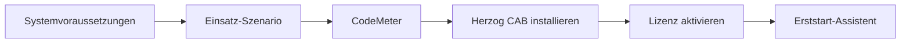

# Loslegen

Dieses Kapitel begleitet Sie von der Erstinstallation bis zum ersten
Programmstart. Rechnen Sie für die komplette Strecke mit rund 15 Minuten.
Wenn Herzog CAB bei Ihnen bereits läuft und Sie nur ein **Update**
einspielen oder das Programm **deinstallieren** wollen, springen Sie direkt
zur passenden Karte unten.

- :material-clipboard-check-outline: **Systemvoraussetzungen**

    Windows-Version, Hardware und Berechtigungen, die für die Installation
    nötig sind.

    [:octicons-arrow-right-24: Weiter](system-requirements.md)

- :material-lan: **Einsatz-Szenarien**

    Single-Client, Server mit RDP-Zugriff oder Mixed Setup mit
    Lizenzserver — welche Topologie passt zu Ihrem Werk?

    [:octicons-arrow-right-24: Weiter](topology.md)

- :material-usb-flash-drive-outline: **CodeMeter installieren**

    Die Wibu-Laufzeitumgebung für die Lizenzprüfung einrichten — einmalig
    pro Rechner.

    [:octicons-arrow-right-24: Weiter](codemeter.md)

- :material-application-cog-outline: **Herzog CAB installieren**

    Den Einrichtungsassistenten von Herzog CAB durchlaufen.

    [:octicons-arrow-right-24: Weiter](installer.md)

- :material-key-variant: **Lizenz aktivieren**

    CmDongle einstecken oder eine Software-Lizenz per CmAct-Dateiaustausch
    aktivieren.

    [:octicons-arrow-right-24: Weiter](activate-license.md)

- :material-rocket-launch-outline: **Erststart und Einrichtung**

    Administrator-Konto, Speicherort und Arbeitsverzeichnis beim ersten
    Programmstart einrichten.

    [:octicons-arrow-right-24: Weiter](first-run.md)

- :material-cloud-download-outline: **Updates installieren**

    Neue Version über das Maintenance-Tool einspielen.

    [:octicons-arrow-right-24: Weiter](update.md)

- :material-trash-can-outline: **Deinstallation**

    Herzog CAB entfernen — mit oder ohne Ihre Auftrags- und Stammdaten.

    [:octicons-arrow-right-24: Weiter](uninstall.md)

## Ablauf der Erstinstallation

Für einen neuen Rechner arbeiten Sie die Karten oben in dieser Reihenfolge ab:

Danach ist Herzog CAB einsatzbereit. Wie Sie sich in der Oberfläche
zurechtfinden, zeigt das Kapitel [Grundlagen](../basics/index.md).

!!! info "Sie haben kein Installationspaket erhalten?"
    Wenden Sie sich an Ihren Herzog-Ansprechpartner oder schreiben Sie an
    [e.siemering@herzog-online.com](mailto:e.siemering@herzog-online.com).
