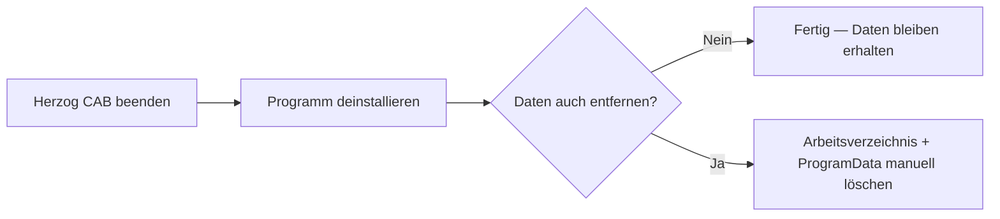

# Deinstallation

!!! example "Anleitung — Herzog CAB entfernt, mit oder ohne eigene Daten"

Sie können Herzog CAB über zwei gleichwertige Wege deinstallieren — über
das mitgelieferte Maintenance-Tool oder über die Windows-Einstellungen
(die im Hintergrund dasselbe Maintenance-Tool aufrufen). Das Entfernen des
Programms lässt dabei Ihre Aufträge, Stammdaten und Benutzerkonten
standardmäßig **unangetastet**.

## Schritt 1: Herzog CAB beenden

Schließen Sie das Programm vollständig, falls es noch läuft — auch aus
dem Tray-Symbol heraus.

## Schritt 2: Programm deinstallieren

=== "Über das Maintenance-Tool"

    1. Öffnen Sie das Startmenü unter *Herzog > Herzog CAB Maintenance*.
    2. Wählen Sie **Alle Komponenten entfernen**.
    3. Bestätigen Sie den Vorgang und warten Sie, bis der Assistent fertig
       ist.

=== "Über die Windows-Einstellungen"

    1. Öffnen Sie *Einstellungen > Apps > Installierte Apps*.
    2. Suchen Sie den Eintrag **Herzog CAB**.
    3. Klicken Sie auf **Deinstallieren** und bestätigen Sie die Abfrage.

    Windows ruft dabei im Hintergrund dasselbe Maintenance-Tool auf wie im
    ersten Weg — das Ergebnis ist identisch.

!!! warning "📷 Screenshot fehlt"
    **Motiv:** Maintenance-Tool-Assistent im Schritt „Alle Komponenten
    entfernen".
    **So erzeugen:** Maintenance-Tool über *Herzog > Herzog CAB
    Maintenance* öffnen und den Deinstallations-Schritt fotografieren.
    **Ziel-Datei:** `assets/screenshots/setup/maintenance-tool-entfernen.png`

## Daten entfernen

!!! warning "Der Workspace bleibt erhalten"
    Die Deinstallation entfernt **nur das Programm selbst**. Ihr
    Arbeitsverzeichnis (Aufträge, Flechtmaschinen, Materialien,
    Druckvorlagen) und die Benutzerverwaltung (Konten, Profile, Rollen)
    bleiben bestehen — falls Sie Herzog CAB später erneut installieren
    oder ein anderer Rechner denselben Speicherort weiterverwendet.

Wollen Sie diese Daten wirklich endgültig entfernen, löschen Sie manuell:

| Ort | Inhalt |
|---|---|
| Ihr Arbeitsverzeichnis (selbst gewählter Ordner, z. B. *Dokumente\HerzogCAB*) | Aufträge, Flechtmaschinen, Materialien, Farben, Druckvorlagen jedes Profils, das auf diesen Ordner zeigt. |
| `%ProgramData%\Herzog GmbH\Herzog Cab` | Globale Benutzerverwaltung (Konten, Profile, Rollen) — nur wenn diese **lokal** gespeichert ist. Liegt sie auf einem Netzwerk-Pfad (siehe [Speicherort](../admin/storage-location.md)), löschen Sie stattdessen den dort konfigurierten Ordner. |
| Registry-Schlüssel `HKEY_CURRENT_USER\Software\Herzog GmbH\Herzog Cab` | Persönliche Anzeigeeinstellungen (Fenstergrößen u. Ä.) dieses Windows-Benutzers. |

!!! danger "Nicht wiederherstellbar"
    Gelöschte Aufträge, Stammdaten und Benutzerkonten lassen sich **nicht**
    wiederherstellen. Prüfen Sie vorher, ob ein Backup des
    Arbeitsverzeichnisses nötig ist.

## Ergebnis

Herzog CAB ist von diesem Rechner entfernt. Haben Sie die Daten wie oben
beschrieben zusätzlich gelöscht, ist auch keine Spur der Benutzerverwaltung
und der Auftragsdaten mehr vorhanden — eine erneute Installation startet
dann wieder mit dem [Erststart-Assistenten](first-run.md).

## Wenn etwas nicht klappt

* Die Deinstallation bricht mit einem Fehler ab → Herzog CAB vollständig
  beenden (auch im Tray-Symbol prüfen) und erneut versuchen.
* Sie sind sich unsicher, welche Daten noch woanders gebraucht werden
  (z. B. Netzwerk-Speicherort für andere Rechner) → siehe
  [Speicherort](../admin/storage-location.md) und wenden Sie sich im
  Zweifel an [Support](../help/support.md).
