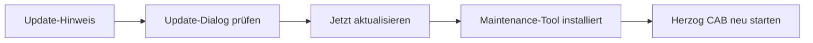

# Updates installieren

!!! example "Anleitung — Neue Herzog-CAB-Version über das Maintenance-Tool eingespielt"

**Voraussetzungen:** Herzog CAB ist installiert, der Rechner hat eine
Internetverbindung.

## Schritt 1: Auf ein verfügbares Update aufmerksam werden

Herzog CAB prüft bei **jedem Programmstart** im Hintergrund, ob eine neuere
Version vorliegt. Findet sich nichts Neues, bemerken Sie davon nichts — es
gibt keine störende Meldung.

Ist eine neuere Version verfügbar, zeigt sich das an zwei Stellen:

* Auf der [Startseite (Home)](../basics/home.md) erscheint eine dezente
  Karte **„Update verfügbar"**. Ein Klick darauf öffnet den
  Update-Dialog aus Schritt 2.
* Über *Hilfe > Updates* können Sie jederzeit manuell prüfen — dieser Weg
  meldet auch, wenn **kein** Update verfügbar ist.

## Schritt 2: Update-Dialog prüfen

Der Dialog **„Update verfügbar"** zeigt:

| Element | Bedeutung |
|---|---|
| Titel | „Herzog CAB *Version* ist verfügbar". |
| Unterzeile | Ihre aktuell installierte Version sowie das Veröffentlichungsdatum der neuen Version. |
| **Was ist neu** | Liste der Neuerungen aus den Release Notes. |
| Hinweis | Bestätigt, dass Ihre Stammdaten (Maschinen, Materialien, Spulen, Aufträge, Designs) beim Update erhalten bleiben. |
| **Release-Seite öffnen** | Öffnet die Release-Seite im Browser, ohne zu installieren. |
| **Später** | Schließt den Dialog, ohne zu aktualisieren. Die Karte auf der Startseite bleibt sichtbar. |
| **Jetzt aktualisieren** | Startet die Installation (siehe Schritt 3). |

!!! warning "📷 Screenshot fehlt"
    **Motiv:** Dialog „Update verfügbar" mit Versionsangabe, Was-ist-neu-Liste
    und den drei Schaltflächen.
    **So erzeugen:** *Hilfe > Updates* anklicken, wenn eine neuere Version
    veröffentlicht ist.
    **Ziel-Datei:** `assets/screenshots/setup/update-dialog.png`

## Schritt 3: Jetzt aktualisieren

=== "Über den Update-Dialog"

    1. Klicken Sie im Update-Dialog auf **Jetzt aktualisieren**.
    2. Herzog CAB startet das **Maintenance-Tool** im Update-Modus und
       beendet sich anschließend selbst, damit das Tool die Programmdateien
       ersetzen kann.
    3. Im Maintenance-Tool führen Sie den Update-Assistenten bis zum Ende
       durch und klicken zum Abschluss auf **Fertigstellen**.
    4. Starten Sie Herzog CAB über das Startmenü oder den Desktop erneut.

=== "Direkt über das Maintenance-Tool"

    1. Beenden Sie Herzog CAB, falls es noch läuft.
    2. Öffnen Sie das Startmenü unter *Herzog > Herzog CAB Maintenance*.
    3. Wählen Sie **Komponenten aktualisieren**.
    4. Folgen Sie den Anweisungen, klicken Sie am Ende auf **Fertigstellen**.
    5. Starten Sie Herzog CAB neu.

=== "Installer aus dem Lizenzportal"

    Wer ein [Kundenkonto](account.md) hat, kann jede Version auch ohne
    Maintenance-Tool einspielen:

    1. Im [Lizenzportal](https://license.herzog-cab.com) auf
       **Herunterladen** klicken und den aktuellen Installer laden.
    2. Herzog CAB beenden und den Installer ausführen — er aktualisiert die
       bestehende Installation an Ort und Stelle.
    3. Herzog CAB neu starten. Die Anmeldung am Konto bleibt erhalten.

!!! warning "📷 Screenshot fehlt"
    **Motiv:** Maintenance-Tool-Assistent im Schritt „Komponenten
    aktualisieren".
    **So erzeugen:** Maintenance-Tool über *Herzog > Herzog CAB
    Maintenance* öffnen und den Update-Schritt fotografieren.
    **Ziel-Datei:** `assets/screenshots/setup/maintenance-tool-update.png`

!!! info "Update von Version 1.x auf 2.0"
    Version 2.0 bringt das Kundenkonto mit. Bestandskunden mit **Dongle oder
    CmAct-Lizenz** ändern nichts — der Dongle wird weiterhin erkannt und die
    lokale Benutzerverwaltung bleibt. Nur wer von Herzog auf das
    Kundenkonto umgestellt wurde, meldet den Rechner nach dem Update einmal
    am Konto an (siehe [Anmelden und Lizenz beziehen](activate-license.md)).
    Installationen der Version 1.0 (ohne Maintenance-Tool) lassen sich nicht
    aktualisieren — dort ist eine Neuinstallation nötig; das
    Arbeitsverzeichnis kann übernommen werden.

## Ergebnis

Herzog CAB startet in der neuen Version. Ihre Aufträge, Stammdaten und
Druckvorlagen im Arbeitsverzeichnis bleiben unverändert erhalten. Was sich
in der neuen Version geändert hat, steht unter
[Versionshinweise](../appendix/changelog.md).

## Wenn etwas nicht klappt

* Das Maintenance-Tool wird nicht gefunden → Herzog CAB öffnet
  automatisch die Release-Seite, von der Sie einen neuen Installer laden
  können.
* Die Update-Prüfung schlägt fehl oder das Update lässt sich nicht
  installieren → siehe [Update-Fehler](../help/update-errors.md).
