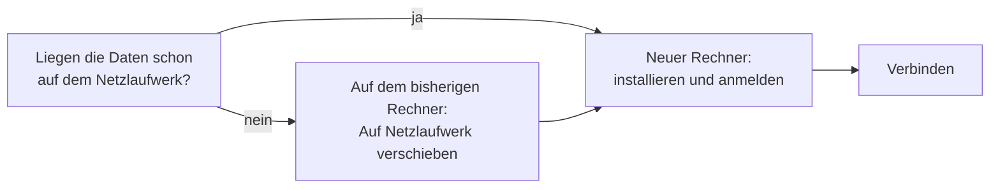

# Einen weiteren Rechner einrichten

!!! example "Anleitung — am Ende arbeitet ein weiterer Rechner mit denselben Designs, Aufträgen und Maschinen wie die übrigen Rechner Ihrer Firma"

**Voraussetzungen:**

* Ihre Firma arbeitet mit einem [Kundenkonto](../setup/account.md) und hat
  einen freien Platz (siehe [Mein Konto](../portal/licenses.md)).
* Die Person, die am neuen Rechner arbeitet, ist ins Kundenkonto
  eingeladen (siehe [Benutzer und Rollen einrichten](setup-users.md)).
* Der neue Rechner erreicht das Netzlaufwerk Ihrer Firma (im Homeoffice
  über VPN).

## Schritt 1: Liegen die Daten schon auf dem Netzlaufwerk?

Öffnen Sie auf einem Rechner, der schon mit Herzog CAB arbeitet,
*Systemverwaltung > Speicherort* (Referenz: [Speicherort](../admin/storage-location.md)).

* Zeigt der Arbeitsbereich **NETZWERK** und steht darunter der
  *Speicherort der Firma im Kundenkonto*, ist alles bereit. Weiter mit
  Schritt 3.
* Zeigt er **LOKAL**, liegen die Daten nur auf diesem Rechner. Weiter mit
  Schritt 2.

!!! tip "In der Web-App nachsehen"
    Denselben Speicherort sehen Administratoren auch in der Web-App unter
    [Konto und Benutzer](../web/account.md#speicherort-der-firma) und im
    [Lizenzportal](../portal/licenses.md) über der Rechnerliste.

## Schritt 2: Daten auf das Netzlaufwerk verschieben

Nur nötig, wenn Ihre Firma bisher mit einem Rechner und lokalen Daten
gearbeitet hat.

1. Legen Sie auf dem Fileserver einen **leeren** Ordner an, z. B.
   `\\fileserver\freigabe\HerzogCAB`, auf den alle Mitarbeiter schreiben
   dürfen. Fragen Sie im Zweifel Ihre IT.
2. Speichern Sie offene Designs und Aufträge.
3. Klicken Sie unter *Systemverwaltung > Speicherort* auf
   **Auf Netzlaufwerk verschieben …**, wählen Sie den neuen Ordner und
   klicken Sie auf **Verschieben**
   (Referenz: [Auf Netzlaufwerk verschieben](../admin/storage-location.md#auf-netzlaufwerk-verschieben)).
4. Herzog CAB kopiert die Daten, prüft sie und startet neu. Der neue Ordner
   steht danach als Speicherort der Firma im Kundenkonto.

## Schritt 3: Neuen Rechner einrichten

1. Installieren Sie Herzog CAB auf dem neuen Rechner
   (Referenz: [Installation](../setup/installer.md)).
2. Starten Sie Herzog CAB und melden Sie sich mit der E-Mail-Adresse und dem
   Passwort aus dem Kundenkonto an
   (Referenz: [Anmelden und Lizenz beziehen](../setup/activate-license.md)).
3. Der Dialog **„Arbeitsverzeichnis einrichten"** zeigt den Ordner Ihrer
   Firma. Steht dort ✔ *erreichbar*, klicken Sie auf **Verbinden**
   (Referenz: [Erststart](../setup/first-run.md#kundenkonto-arbeitsverzeichnis-der-firma)).

## Ergebnis

* Der neue Rechner zeigt auf der Startseite *Daten: auf dem Netzlaufwerk (…)*.
* Designs, Aufträge und Maschinen sind auf allen Rechnern dieselben.
* Unter *Einstellungen > Lizenz* zählt der neue Rechner einen Platz mehr.

## Wenn etwas nicht klappt

* ✘ *Der Ordner ist von diesem Rechner aus nicht erreichbar* → Netzlaufwerk
  verbinden (im Homeoffice: VPN) und **Erneut prüfen**. Hilft das nicht,
  fehlen meist Schreibrechte auf der Freigabe — fragen Sie Ihre IT.
* Der Dialog fragt „Wo sollen die Daten liegen?", obwohl die Firma schon ein
  Netzlaufwerk nutzt → Im Kundenkonto ist noch kein Speicherort hinterlegt.
  Ein Administrator trägt ihn in der Web-App unter
  [Konto und Benutzer](../web/account.md#speicherort-der-firma) ein oder
  startet Herzog CAB einmal auf einem Rechner, der schon auf dem
  Netzlaufwerk arbeitet. Danach den neuen Rechner neu starten.
* Alle Plätze belegt → [Mein Konto](../portal/licenses.md) im Lizenzportal
* Weitere Hilfe → [Hilfe-Übersicht](../help/index.md) und
  [Support kontaktieren](../help/support.md)
