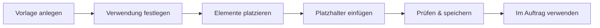

# Eine Druckvorlage erstellen

!!! example "Anleitung — am Ende steht eine eigene Druckvorlage bereit, die beim Drucken eines Auftrags, Designs oder einer Berechnung ausgewählt werden kann"

**Voraussetzungen:**

* Sie haben die Berechtigung, Druckvorlagen zu bearbeiten (ohne sie öffnet
  sich der Druck-Editor schreibgeschützt).
* Firmenlogo und Firmendaten sind gepflegt, wenn Sie Firmenelemente verwenden
  möchten ([Firma](../admin/company.md),
  [Medien](../master-data/media.md)).
* Zum Testen: ein gespeicherter [Auftrag](../orders/index.md) oder ein
  [Design](../master-data/designs.md) mit echten Daten.

## Schritt 1: Vorlage anlegen

1. Öffnen Sie den Navigationspunkt **Druck Editor** (Referenz:
   [Druck-Editor](../print-templates/index.md)).
2. Klicken Sie auf **Neue Vorlage**, um mit einer leeren Vorlage zu starten.

!!! tip "Mit einer Kopie starten"
    Schneller geht es meist, wenn Sie eine mitgelieferte Standardvorlage
    (z. B. *Standard Auftrag*) auswählen, anpassen und unter neuem Namen
    speichern — siehe [Vorlagen verwalten](../print-templates/manage.md).

## Schritt 2: Verwendung festlegen

Legen Sie in den Seiteneinstellungen fest, wofür die Vorlage gilt: **Design**,
**Auftrag** oder **Berechnung**. Diese Zuordnung entscheidet,

* in welchem Drucken-Dialog die Vorlage später zur Auswahl steht und
* welche Elemente im Werkzeugkasten überhaupt angeboten werden (z. B.
  Eingabe-/Ergebnistabellen nur bei Berechnungs-Vorlagen).

Stellen Sie hier auch Papierformat, Ausrichtung und Seitenrand ein
(Referenz: [Vorlagen verwalten](../print-templates/manage.md) und
[Editor & Werkzeugkasten](../print-templates/editor.md)).

## Schritt 3: Elemente platzieren

1. Ziehen Sie die gewünschten Bausteine aus dem Werkzeugkasten links auf die
   Seite: Datentabellen (Auftrag, Kunde, Material, Spule, Flechterei- und
   Spulerei-Tabellen), grafische Design-Elemente (Geflechtbild,
   Besetzungsübersicht), Firmenelemente (Logo, Adresse, Footer) sowie freie
   Elemente (Textfeld, freie Tabelle, Bild, Datum/Zeit).
2. Positionieren Sie die Elemente per Ziehen und passen Sie ihre Größe an.
3. Reicht eine Seite nicht, fügen Sie weitere Seiten hinzu.

Welche Elemente es gibt und was sie ausgeben, steht auf der Referenzseite
[Elemente & Platzhalter](../print-templates/elements.md); die Bedienung der
Arbeitsfläche (Zoom, Kontextmenü, Elementliste) auf
[Editor & Werkzeugkasten](../print-templates/editor.md).

## Schritt 4: Platzhalter einfügen

Markieren Sie ein Textfeld und öffnen Sie im Eigenschaften-Panel rechts den
Token-Browser: Er listet alle einfügbaren Platzhalter (z. B. Kundenname oder
Auftragsnummer) mit Vorschau und Beschreibung. Beim Druck werden die
Platzhalter durch die echten Daten des Auftrags, Designs oder der Berechnung
ersetzt — Details: [Elemente & Platzhalter](../print-templates/elements.md).

## Schritt 5: Prüfen und speichern

1. Kontrollieren Sie das Layout direkt auf der Arbeitsfläche — sie zeigt die
   Vorlage originalgetreu im gewählten Papierformat (Referenz:
   [Vorschau und Druck](../print-templates/preview-and-print.md)).
2. Klicken Sie auf **Speichern** und vergeben Sie einen aussagekräftigen
   Vorlagennamen — er erscheint später im Auswahldialog beim Drucken.

## Schritt 6: Vorlage im Auftrag verwenden

1. Öffnen Sie einen Auftrag und klicken Sie auf **Drucken**.
2. Wählen Sie im Dialog **Druckvorlage wählen** Ihre neue Vorlage.
3. Die Druckvorschau zeigt die Vorlage mit den echten Auftragsdaten — von
   hier drucken Sie oder geben als PDF aus (Referenz:
   [Auftrag drucken](../orders/print.md)).

Beim Drucken eines Designs oder einer Berechnung funktioniert es genauso —
angeboten werden jeweils die Vorlagen der passenden Verwendung.

<!-- TODO(Verifikation): Eine Funktion „Vorlage als Standard setzen" ist im
     Code nicht auffindbar (Stand 1.4.5). Die Vorauswahl im Dialog
     „Druckvorlage wählen" treffen die mitgelieferten Standardvorlagen
     automatisch (nach Auftragsart bzw. Klöppelzahl). Falls eine solche
     Funktion später ergänzt wird, hier als eigenen Schritt dokumentieren. -->

## Ergebnis

* Die Vorlage ist gespeichert und erscheint im Vorlagen-Dropdown des
  Druck-Editors sowie im Dialog **Druckvorlage wählen** der passenden
  Verwendung.
* Ausdrucke aus Auftrag, Design oder Berechnung nutzen Ihr Layout mit den
  jeweils aktuellen Daten.

## Wenn etwas nicht klappt

* Die Vorlage erscheint nicht im Drucken-Dialog → die **Verwendung**
  (Design/Auftrag/Berechnung) passt nicht zum Druckziel, siehe
  [Vorlagen verwalten](../print-templates/manage.md)
* Elemente fehlen im Werkzeugkasten → auch das steuert die Verwendung der
  Vorlage, siehe [Elemente & Platzhalter](../print-templates/elements.md)
* Ausdruck falsch platziert, abgeschnitten oder leer →
  [Druckprobleme](../help/print-problems.md)
* Weitere Hilfe → [Hilfe-Übersicht](../help/index.md) und
  [Support kontaktieren](../help/support.md)
