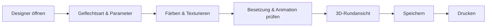

# Ein Design entwerfen und drucken

!!! example "Anleitung — am Ende liegt ein fertig bemustertes Design in der Design-Bibliothek und als Ausdruck vor"

**Voraussetzungen:**

* Sie haben die Berechtigung, Designs anzulegen und zu speichern.
* Optional: eigene Farben in der [Farbdatenbank](../master-data/colors.md) —
  der Designer bringt aber auch ohne Vorarbeit eine Farbpalette mit.

## Schritt 1: Designer öffnen und neues Design anlegen

1. Öffnen Sie den Navigationspunkt **Designer** (Referenz:
   [Designer](../designer/index.md)).
2. Klicken Sie in der Startansicht auf **Design erstellen** (++ctrl+n++). Ein
   leeres Design mit Standardwerten wird angelegt.

Ein bestehendes Design öffnen Sie stattdessen über **Design laden** oder per
Doppelklick in der Liste „Zuletzt bearbeitet". Sie können zwei Design-Fenster
nebeneinander öffnen, um Varianten direkt zu vergleichen.

!!! tip "Geführte Tour"
    Beim ersten Besuch bietet der Designer eine
    [geführte Tour](../basics/guided-tour.md) an, die Schritt für Schritt
    durch das Anlegen eines Designs führt.

## Schritt 2: Geflechtsart und Parameter festlegen

Stellen Sie im linken Panel die Grunddaten des Designs ein: **Designname**,
**Geflechtsart** (Rundgeflecht, Litzengeflecht, Quadratgeflecht oder
Packungsgeflecht), **Bindung/Besetzung**, **Anzahl Klöppel**, **Flechtwinkel**
und **Fachung**. Jede Änderung baut das Flechtbild sofort neu auf.

Alle Parameter und ihre zulässigen Werte sind auf der Referenzseite
[Geflechtsart & Parameter](../designer/parameters.md) erklärt.

## Schritt 3: Färben und Texturieren

1. Aktivieren Sie das Werkzeug **Färben**.
2. Wählen Sie eine Farbe aus der Palette (oder aus einer Bibliothek der
   [Farbdatenbank](../master-data/colors.md)).
3. Klicken Sie im Flechtbild oder in der Klöppeltabelle auf die Positionen,
   die diese Farbe erhalten sollen. Über den Seitenfilter färben Sie gezielt
   nur den Linkslauf, nur den Rechtslauf oder beide Laufrichtungen.
4. Optional belegen Sie Positionen mit einer Faser-Textur aus der
   Texturpalette.

Fehlgriffe machen Sie mit **Rückgängig** wieder rückgängig. Alle
Bedienelemente des Malmodus beschreibt die Referenzseite
[Färben & Texturieren](../designer/painting.md).

## Schritt 4: Besetzung und Gangbahn-Animation prüfen

Die Besetzungsübersicht zeigt die Flügelräder der Maschine von oben mit den
zugewiesenen Farben je Klöppel:

1. Probieren Sie mit den Pfeil-Schaltflächen Farbvarianten durch — sie
   rotieren die Farbzuordnung entlang der Gangbahn.
2. Starten Sie mit der Play-Schaltfläche die **Gangbahn-Animation**: Die
   Klöppel wandern über die Räder, und das Flechtbild baut sich synchron
   Lage für Lage auf. Das Tempo regeln Sie mit den
   Geschwindigkeits-Schaltflächen.

Details zu allen Schaltflächen: Referenzseite
[Besetzung & Gangbahn-Animation](../designer/animation.md).

## Schritt 5: 3D-Rundansicht kontrollieren

Schalten Sie über die Werkzeugleiste die **3D-Rundansicht** ein (verfügbar für
Rund- und Quadratgeflecht). Sie zeigt, wie sich das Muster am fertigen
Geflechtstrang umlaufend fortsetzt — Referenz:
[3D-Rundansicht](../designer/view-3d.md).

## Schritt 6: Design in der Bibliothek speichern

1. Klicken Sie in der Kopfzeile des Design-Fensters auf **Speichern**.
2. Wählen Sie im Dialog den Zielordner der Design-Bibliothek (oder legen Sie
   direkt einen neuen Unterordner an) und vergeben Sie den Designnamen.

Eine Kopie unter neuem Namen erzeugen Sie mit **Speichern unter neuem
Namen**. Details: [Speichern & Drucken](../designer/save-print.md). Das
gespeicherte Design finden Sie anschließend in der
[Design-Bibliothek](../master-data/designs.md) unter *Stammdaten > Designs*.

## Schritt 7: Design drucken

1. Klicken Sie in der Kopfzeile des Design-Fensters auf **Drucken**.
2. Sind mehrere Druckvorlagen vorhanden, wählen Sie die gewünschte Vorlage
   aus; passend zur Klöppelzahl ist bereits eine Standardvorlage
   vorausgewählt.
3. Prüfen Sie die Druckvorschau und starten Sie den Druck.

Details: [Speichern & Drucken](../designer/save-print.md); eigene Vorlagen
gestalten Sie im [Druck-Editor](../print-templates/index.md).

## Ergebnis

* Das Design liegt in der [Design-Bibliothek](../master-data/designs.md) und
  erscheint unter „Letzte Designs" auf der [Startseite](../basics/home.md).
* Der Ausdruck mit Flechtbild, Besetzung und Klöppeltabelle ist fertig.
* Das Design kann jetzt im
  [Flechtauftrag](../orders/braiding-order.md) (Tab **Design**) verknüpft
  werden — siehe Ablauf
  [Vom Kundenauftrag zum Maschinenzettel](order-to-machine-sheet.md).

## Wenn etwas nicht klappt

* Der Ausdruck sieht falsch aus oder es passiert nichts →
  [Druckprobleme](../help/print-problems.md)
* Sie können keine weiteren Designs anlegen (Testversion) →
  [Testversion und Lizenz-Quoten](../basics/trial-quotas.md)
* Weitere Hilfe → [Hilfe-Übersicht](../help/index.md) und
  [Support kontaktieren](../help/support.md)
