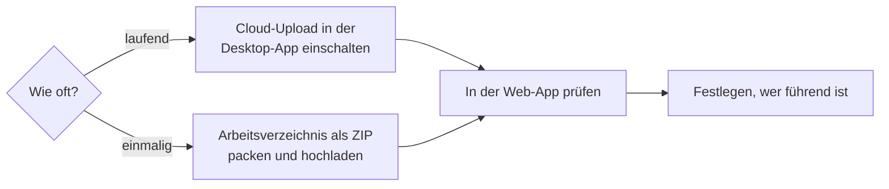

# Daten vom Desktop in die Web-App bringen

!!! example "Anleitung — am Ende sehen Sie Ihre Aufträge, Designs, Maschinen und Stammdaten aus der Desktop-App auch in der Web-App"

**Voraussetzungen:**

* Ihr [Kundenkonto](../setup/account.md) hat den Baustein **Herzog CAB Web**
  (oder die Web-Testphase), und Sie können sich in der
  [Web-App](../web/login.md) anmelden.
* Für den Cloud-Upload: Die Desktop-App ist am Kundenkonto angemeldet
  (Version 2.0 oder neuer) und der Rechner ist online.
* Für den ZIP-Import: Sie haben in der Web-App das Recht
  **Workspace-Einstellungen** (Konto-Administratoren haben es immer).

## Welcher Weg?

| | Cloud-Upload | ZIP-Import |
|---|---|---|
| Wann | Die Desktop-App bleibt das führende System, die Web-App soll immer den aktuellen Stand zeigen. | Einmaliger Umzug oder gelegentliches Nachziehen; auch ohne laufende Desktop-App. |
| Richtung | Desktop → Web, automatisch, wenige Sekunden nach dem Speichern und alle 15 Minuten | Desktop → Web (Upload) und Web → Desktop (Download), jeweils von Hand |
| Löschungen | werden übernommen, sofern der Eintrag vom Desktop stammt | werden nicht übernommen |
| Voraussetzung | Desktop-App am Konto angemeldet, Web-Baustein | Web-Baustein, Recht *Workspace-Einstellungen* |

## Weg A: Cloud-Upload einschalten

1. Öffnen Sie in der Desktop-App *Datei > Einstellungen*, Tab **Lizenz**.
2. Haken Sie in der Karte **Cloud (app.herzog-cab.com)** die Option
   **Arbeitsverzeichnis automatisch in die Cloud hochladen** an. Ist der
   Schalter grau, fehlt dem Konto der Web-Baustein — der Hinweis nennt den
   Grund (Referenz: [Lizenz und Cloud](../admin/settings/license.md)).
3. Klicken Sie auf **Jetzt hochladen**. Der Stand wechselt von
   *Arbeitsverzeichnis wird gelesen …* über *Wird hochgeladen …* zu
   *Zuletzt hochgeladen: &lt;Zeit&gt;*.
4. Klicken Sie auf **Sichern**.

Ab jetzt lädt die Desktop-App jede gespeicherte Änderung von selbst hoch.

## Weg B: Arbeitsbereich als ZIP importieren

1. Suchen Sie das Arbeitsverzeichnis: *Datei > Einstellungen*, Tab
   **Speicherorte** (Referenz: [Speicherorte](../admin/settings/files.md)).
2. Packen Sie den Ordner als ZIP — im Windows-Explorer mit Rechtsklick,
   *Senden an > ZIP-komprimierter Ordner*. Große Unterordner wie
   `machines/` können Sie weglassen.
3. Melden Sie sich in der Web-App an und öffnen Sie *Benutzermenü > Import
   aus dem Desktop* (Referenz: [Import aus dem Desktop](../web/import.md)).
4. Wählen Sie die ZIP-Datei, bei Bedarf **Nur Daten, keine Bilder und
   Dokumente**, und klicken Sie auf **Importieren**.
5. Prüfen Sie das **Ergebnis**: je Datentyp die Zahl der angelegten,
   aktualisierten und unveränderten Einträge sowie Fehler.

Der Import lässt sich jederzeit wiederholen; gleiche Einträge werden nach
Änderungsdatum aktualisiert, nichts wird gelöscht.

## In der Web-App prüfen

Öffnen Sie die [Startseite](../web/start.md) — die Kennzahlen **Aufträge**,
**Designs**, **Maschinen** und **Kunden** zeigen den Stand. Stichproben:

* [Aufträge](../web/orders.md): ein Flechtauftrag mit Design öffnen — Reiter
  **Design** zeigt Vorschau und Klöppel-Tabelle.
* [Designs](../web/designer.md): Vorschaubilder und Ordner stimmen.
* [Maschinen](../web/machines.md): Bilder vorhanden (sonst wurden sie beim
  Import übersprungen).
* [Drucken](../web/print.md): Ihre Druckvorlagen stehen unter
  **Druckvorlage wählen**.

## Festlegen, wer führend ist

Änderungen fließen **nicht** automatisch von der Web-App zurück in die
Desktop-App. Legen Sie deshalb fest:

* **Desktop führend** (typisch für die Arbeitsvorbereitung): Cloud-Upload
  an; in der Web-App wird nachgesehen, gerechnet und gedruckt. Was dort
  geändert wird, überschreibt der nächste Upload wieder.
* **Web-App führend** (Team an mehreren Orten): Cloud-Upload aus; die
  Desktop-App holt sich bei Bedarf den Stand per **Arbeitsbereich als ZIP
  herunterladen** und entpackt ihn in ein eigenes Arbeitsverzeichnis.

## Ergebnis

Die Web-App zeigt Ihren Arbeitsbereich; beim Cloud-Upload steht unter
*Einstellungen > Lizenz* der Zeitpunkt des letzten Uploads.

## Wenn etwas nicht klappt

* Schalter grau, Hinweis *Dafür braucht das Konto den Baustein „Herzog CAB
  Web"* → Jahresabo in der Web-App unter
  [Abo und Bestellung](../web/subscription.md) bestellen. Das Abo umfasst
  Programm und Web-App.
* *Fehler: Keine Verbindung zum Server* → Internet, Proxy und Firewall
  prüfen (`app.herzog-cab.com`, HTTPS).
* *Die Anmeldung am Kundenkonto gilt nicht mehr* → Desktop-App neu starten
  und am Konto anmelden.
* ZIP-Upload scheitert → Ordner `machines/` ausschließen oder **Nur Daten**
  wählen; Bilder später über die [Medienbibliothek](../web/media.md) nachladen.
* Einträge fehlen in der Web-App → in der Testphase gelten Mengengrenzen,
  zum Beispiel höchstens 2 Designs und 4 Aufträge ([Testphase](../web/trial.md)).
