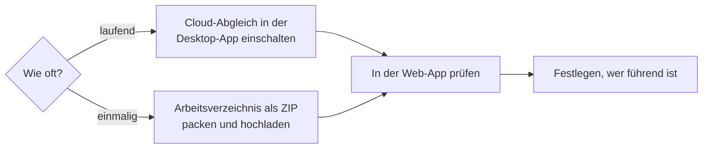

# Daten vom Desktop in die Web-App bringen

!!! example "Anleitung — am Ende sehen Sie Ihre Aufträge, Designs, Maschinen und Stammdaten aus der Desktop-App auch in der Web-App"

**Voraussetzungen:**

* Ihr [Kundenkonto](../setup/account.md) hat ein Jahresabo, das die Web-App
  umfasst (oder die Testversion), und Sie können sich in der
  [Web-App](../web/login.md) anmelden.
* Für den Cloud-Abgleich: Die Desktop-App ist am Kundenkonto angemeldet
  (Version 2.0 oder neuer) und der Rechner ist online.
* Für den ZIP-Import: Sie haben in der Web-App das Recht
  **Workspace-Einstellungen** (Konto-Administratoren haben es immer).

## Welcher Weg?

| | Cloud-Abgleich | ZIP-Import |
|---|---|---|
| Wann | Desktop-App und Web-App sollen laufend denselben Stand zeigen; die Desktop-App hat bei Konflikten Vorrang. | Einmaliger Umzug oder gelegentliches Nachziehen; auch ohne laufende Desktop-App. |
| Richtung | Desktop → Web automatisch, kurz nach dem Speichern und alle 15 Minuten; danach Web → Desktop, solange *Änderungen aus der Webapp ins Arbeitsverzeichnis übernehmen* an ist (Vorgabe) | Desktop → Web (Upload) und Web → Desktop (Download), jeweils von Hand |
| Löschungen | wirken in beide Richtungen (Einzelheiten unter [Lizenz und Cloud](../admin/settings/license.md#was-in-welche-richtung-geht)) | werden nicht übernommen |
| Voraussetzung | Desktop-App am Konto angemeldet, Abo mit Web-App; ein Arbeitsverzeichnis je Konto | Abo mit Web-App, Recht *Workspace-Einstellungen* |

## Weg A: Cloud-Abgleich einschalten

1. Öffnen Sie in der Desktop-App *Datei > Einstellungen*, Tab **Lizenz**.
2. Haken Sie in der Karte **Cloud (app.herzog-cab.com)** die Option
   **Arbeitsverzeichnis automatisch mit der Cloud abgleichen** an. Ist der
   Schalter grau, fehlt dem Konto ein Abo mit Web-App. Der Hinweis nennt den
   Grund (Referenz: [Lizenz und Cloud](../admin/settings/license.md)).
3. Lassen Sie **Änderungen aus der Webapp ins Arbeitsverzeichnis
   übernehmen** angehakt, wenn auch in der Web-App gearbeitet wird;
   nehmen Sie den Haken heraus, wenn nur der Desktop Daten ändern soll.
4. Prüfen Sie die Zeile **In der Cloud:** — beim ersten Mal steht dort
   *Noch kein Arbeitsverzeichnis – der erste Abgleich legt es fest.*
5. Klicken Sie auf **Jetzt abgleichen**. Der Stand wechselt von
   *Arbeitsverzeichnis wird gelesen …* über *Wird abgeglichen …* zu
   *Zuletzt abgeglichen: &lt;Zeit&gt;*.
6. Klicken Sie auf **Sichern**.

Ab jetzt gleicht die Desktop-App jede gespeicherte Änderung von selbst ab.

## Weg B: Arbeitsbereich als ZIP importieren

1. Suchen Sie das Arbeitsverzeichnis: *Datei > Einstellungen*, Tab
   **Speicherorte** (Referenz: [Speicherorte](../admin/settings/files.md)).
2. Packen Sie den Ordner als ZIP — im Windows-Explorer mit Rechtsklick,
   *Senden an > ZIP-komprimierter Ordner*. Große Unterordner wie
   `machines/` können Sie weglassen.
3. Melden Sie sich in der Web-App an und öffnen Sie *Benutzermenü > Import
   aus dem Desktop* (Referenz: [Import aus dem Desktop](../web/import.md)).
4. Wählen Sie die ZIP-Datei, bei Bedarf **Nur Daten, keine Bilder und
   Dokumente**, und klicken Sie auf **Importieren**.
5. Prüfen Sie das **Ergebnis**: je Datentyp die Zahl der angelegten,
   aktualisierten und unveränderten Einträge sowie Fehler.

Der Import lässt sich jederzeit wiederholen; gleiche Einträge werden nach
Änderungsdatum aktualisiert, nichts wird gelöscht.

## In der Web-App prüfen

Öffnen Sie die [Startseite](../web/start.md) — die Karte **Überblick** zeigt
mit **Aufträge**, **Designs**, **Maschinen** und **Kunden** den Stand.
Stichproben:

* [Aufträge](../web/orders.md): ein Flechtauftrag mit Design öffnen — Reiter
  **Design** zeigt Vorschau und Klöppel-Tabelle.
* [Designs](../web/designer.md): Vorschaubilder und Ordner stimmen.
* [Maschinen](../web/machines.md): Bilder vorhanden (sonst wurden sie beim
  Import übersprungen).
* [Drucken](../web/print.md): Ihre Druckvorlagen stehen unter
  **Druckvorlage wählen**.

## Festlegen, wie beide zusammenarbeiten

Der Cloud-Abgleich lädt zuerst hoch und holt danach die Änderungen aus der
Web-App; ändern beide Seiten denselben Eintrag, gewinnt der Desktop.
Wählen Sie eine dieser Arbeitsweisen:

* **Beide arbeiten** (Vorgabe): Abgleich an, *Änderungen aus der Webapp
  ins Arbeitsverzeichnis übernehmen* an. Aufträge, Designs, Stammdaten,
  Maschinen, Hallenpläne und Dateien aus der Web-App kommen ins
  Arbeitsverzeichnis, Löschungen eingeschlossen. Sprechen Sie ab, wer
  welchen Eintrag bearbeitet.
* **Desktop führend**: Abgleich an, Rückweg aus. In der Web-App wird
  nachgesehen, gerechnet und gedruckt; dort Geändertes bleibt in der
  Cloud, bis der Desktop denselben Eintrag ändert und ihn überschreibt.
* **Web-App führend** (ohne laufende Desktop-App): Abgleich aus; die
  Desktop-App holt sich bei Bedarf den Stand per **Arbeitsbereich als ZIP
  herunterladen** und entpackt ihn in ein eigenes Arbeitsverzeichnis.

## Ergebnis

Die Web-App zeigt Ihren Arbeitsbereich; beim Cloud-Abgleich steht unter
*Einstellungen > Lizenz* der Zeitpunkt des letzten Abgleichs.

## Wenn etwas nicht klappt

* Schalter grau, Hinweis *Dafür braucht das Konto den Baustein „Herzog CAB
  Web"* → Jahresabo in der Web-App unter
  [Abo und Bestellung](../web/subscription.md) bestellen. Das Abo umfasst
  Programm und Web-App.
* *Fehler: Keine Verbindung zum Server* → Internet, Proxy und Firewall
  prüfen (`app.herzog-cab.com`, HTTPS).
* *Die Anmeldung am Kundenkonto gilt nicht mehr* → Desktop-App neu starten
  und am Konto anmelden.
* *Dieses Konto wird schon vom Arbeitsverzeichnis „…" abgeglichen …* → Das
  Konto gleicht bereits mit einem anderen Arbeitsverzeichnis (Profil) ab.
  Arbeiten Sie in diesem, oder binden Sie die Cloud mit **Stattdessen
  dieses Arbeitsverzeichnis verwenden …** um (Recht *Arbeitsbereich
  verwalten*).
* ZIP-Upload scheitert → Ordner `machines/` ausschließen oder **Nur Daten**
  wählen; Bilder später über die [Medienbibliothek](../web/media.md) nachladen.
* Einträge fehlen in der Web-App → in der Testphase gelten Mengengrenzen,
  zum Beispiel höchstens 2 Designs und 4 Aufträge ([Testphase](../web/trial.md)).
