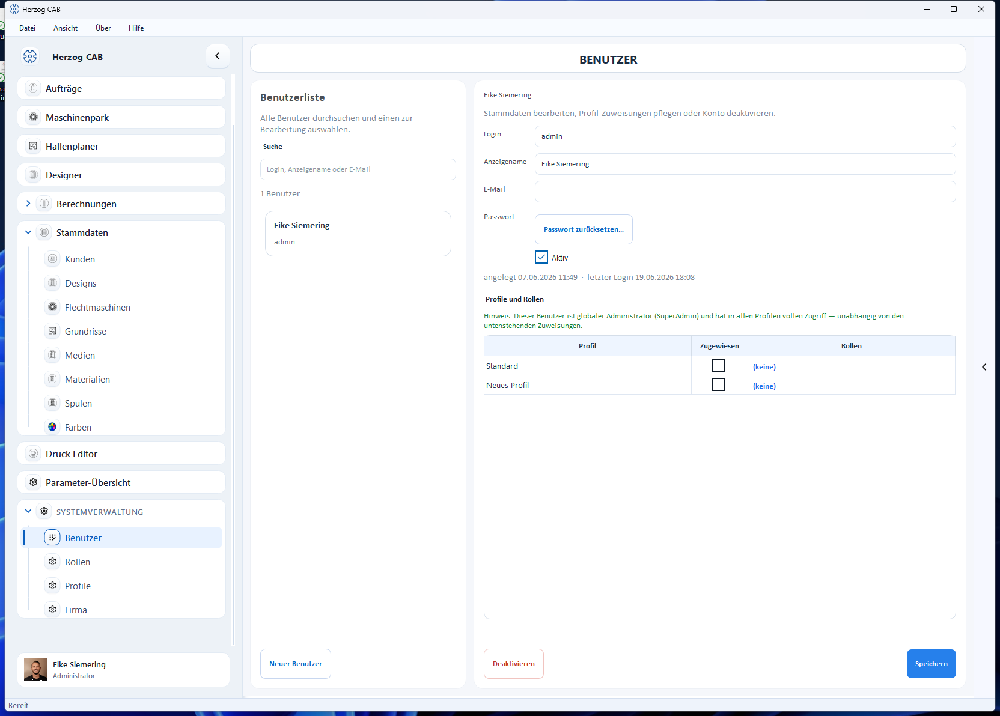

# Eigenes Profil

Jeder Benutzer hat ein persönliches Konto mit **Anzeigename**, **E-Mail**,
**Passwort** und **Profilbild**. Diese Daten bearbeiten Administratoren in der
[Benutzerverwaltung](manage.md); Ihren Anmeldenamen und Ihr Bild sehen Sie
außerdem unten links in der Navigationsleiste.

## Was zum Konto gehört

| Angabe | Beschreibung |
|---|---|
| **Login** | Anmeldename (wird zum Einloggen verwendet). |
| **Anzeigename** | Name, der in der Oberfläche und auf Ausdrucken erscheint. |
| **E-Mail** | Optionale Kontaktadresse. |
| **Passwort** | Über **Passwort zurücksetzen…** ändern – siehe [Passwort zurücksetzen](password-reset.md). |
| **Profilbild** | Foto/Avatar – siehe [Profilbild ändern](avatar.md). |

!!! note "Wer darf was ändern?"
    Das Bearbeiten fremder Konten erfordert das Recht **Benutzer verwalten**.
    Ohne dieses Recht wenden Sie sich für Änderungen an Ihren Administrator.
