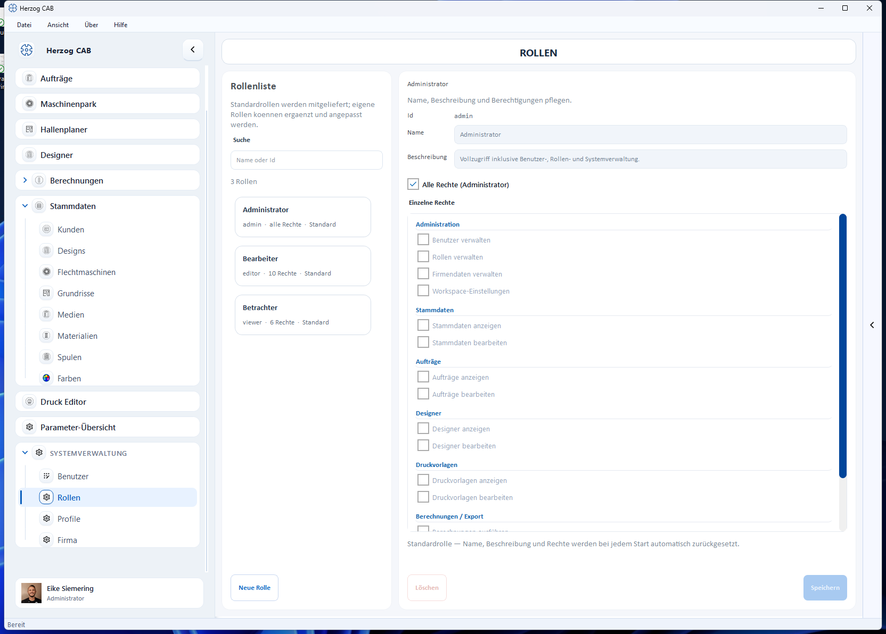

# Rollen und Berechtigungen

Herzog CAB hat ein **rollenbasiertes Rechtesystem**. Statt einzelne
Berechtigungen pro Benutzer zu setzen, weisen Sie [Benutzern](manage.md) Rollen
zu – die Rolle bündelt die Berechtigungen. Die Verwaltung öffnen Sie über
**Systemverwaltung → Rollen**.

## Eingebaute Rollen

Herzog CAB liefert drei Standardrollen mit. Sie können ergänzt und angepasst
werden; die mitgelieferten Standardrollen werden bei jedem Start automatisch
auf ihre Vorgaben zurückgesetzt.

| Rolle | Zielgruppe | Rechte |
|---|---|---|
| **Administrator** | IT / Fachverantwortlicher | Vollzugriff inkl. Benutzer-, Rollen- und Systemverwaltung („Alle Rechte"). |
| **Bearbeiter** | Datenpflege / Arbeitsvorbereitung | Stammdaten, Aufträge, Designer, Druckvorlagen bearbeiten, Berechnungen nutzen. |
| **Betrachter** | Auszubildende / Gäste | Nur ansehen, nichts verändern. |

## Einzelne Rechte

Eine Rolle setzt sich aus Einzelrechten zusammen, gruppiert nach Bereichen:

| Bereich | Rechte |
|---|---|
| **Administration** | Benutzer verwalten · Rollen verwalten · Firmendaten verwalten · Workspace-Einstellungen |
| **Stammdaten** | Stammdaten anzeigen · Stammdaten bearbeiten |
| **Aufträge** | Aufträge anzeigen · Aufträge bearbeiten |
| **Designer** | Designer anzeigen · Designer bearbeiten |
| **Druckvorlagen** | Druckvorlagen anzeigen · Druckvorlagen bearbeiten |
| **Berechnungen / Export** | Berechnungen nutzen · Drucken / Export |

Mit der Option **Alle Rechte** erhält eine Rolle pauschal sämtliche
Berechtigungen (entspricht *Administrator*).

## Eigene Rollen anlegen

Über **Neue Rolle** legen Sie eine Rolle an, vergeben Name und Beschreibung und
haken die gewünschten Einzelrechte an. **Speichern** sichert sie; **Löschen**
entfernt eine eigene Rolle.

!!! tip "Sparsam mit Rollen"
    Beginnen Sie mit den Standardrollen. Eigene Rollen lohnen sich erst bei
    Sonderfällen – z. B. eine Rolle, die Berechnungen nutzen, aber nicht drucken
    darf.
