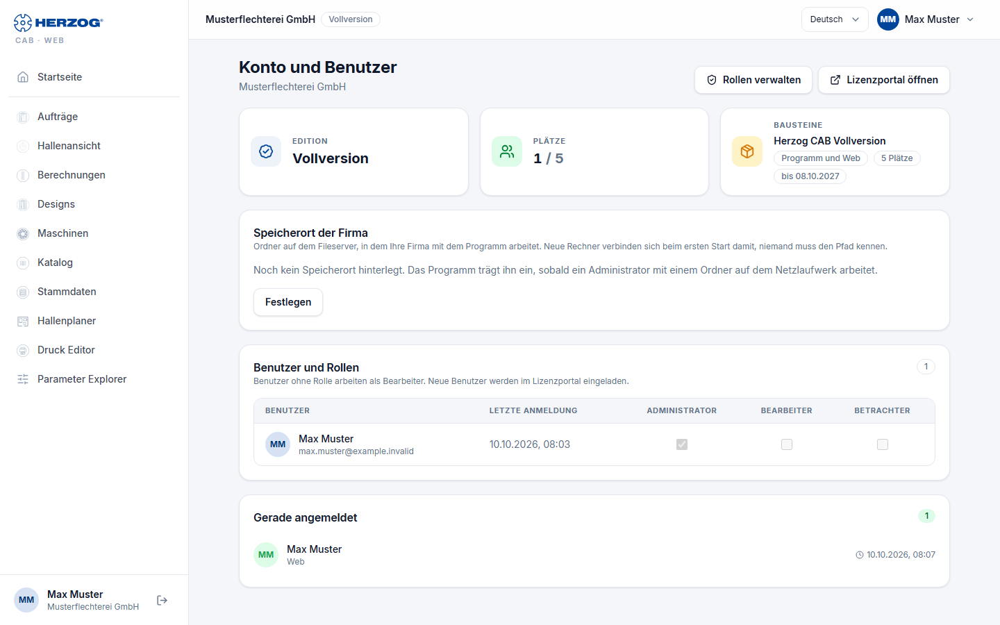

# Konto und Benutzer (Web-App)

!!! abstract "Referenz — Die Seite „Konto und Benutzer" im Benutzermenü der Web-App: Edition, Bausteine, Plätze, Benutzer und ihre Rollen"

## Wofür Sie diesen Bereich nutzen

Hier sehen Sie, was Ihr Konto in der Web-App freigeschaltet hat und wer
gerade damit arbeitet — und Administratoren weisen den Benutzern ihre
**Rollen für die Web-App** zu. Neue Benutzer einladen, Passwörter und
Rechner verwaltet weiterhin das [Lizenzportal](../portal/index.md); die
Seite verlinkt dorthin.

Sie öffnen die Seite über *Benutzermenü > Konto und Benutzer* oder die
Kachel **Konto und Benutzer** auf der Startseite.

## Der Bildschirm im Überblick

| Element | Bedeutung |
|---|---|
| **Edition** | Welche Ausführung der Web-App für das Konto gilt: Vollversion, Designer oder Testphase. Bei internen Konten der Vermerk *internes Konto*. |
| **Plätze** | Belegte und vorhandene Plätze, zum Beispiel *2 / 3*. Programm und Web-App zählen zusammen. |
| **Bausteine** | Die Bausteine, die die Web-App öffnen, mit der Zahl der Plätze und der Laufzeit (*bis &lt;Datum&gt;* oder *Lebenszeit*). |
| **Gerade angemeldet** | Wer gerade einen Platz belegt und wo: Rechnername, *Web* oder *(offline)*. |
| **Rollen verwalten** | Wechselt zu [Rollen](roles.md). |
| **Lizenzportal öffnen** | Öffnet [license.herzog-cab.com](https://license.herzog-cab.com) in einem neuen Tab. |

### Benutzer und Rollen

Die Tabelle listet alle Benutzer des Kontos mit **Name**, **E-Mail**,
**Letzte Anmeldung**, dem Kennzeichen **Gerade angemeldet** bzw. *inaktiv*
und je Rolle ein **Kästchen**.

* **Rolle zuweisen:** Administratoren haken die Kästchen an oder ab; die
  Änderung gilt sofort. Ein Benutzer kann mehrere Rollen haben — die Rechte
  addieren sich.
* **Ohne Rolle** arbeitet ein Benutzer als **Bearbeiter**.
* Die Rolle **Administrator** aus dem Kundenkonto hat immer alle Rechte;
  sie lässt sich hier nicht abwählen.

!!! info "Zwei Orte, ein Benutzer"
    Die Konto-Rolle (Administrator / Bearbeiter / Betrachter) vergibt das
    [Lizenzportal](../portal/users.md); sie gilt in Desktop-App und Web-App.
    Die Kästchen hier ergänzen sie um **Web-App-Rollen** mit einzelnen
    Rechten — nützlich, wenn z. B. der Vertrieb nur Designs und Aufträge
    sehen soll.

## Verwandte Seiten

* [Rollen (Web-App)](roles.md) — eigene Rollen mit einzelnen Rechten
* [Benutzer einladen und verwalten (Lizenzportal)](../portal/users.md)
* [Abo und Bestellung](subscription.md): Jahresabo bestellen und verlängern
* [Kundenkonto und Einladung](../setup/account.md)
