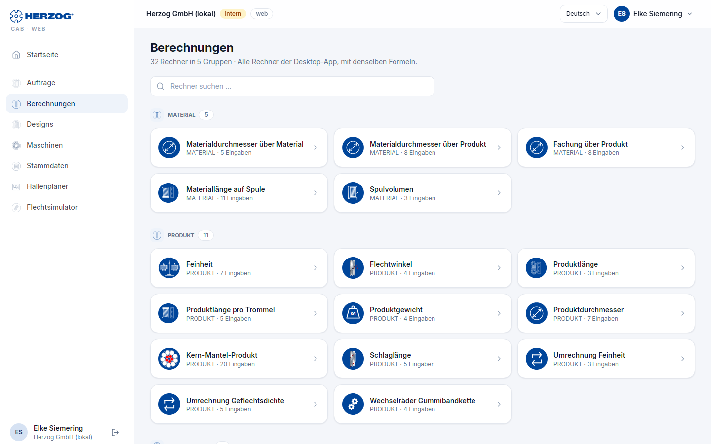
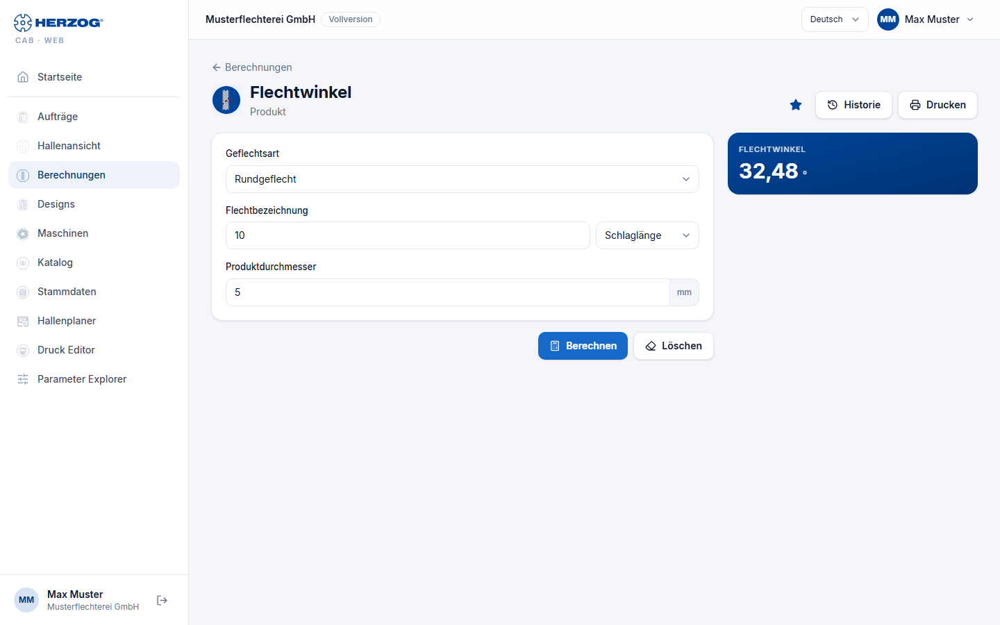

# Berechnungen (Web-App)

!!! abstract "Referenz — Das Modul Berechnungen der Web-App: Rechnerübersicht mit Suche, Favoriten und Historie sowie die Rechnerseite"

## Wofür Sie diesen Bereich nutzen

Die Web-App enthält alle Rechner der Desktop-App in denselben fünf
Gruppen — Material, Produkt, Hohlgeflecht, Produktion und Spulerei —,
darunter auch **Flechtwinkel über Abzug** und
**Trommel- und Aufwicklerwahl** (Stand 30.09.2026: 34 Rechner; die aktuelle
Zahl steht unter dem Seitentitel). Eingaben, Auswahlfelder, Einheiten,
Formeln und Ergebnisse sind dieselben wie in der Desktop-App; die Bedeutung
jedes Felds steht auf der Referenzseite des jeweiligen Rechners im Kapitel
[Berechnungen](../calculations/index.md). Diese Seite beschreibt nur die
Bedienung im Browser.

!!! info "Unterschied zur Desktop-App"
    Favoriten, die Historie der Berechnungen und die zuletzt eingegebenen
    Werte gehören in der Web-App zu Ihrem Benutzer und gelten auf jedem
    Gerät. Zusätzlich gibt es eine Suche über alle Rechner.
    **Produktlänge pro Trommel** behält im Browser die drei Maßfelder
    (*Außendurchmesser*, *Kerndurchmesser*, *Wickellänge*): Die Auswahl
    **Trommel:** füllt sie aus den [Trommeln](master-data.md#trommeln), mit
    *Eigene Maße* tragen Sie sie selbst ein. In der Desktop-App kommen die
    Maße seit Version 2.1.0 nur aus der gewählten Trommel.

## Rechnerübersicht

| Element | Bedeutung |
|---|---|
| Untertitel | Anzahl der Rechner und Gruppen, dazu *Alle Rechner der Desktop-App, mit denselben Formeln.* |
| **Historie** | Öffnet die letzten Berechnungen (höchstens zehn) mit Ergebnis und Zeit; ein Klick öffnet den Rechner mit den damaligen Eingaben und rechnet neu. |
| **Rechner suchen …** | Filtert die Kacheln live nach dem Namen des Rechners. Passt nichts, meldet die Seite *Kein Rechner passt zu „…"*. |
| **Favoriten** | Gruppe ganz oben mit Ihren Lieblingsrechnern, sobald Sie mindestens einen markiert haben. |
| Gruppen | **Material**, **Produkt**, **Hohlgeflecht**, **Produktion**, **Spulerei** — jede mit ihren Rechner-Kacheln (Symbol, Name, Zahl der Eingaben). |
| Kachel | Ein Klick öffnet die Rechnerseite. Der Stern oben rechts (**Favorisieren** / **Favorit entfernen**) nimmt den Rechner in die Favoriten auf oder wieder heraus. |

## Rechnerseite

| Element | Bedeutung |
|---|---|
| **Berechnungen** (Pfeil) | Zurück zur Rechnerübersicht. |
| Stern, **Historie** | Wie in der Übersicht: Favorit setzen oder entfernen, letzte Berechnungen öffnen. |
| **Eingaben** | Alle Eingabefelder mit Einheit; Auswahlfelder wie *Material wählen …* und *Spule wählen …* greifen auf Ihre [Stammdaten](master-data.md) zu. Ein kleines Bild neben manchen Feldern erklärt die Größe (z. B. den Flechtwinkel). |
| **Einheit** | Wo die Desktop-App einen Einheiten-Umschalter hat (z. B. Feinheit in tex, dtex, den, Nm, Ne), gibt es ihn auch hier. |
| **Berechnen** | Führt die Berechnung aus. Fehlende oder ungültige Eingaben werden am Feld markiert. |
| **Löschen** | Setzt alle Eingaben auf die Vorgabewerte zurück. |
| **Ergebnis** | Die Ergebniswerte mit Einheit — dieselben Werte und Nachkommastellen wie am Desktop. Rechner mit Tabelle (z. B. *Trommeln und Haspeln* der Trommel- und Aufwicklerwahl) zeigen sie darunter. |
| **Drucken** | Druckt Eingaben und Ergebnis über den Browser (siehe [Drucken](print.md)). |

Die zuletzt eingegebenen Werte merkt sich die Web-App je Rechner für Ihren
Benutzer, auch über Geräte hinweg; das Ergebnis bleibt beim Wechsel
zwischen den Seiten erhalten. **Löschen** setzt die Eingaben zurück. Jede
Berechnung mit Ergebnis landet in der Historie — außer bei den beiden
Umrechnern (*Umrechnung Feinheit*, *Umrechnung Geflechtsdichte*) und
*Maschinen Dimensionierung*, wie in der Desktop-App.

!!! info "Flechtwinkel zur Querrichtung oder zur Geflechtsachse"
    Ob Winkelfelder und -ergebnisse gegen die Querrichtung (Herzog) oder
    gegen die Geflechtsachse (Fachliteratur) gemessen werden, stellen Sie
    unter [Einstellungen](settings.md#flechtwinkel) ein. Zeigen Sie auf
    einen Winkel, nennt eine Einblendung beide Werte. Auch das kleine
    Erklärbild am Feld folgt der Wahl.

!!! tip "Rechner aus dem Auftrag heraus"
    Im [Flechtauftrag](orders.md) und [Spulauftrag](orders.md) öffnen die
    Rechner-Symbole neben den Feldern denselben Rechner als Dialog —
    vorbelegt mit den Auftragswerten und mit **Übernehmen** zurück in den
    Auftrag.

## Verwandte Seiten

* [Berechnungen (Referenz aller Rechner)](../calculations/index.md)
* [So sind Berechnungsseiten aufgebaut](../basics/calc-page-anatomy.md) — Aufbau in der Desktop-App
* [Material richtig kalkulieren](../tasks/material-calculation.md)
