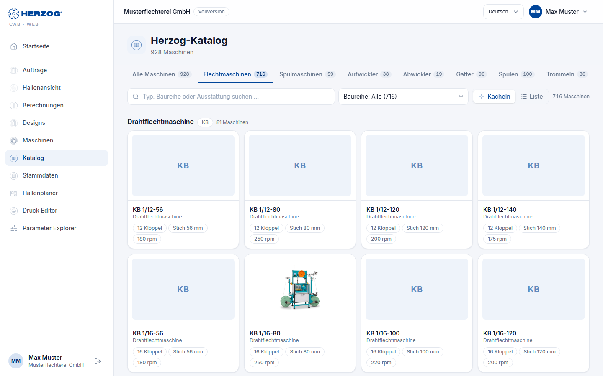
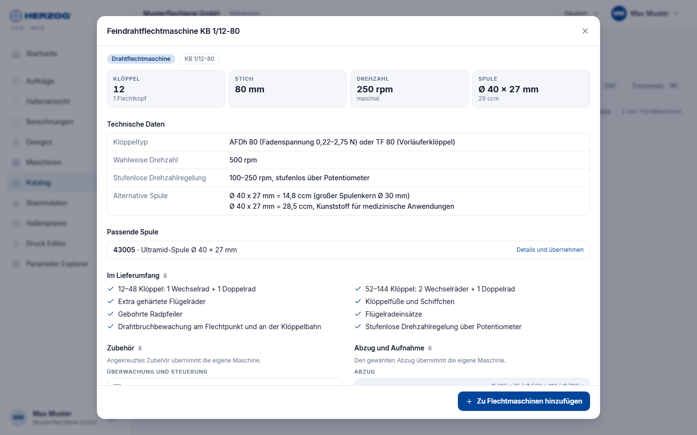
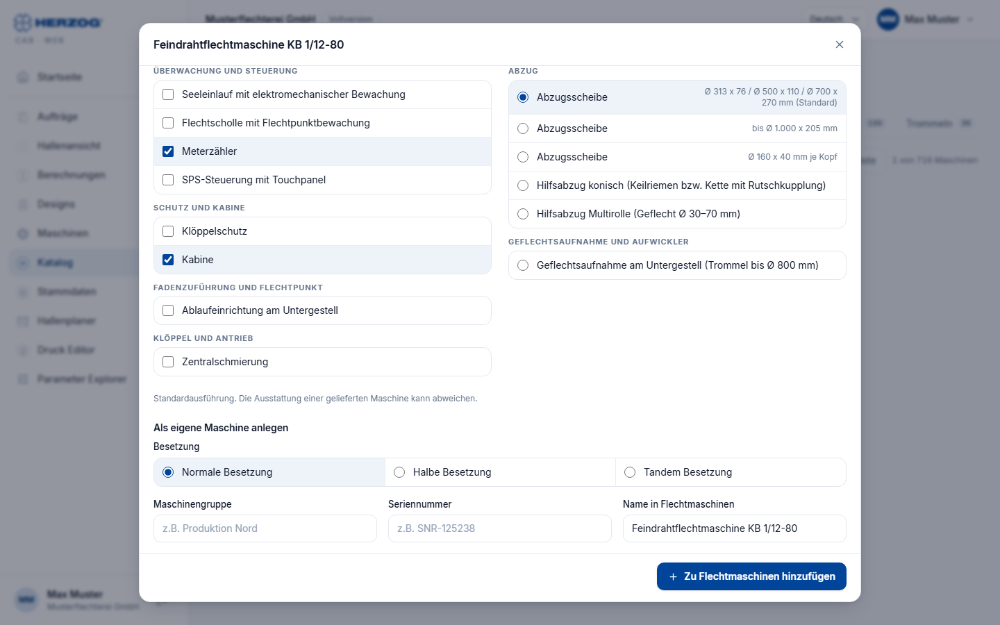

# Herzog-Katalog (Web-App)

!!! abstract "Referenz — Der Herzog-Katalog der Web-App: die Maschinenmodelle, Spulen und Trommeln von Herzog ansehen und direkt als eigene Maschine übernehmen"

## Wofür Sie diesen Bereich nutzen

Der Herzog-Katalog enthält die Modelle von Herzog: Flechtmaschinen,
Spulmaschinen, Aufwickler, Abwickler und Gatter sowie Spulen und Trommeln.
Sie sehen sich ein Modell mit seinen technischen Daten an und legen es mit
wenigen Klicks als eigene Maschine an. Die Technik (Köpfe, Klöppel, Stich,
Drehzahl, Wickeltechnik, Trommel- und Gatterdaten) und das Bild kommen aus
dem Katalog; Sie wählen nur Zubehör, Abzug und Besetzung und tragen Gruppe,
Seriennummer und Namen ein.

!!! info "Wer den Katalog sieht"
    Der Herzog-Katalog steht allen Konten mit Maschinen zur Verfügung, in
    Herzog CAB Designer gibt es ihn nicht. Im Programm finden Sie ihn ab
    Version 2.1.0 ebenfalls, als eigenen Punkt **Katalog** unter dem
    Maschinenpark — siehe [Herzog-Katalog (Desktop-App)](../catalog/index.md).

## Die Übersicht

| Element | Bedeutung |
|---|---|
| Reiter | **Alle Maschinen**, **Flechtmaschinen**, **Spulmaschinen**, **Aufwickler**, **Abwickler**, **Gatter**, **Spulen** und **Trommeln**, je mit der Anzahl der Einträge. |
| **Suchen** | Filtert nach Typ, Baureihe oder Ausstattung; bei Spulen und Trommeln nach Maß, Werkstoff, Klöppel oder Artikelnummer. |
| **Baureihe** | Grenzt die Liste auf eine Baureihe ein (z. B. *Drahtflechtmaschine · KB*); in Klammern steht die Anzahl. |
| **Kacheln** / **Liste** | Karten mit Bild und Kennzahlen oder eine Tabelle, deren Spalten sich per Klick auf die Überschrift sortieren lassen. Die Wahl bleibt gespeichert. |
| Karte / Zeile | Ein Klick öffnet die Details des Modells. |

## Details eines Maschinenmodells

Die Details zeigen von oben nach unten:

| Bereich | Inhalt |
|---|---|
| **Kopf** | Bild (falls vorhanden), Baureihe, Modellbezeichnung und die Kennzahlen je Maschinenart — Flechtmaschine: **Klöppel** (mit Zahl der Flechtköpfe), **Stich**, **Drehzahl**, **Spule**; Spulmaschine: **Spulstellen**, **Spulengröße**, **Verlegebreite**, **Drehzahl**; Aufwickler: **Trommeldurchmesser** bzw. **Haspeldurchmesser** und **Haspelvolumen**, **Verlegebreite**, **Traglast**, **Geflechtdurchmesser**; Abwickler: **Trommeldurchmesser**, **Trommelbreite**, **Traglast**, **Materialdurchmesser**; Gatter: **Ablaufstellen**, **Ablauf**, **Spule**. |
| **Technische Daten** | Die übrigen Angaben des Modells (z. B. Klöppeltyp, Verlegung, Steuerung, Ausführung). Die **Besetzung** einer Flechtmaschine steht hier nur, wenn es keine Wahl gibt — sonst wählen Sie sie unten beim Anlegen. |
| **Passende Spule** | Nur bei Flechtmaschinen: die Katalogspule mit den Maßen der Maschine. Ein Klick zeigt ihre Details; dort übernehmen Sie sie mit **Zu Spulen hinzufügen** in Ihre Spulen. |
| **Im Lieferumfang** | Was serienmäßig zur Maschine gehört. |
| **Zubehör** | Das lieferbare Zubehör, gruppiert (z. B. *Überwachung und Steuerung*, *Schutz und Kabine*). Kreuzen Sie an, was Ihre Maschine hat — **angekreuztes Zubehör übernimmt die eigene Maschine**. Ein Klick irgendwo auf die Zeile setzt oder entfernt das Häkchen; angekreuzte Zeilen sind hinterlegt. |
| **Abzug und Aufnahme** | Nur bei Flechtmaschinen: die Abzugs- und Aufnahmevarianten mit ihren Maßen. Genau eine ist gewählt (Auswahlkreis), vorgewählt die erste (Standard). **Den gewählten Abzug übernimmt die eigene Maschine.** |
| **Hinweise** | Ergänzende Angaben, z. B. bei Aufwicklern. |

Ohne das Recht *Stammdaten bearbeiten* sind Zubehör und Abzug nur zu sehen,
und der Bereich zum Anlegen fehlt.

## Als eigene Maschine anlegen

Am Ende der Details tragen Sie nur ein, was der Katalog nicht wissen kann:

| Feld | Bedeutung |
|---|---|
| **Besetzung** | Nur bei Flechtmaschinen mit mehreren Besetzungen: **Normale Besetzung**, **Halbe Besetzung** oder **Tandem Besetzung** nebeneinander zum Anklicken. Vorgewählt ist die Besetzung, mit der die Maschine üblicherweise läuft. |
| **Maschinengruppe** | Frei vergebbare Gruppierung (z. B. *Produktion Nord*). |
| **Seriennummer** | Seriennummer Ihrer Maschine. |
| **Name in Flechtmaschinen** | Der Name im Maschinenpark, vorbelegt mit dem Katalognamen. Bei den anderen Maschinenarten heißt das Feld **Name in Spulmaschinen**, **Name in Aufwicklern**, **Name in Abwicklern** bzw. **Name in Gattern**. |

| Schaltfläche | Wirkung |
|---|---|
| **Produktseite** | Öffnet die Produktseite des Modells auf herzog-online.com (nicht bei allen Modellen). |
| **Zu Flechtmaschinen hinzufügen** | Legt die Maschine sofort im [Maschinenpark](machines.md) an — mit der Technik und dem Bild aus dem Katalog, dem angekreuzten Zubehör, dem gewählten Abzug und der gewählten Besetzung. Bei den anderen Maschinenarten heißt die Schaltfläche **Zu Spulmaschinen hinzufügen**, **Zu Aufwicklern hinzufügen**, **Zu Abwicklern hinzufügen** bzw. **Zu Gattern hinzufügen**. Eine Meldung bestätigt das Anlegen, die Details schließen sich. |

!!! info "Spulen zuordnen"
    Eine aus dem Katalog angelegte Flechtmaschine hat noch keine Spule.
    Öffnen Sie sie im Maschinenpark und wählen Sie im Reiter **Technik** unter
    **Spulen** mindestens eine aus — ohne Spule meldet die Maschinenseite
    beim Speichern *Bitte mindestens eine Spule auswählen.*

!!! tip "Später ergänzen"
    Standort, Baujahr, Abmessungen, Dokumente und alle technischen Werte
    ändern Sie danach auf der [Maschinenseite](machines.md#maschinenseite).
    Zubehör und Abzug lassen sich dort ebenfalls anpassen.

## Spulen und Trommeln

In den Reitern **Spulen** und **Trommeln** stehen die Spulen und Trommeln von
Herzog mit Maßen, Werkstoff und Artikelnummer. Die Details zeigen die
technischen Daten; **Zu Spulen hinzufügen** bzw. **Zu Trommeln hinzufügen**
übernimmt den Eintrag in Ihre [Stammdaten](master-data.md). Steht er dort
schon, sagt der Dialog das und die Schaltfläche bleibt grau.

## Verwandte Seiten

* [Maschinen (Web-App)](machines.md) — Maschinenpark und Maschinenseite
* [Flechtmaschinen (Stammdaten)](../master-data/braiding-machines.md) · [Spulmaschinen (Stammdaten)](../master-data/winding-machines.md) — Bedeutung der Maschinendaten
* [Stammdaten (Web-App)](master-data.md) — Spulen und Trommeln
* [Herzog-Katalog (Desktop-App)](../catalog/index.md) — derselbe Katalog im Programm
