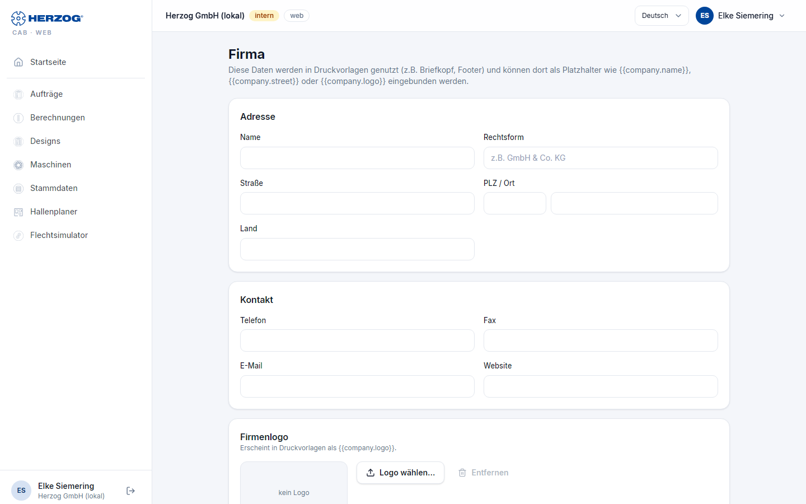

# Firma (Web-App)

!!! abstract "Referenz — Die Seite „Firma" im Benutzermenü der Web-App: Firmendaten und Logo für Druckvorlagen"

## Wofür Sie diesen Bereich nutzen

Die Firmendaten erscheinen auf Ausdrucken — als Briefkopf, in der Fußzeile
oder wo immer eine Druckvorlage die Platzhalter `{{company.name}}`,
`{{company.street}}`, `{{company.logo}}` usw. verwendet. Die Seite entspricht
[Firma](../admin/company.md) in der Systemverwaltung der Desktop-App; beide
schreiben dieselben Daten des Arbeitsbereichs.

Sie öffnen die Seite über *Benutzermenü > Firma*. Zum Ändern brauchen Sie
das Recht **Firmendaten verwalten**; sonst ist die Seite nur lesbar.

## Der Bildschirm im Überblick

| Karte | Felder |
|---|---|
| **Firma** | **Name**, **Rechtsform**. |
| **Adresse** | **Straße**, **PLZ / Ort**, **Land**. |
| **Kontakt** | **Telefon**, **Fax**, **E-Mail**, **Website**. |
| **Rechtliches** — Steuern & Handelsregister | **USt-IdNr.**, **Steuernummer**, **HR-Nummer**, **Registergericht**, **Geschäftsführer**. |
| **Firmenlogo** | Vorschau des Logos; **Logo wählen…** lädt ein Bild hoch bzw. wählt eines aus der [Medienbibliothek](media.md), **Entfernen** löscht die Zuordnung. Erscheint in Druckvorlagen als `{{company.logo}}`. |

**Speichern** übernimmt alle Karten; die Bestätigung lautet *Firmendaten
gespeichert.*

## Verwandte Seiten

* [Firma (Desktop-App)](../admin/company.md)
* [Drucken (Web-App)](print.md)
* [Elemente und Platzhalter (Druck-Editor)](../print-templates/elements.md) — die Platzhalter im Detail
