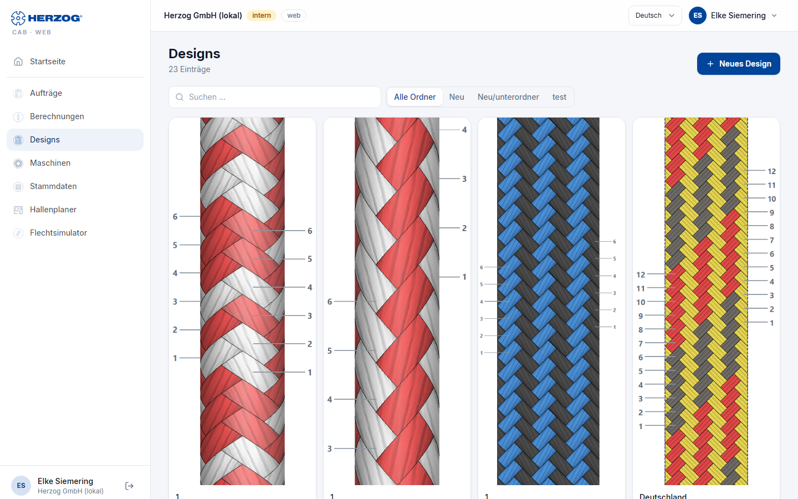
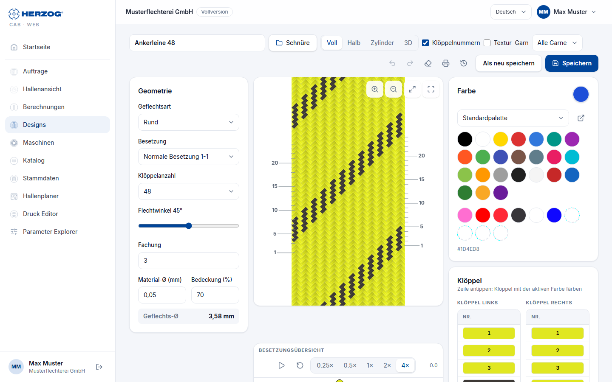

# Designs und Designer (Web-App)

!!! abstract "Referenz — Das Modul Designs der Web-App: Design-Bibliothek und der Designer mit Geometrie, Flechtbild, Farben, Klöppeltabelle, Besetzungsübersicht und 3D-Ansicht"

## Wofür Sie diesen Bereich nutzen

Unter **Designs** liegt die Design-Bibliothek Ihres Kontos; ein Klick auf
ein Design öffnet den **Designer**. Er beherrscht wie die Desktop-App alle
sechs Geflechtsarten (Rund, Litze, Quadrat, Spirale, Packung, Soutache) mit
ihren Bindungen, zeichnet dasselbe Flechtbild, zeigt die Besetzungsübersicht
mit Gangbahn-Animation und das echte 3D-Modell des Geflechts. Was die
einzelnen Parameter bedeuten, steht in der Referenz des Desktop-Designers
([Geflechtsart und Parameter](../designer/parameters.md)); hier geht es um
die Bedienung im Browser.

## Design-Bibliothek

| Element | Bedeutung |
|---|---|
| **Neues Design** | Legt ein neues Design mit Standardwerten an und öffnet den Designer. |
| **Suchen …** | Filtert nach dem Namen. |
| **Ordner** | Filter nach dem Ordner des Designs (Segment-Schalter bei wenigen Ordnern, sonst Auswahlfeld); **Alle Ordner** hebt den Filter auf. |
| Eintrag | Vorschaubild (*keine Vorschau*, solange das Design noch nie gespeichert wurde), Name und Chips mit Geflechtsart, Klöppelzahl und Flechtwinkel. Ein Klick öffnet das Design. |
| **Löschen** | Entfernt das Design nach Sicherheitsabfrage. |

Designs aus der Desktop-App erscheinen hier nach dem
[Import](import.md) bzw. dem Cloud-Upload mit ihrem Ordner.

## Der Designer im Überblick

Am Desktop ist der Designer dreispaltig: **Geometrie** links, **Flechtbild**
mit **Besetzungsübersicht** in der Mitte, **Farben** und **Klöppeltabelle**
rechts. Auf Tablet und Smartphone liegt das Flechtbild oben in voller
Breite; darunter schalten die Reiter **Geometrie**, **Farben** und
**Übersicht** die Bereiche um.

### Kopfzeile und Werkzeugleiste

| Element | Wirkung |
|---|---|
| **Produktname** | Name des Designs (Kopfzeile). |
| **Ansicht**: **Abwicklung** / **Zylinder** bzw. **Vierkant** / **3D** | *Abwicklung* ist das flache Flechtbild. *Zylinder* (Rund) bzw. *Vierkant* (Quadrat, Packung) projiziert die Abwicklung drehbar auf den Körper. *3D* zeigt das echte Modell aus den Klöppelbahnen — für alle Geflechtsarten (siehe unten). |
| **Klöppelnummern** | Blendet die Klöppelbezeichnungen im Flechtbild ein oder aus. |
| **Rückgängig** / **Wiederholen** | Färbeschritte zurücknehmen bzw. wiederherstellen. |
| **Alle Farben löschen** | Setzt alle Klöppel auf ungefärbt. |
| **Farben um einen Klöppel drehen** | Rotiert die Farbbelegung um eine Position — praktisch für Spiralmuster. |
| **Vergrößern** / **Verkleinern** / **Einpassen** | Zoom des Flechtbilds; zusätzlich Mausrad (am Touchscreen zwei Finger) und Ziehen mit gedrückter Maustaste. |
| **Drucken** | Öffnet die [Druckseite](print.md) mit der Design-Vorlage. |
| **Speichern** / **Als neu speichern** | Speichert das Design bzw. legt eine Kopie unter neuem Namen an. Beim Speichern entsteht das Vorschaubild für die Bibliothek. |

### Geometrie

| Feld | Bedeutung |
|---|---|
| **Geflechtsart** | Rundgeflecht, Litzengeflecht, Quadratgeflecht, Spiralgeflecht, Packungsgeflecht, Soutachegeflecht. |
| **Bahn-Art** | Nur Packungsgeflecht: Familie (2-, 3-, 4-bahnig, rund). |
| **Besetzung** | Bindung: Normal, Halb, Tandem usw. — je nach Geflechtsart. |
| **Klöppelanzahl** | Zulässige Klöppelzahlen der gewählten Geflechtsart und Bindung. |
| **Flechtwinkel** | Wirkt auf das Flechtbild und live auf die 3D-Ansicht. |
| **Fachung** | Anzahl der Fäden je Klöppel. |
| **Seelenfäden** | Nur Soutache: Seelen durch die Radachsen. |
| **Material-Ø** / **Bedeckung %** | Materialdurchmesser und Bedeckung; die Bedeckung steuert in der 3D-Ansicht die gezeichnete Fadendicke. |
| **Ordner** | Ordner in der Bibliothek. |

Die Bedeutung dieser Parameter je Geflechtsart erklärt
[Geflechtsart und Parameter](../designer/parameters.md).

### Farben und Klöppeltabelle

* **Farbe:** Die Farbpalette aus Ihren [Farben-Stammdaten](master-data.md)
  und **Eigene Farbe** (Farbwähler). Die aktive Farbe ist hervorgehoben.
* **Färben:** Klicken Sie auf eine Kachel im **Flechtbild** oder auf eine
  Zeile der **Klöppeltabelle** — der Klöppel (bei Rund- und Quadratgeflecht:
  Index und Laufseite) übernimmt die aktive Farbe. Beim Zeigen auf eine
  Kachel nennt eine Einblendung den Klöppel.
* **Klöppeltabelle:** Spalten **Nr.**, **Seite**, **Hornrad**, **Einschnitt**
  und Farbe — dieselbe Belegung, die später im Auftrag und auf dem Druck
  erscheint.

### Besetzungsübersicht

Die Draufsicht der Maschine mit Flügelrädern und Klöppeln unter dem
Flechtbild — mit **Gangbahn-Animation** (**Anhalten**, **Zurück auf
Anfang**, **Tempo**). Läuft die Animation in der 3D-Ansicht, wächst das
Geflecht synchron mit. Details zur Übersicht:
[Besetzung und Gangbahn-Animation](../designer/animation.md).

### 3D-Ansicht

Die Ansicht **3D** zeigt das Geflecht als räumliches Modell — jeder Faden
als Rohr, über/unter aus der Kinematik der Besetzungsübersicht, in den
Klöppelfarben. Sie funktioniert für alle sechs Geflechtsarten (Mischdesigns
ausgenommen).

| Element | Wirkung |
|---|---|
| **Draufsicht** / **Seitenansicht** / **Flechtpunkt** | Drei feste Kameraansichten: Querschnitt, ganzes Geflecht von der Seite, Nahaufnahme der Entstehungsstelle. |
| **Schloss** | Gesperrt: Maus und Finger drehen nicht, das Mausrad zoomt. Offen: linke Maustaste dreht, rechte verschiebt, Doppelklick stellt die gewählte Ansicht wieder her. |
| **Material** | Glattes Filament, gedrehtes Garn, Draht oder eine einfache Light-Version. |
| **Darstellung** | Vorgabe der Geflechtsart, *Nur Abbindung (Schema)*, *Automatisch* oder *Wie die Maschine steht* — bestimmt, ob der Querschnitt aus den Gangbahnen oder idealisiert hergeleitet wird. |
| **Bedeckung** | Zeile *Bedeckung n % (Fadendicke m %)*: die Fadendicke folgt der Bedeckung des Designs. |

Farbänderungen übernimmt das 3D sofort; Klöppelzahl, Bindung und Winkel
bauen das Modell neu auf (bei großen Maschinen dauert das einen Moment,
*Geflecht wird aufgebaut …*). Der Browser braucht WebGL — fehlt es, meldet
die Ansicht *„Dieser Browser kann kein WebGL darstellen."*

!!! info "Unterschied zur Desktop-App"
    Die Web-App zeigt ein Design je Seite — den Zwei-Fenster-Vergleich der
    Desktop-App gibt es nicht. Texturen im Flechtbild und Mischdesigns aus
    Rund- und Litzenabschnitten sind in der Web-App nicht enthalten.

## Verwandte Seiten

* [Designer (Desktop-App)](../designer/index.md) — Referenz mit allen Details
* [Geflechtsart und Parameter](../designer/parameters.md)
* [3D-Ansicht (Desktop-App)](../designer/view-3d.md)
* [Ein Design entwerfen und drucken](../tasks/design-from-scratch.md)
* [Drucken (Web-App)](print.md)
