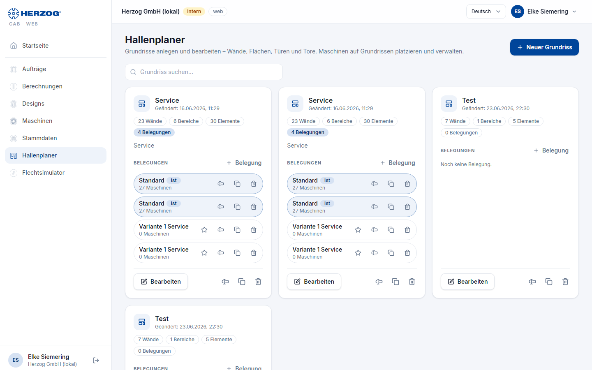
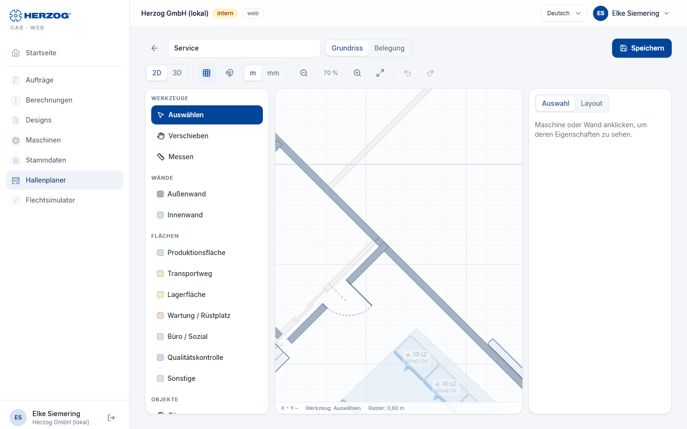

# Hallenplaner (Web-App)

!!! abstract "Referenz — Das Modul Hallenplaner der Web-App: Grundrisse und Belegungen verwalten, der 2D-Editor und die 3D-Ansicht"

## Wofür Sie diesen Bereich nutzen

Der Hallenplaner bildet Ihre Produktionshalle ab: ein **Grundriss** (Wände,
Flächen, Türen, Tore, Fenster, Treppen) und darauf beliebig viele
**Belegungen** — Szenarien, welche Maschine wo steht. Eine Belegung kann als
**Ist** markiert werden. Das Modell entspricht der Desktop-App
([Hallenplaner](../hall-planner/index.md)); hier geht es um die Bedienung
im Browser.

## Übersicht der Grundrisse

| Element | Bedeutung |
|---|---|
| **Neuer Grundriss** | Fragt den Namen (Halle / Bereich) ab und öffnet den Editor. |
| **Grundriss suchen…** | Filtert die Liste. |
| Grundriss-Karte | Name, Änderungsdatum, Zahl der Wände, Bereiche und Elemente sowie die zugehörigen **Belegungen**. |
| **Bearbeiten** | Öffnet den Grundriss im Editor (Modus *Grundriss*). |
| **Umbenennen…** / **Duplizieren…** / **Löschen…** | Löschen entfernt auch alle Belegungen des Grundrisses; die Maschinen bleiben in den Stammdaten. |
| **Neue Belegung / Szenario** | Legt eine Belegung für den Grundriss an (Name, z. B. *Variante*). |
| Belegung: **Bestücken** | Öffnet die Belegung im Editor (Modus *Belegung*). |
| Belegung: **Als Ist-Belegung setzen** | Markiert die Belegung als aktuelle Aufstellung (*Ist*). |

!!! info "Layouts im Altformat"
    Layouts aus älteren Desktop-Versionen enthalten Grundriss und Maschinen
    in einer Datei. **Aufteilen** macht daraus einen Grundriss und eine
    Belegung *Standard* — wie die Migration in der Desktop-App.

## Der Editor

Oben die **Kopfzeile** mit dem Namen des Grundrisses und dem Umschalter
**Grundriss** / **Belegung**, darunter die **Werkzeugleiste**. Links liegt
im Modus *Grundriss* die Palette **Werkzeuge** (Werkzeuge, Wände, Flächen,
Objekte), im Modus *Belegung* der **Katalog** Ihrer Maschinen; in der Mitte
die **Zeichenfläche**, rechts die Reiter **Auswahl** (Eigenschaften des
markierten Objekts) und **Layout**. Unten zeigt eine Statuszeile die
Mausposition, das Werkzeug, das Raster und beim Messen die Länge.

### Werkzeugleiste

| Element | Wirkung |
|---|---|
| **Grundriss** / **Belegung** | Modus: Grundriss bearbeiten oder Maschinen platzieren. Im Modus Belegung wählen Sie daneben die Belegung (*Ist* markiert). |
| **2D** / **3D** | Zeichenansicht oder die interaktive 3D-Ansicht (siehe unten). |
| Raster / Einrasten | Raster ein- oder ausblenden, Einrasten am Raster ein- oder ausschalten. |
| **Einheit** | Meter oder Millimeter. |
| **Verkleinern** / **Zoom** / **Vergrößern** / **Einpassen** | Zoom der Zeichenfläche (auch Mausrad bzw. zwei Finger). |
| **Rückgängig** / **Wiederholen** | Bearbeitungsschritte. |
| **Bearbeiten** | Bei Auswahl: 90° nach links/rechts drehen, Auswahl duplizieren oder löschen; bei mehreren Maschinen horizontal/vertikal gleichmäßig verteilen und aneinanderreihen. |
| **Speichern** | Speichert Grundriss bzw. Belegung (*Aktuelles Layout speichern*). |

### Palette „Werkzeuge" (Modus Grundriss)

| Gruppe | Werkzeuge |
|---|---|
| **Werkzeuge** | **Auswählen** (Objekte auswählen, verschieben, markieren), **Verschieben** (Hand: Ansicht ziehen), **Messen** (zwei Punkte klicken — die Länge erscheint unten). |
| **Wände** | **Außenwand** und **Innenwand** als Klick-Kette zeichnen; Rechtsklick oder ++esc++ beendet. |
| **Flächen** | Produktionsbereich, Transportweg, Lagerfläche, Wartung, Büro, Qualitätskontrolle …: Eckpunkte klicken, den ersten Punkt erneut klicken zum Schließen. |
| **Objekte** | **Tür**, **Tor**, **Fenster** auf eine Wand setzen; **Treppe** auf eine freie Stelle; **Banner/Logo**. |
| **Maßstab setzen** | Referenzstrecke auf dem Grundrissbild anklicken und die tatsächliche Länge in Metern eingeben. |

### Palette „Katalog" (Modus Belegung)

Ihre **Flechtmaschinen** und **Spulmaschinen** aus dem
[Maschinenpark](machines.md) mit Suchfeld und Typfilter. Ziehen Sie eine
Maschine in den Grundriss oder platzieren Sie sie per Doppelklick in der
Bildmitte. Maschinen ohne Abmessungen sind mit *Maße fehlen* markiert —
tragen Sie Länge und Breite auf der Maschinenseite nach.

### Reiter „Auswahl"

Eigenschaften des ausgewählten Objekts (Name, Maße, Drehung, Wandart, Tür-
oder Torbreite usw.). Ohne Auswahl steht hier der Hinweis *Maschine oder
Wand anklicken, um deren Eigenschaften zu sehen.*

### Reiter „Layout"

| Einstellung | Wirkung |
|---|---|
| **Name**, **Beschreibung** | des Grundrisses bzw. der Belegung. |
| **Rastergröße**, **Einrasten**, **Objektfang**, **Winkelfang** | Zeichenhilfen. |
| **Hallengrundriss laden** | Ein Foto oder ein Plan als Zeichenunterlage aus der [Medienbibliothek](media.md) oder als Datei; **Transparenz**, **Ausrichtung** (um 90° drehen) und **Maßstab setzen** richten das Bild aus. |
| **Bild/Logo laden…** | Banner oder Logo für den Plan. |
| **Wand-Textur (3D)** | Vorbereitet; wirkt in der Web-App noch nicht. |

## 3D-Ansicht

**3D** in der Werkzeugleiste zeigt die Halle räumlich: Wände mit Öffnungen,
Türen, Tore, Fenster, Treppen, das Grundrissbild und die Maschinen als
Kästen mit Frontband und Bild (bei internen Konten das 3D-Modell). Steuerung:
*Drehen: linke Maustaste · Verschieben: rechte Maustaste · Zoom: Rad*; am
Touchscreen ein Finger drehen, zwei Finger verschieben, Kneifen zoomt.

!!! info "Unterschied zur Desktop-App"
    Kontextmenüs, **Wände verbinden**, die automatische Flächenerkennung und
    Wandtexturen der Desktop-App gibt es in der Web-App nicht.

## Verwandte Seiten

* [Hallenplaner (Desktop-App)](../hall-planner/index.md) · [Editor](../hall-planner/editor.md) · [3D-Hallenansicht](../hall-planner/view-3d.md)
* [Eine Produktionshalle aufbauen](../tasks/build-hall.md)
* [Maschinen (Web-App)](machines.md)
