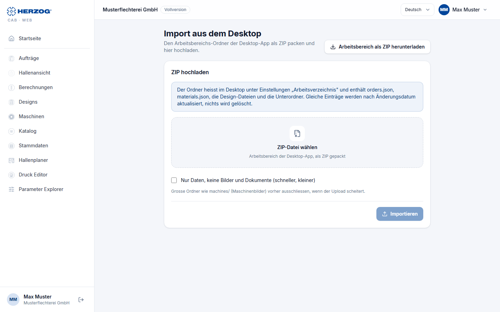

# Import aus dem Desktop und Export (Web-App)

!!! abstract "Referenz — Die Seite „Import aus dem Desktop" im Benutzermenü der Web-App: den Arbeitsbereich der Desktop-App als ZIP hochladen oder den Web-Arbeitsbereich als ZIP herunterladen"

## Wofür Sie diesen Bereich nutzen

Die Web-App arbeitet mit demselben Datenmodell wie die Desktop-App. Über
diese Seite übernehmen Sie einen kompletten **Arbeitsbereich** der
Desktop-App — Aufträge, Kunden, Materialien, Spulen, Farben, Maschinen,
Designs, Hallenpläne, Druckvorlagen und die zugehörigen Dateien — mit einem
einzigen ZIP-Upload in das Konto. Umgekehrt laden Sie den Arbeitsbereich der
Web-App als ZIP herunter, etwa als Sicherung oder um ihn in der Desktop-App
zu öffnen.

Für den laufenden Abgleich gibt es außerdem den **Cloud-Abgleich** in der
Desktop-App ([Lizenz und Cloud](../admin/settings/license.md)), der
Änderungen automatisch hochlädt und Änderungen aus der Web-App zurückholt. Wann welcher Weg passt, erklärt
[Daten vom Desktop in die Web-App bringen](../tasks/desktop-to-web.md).

Sie öffnen die Seite über *Benutzermenü > Import aus dem Desktop* oder die
Kachel auf der Startseite; sie erfordert das Recht
**Workspace-Einstellungen**.

## Der Bildschirm im Überblick

| Element | Bedeutung |
|---|---|
| **Arbeitsbereich als ZIP herunterladen** | Exportiert den Arbeitsbereich des Kontos als ZIP im Dateiformat der Desktop-App. |
| **ZIP-Datei wählen** | Der Arbeitsbereichs-Ordner der Desktop-App, als ZIP gepackt. |
| **Nur Daten, keine Bilder und Dokumente (schneller, kleiner)** | Überspringt Bilder und Dokumente im ZIP. |
| **Importieren** | Startet den Import (*Import läuft …*). |
| **Ergebnis** | Tabelle je Datentyp mit **Angelegt**, **Aktualisiert**, **Unverändert**, **Dateien** und ggf. **Fehler**. |

## So packen Sie den Arbeitsbereich

1. Öffnen Sie in der Desktop-App *Datei > Einstellungen*, Tab
   **Speicherorte** — dort steht der Pfad des **Arbeitsverzeichnisses**
   (siehe [Speicherorte](../admin/settings/files.md)).
2. Packen Sie diesen Ordner mit dem Windows-Explorer (*Senden an > ZIP-
   komprimierter Ordner*) oder einem Packprogramm. Der Ordner enthält u. a.
   `orders.json`, `materials.json`, die Design-Dateien und Unterordner.
3. Laden Sie das ZIP hier hoch.

!!! tip "Großer Ordner?"
    Der Unterordner `machines/` mit Maschinenbildern kann groß werden.
    Schlägt der Upload fehl, schließen Sie ihn vorher aus oder haken Sie
    **Nur Daten** an — Bilder lassen sich später über die
    [Medienbibliothek](media.md) nachladen.

## Was beim Import passiert

* Gleiche Einträge (gleiche Kennung) werden **nach Änderungsdatum
  aktualisiert** — der neuere gewinnt. Es wird **nichts gelöscht**.
* Neue Einträge werden angelegt, unveränderte übersprungen.
* Dateien (Bilder, Dokumente) werden in die Medienbibliothek übernommen;
  gleiche Dateien nur einmal.
* Benutzer, Rollen und Profile der Desktop-App gehören nicht zum
  Arbeitsbereich und werden nicht importiert — Benutzer kommen aus dem
  [Kundenkonto](../setup/account.md).
* In der [Testphase](trial.md) gilt die Mengenbegrenzung auch beim Import.

Der Import lässt sich beliebig wiederholen, z. B. um später geänderte
Aufträge nachzuziehen.

## Verwandte Seiten

* [Daten vom Desktop in die Web-App bringen](../tasks/desktop-to-web.md) — der Ablauf
* [Lizenz und Cloud (Desktop-App)](../admin/settings/license.md) — der automatische Cloud-Upload
* [Speicherorte (Desktop-App)](../admin/settings/files.md) — wo das Arbeitsverzeichnis liegt
* [Medienbibliothek (Web-App)](media.md)
