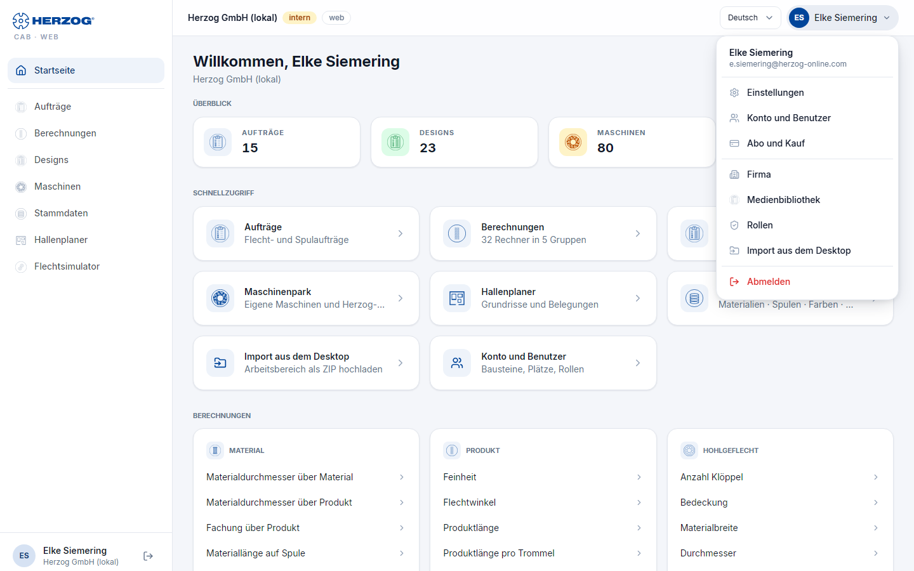

# Oberfläche der Web-App

!!! info "Konzept — Wie die Web-App aufgebaut ist: Seitenleiste, Kopfzeile, Reiter, Benutzermenü, Listen und Dialoge, Bedienung am Tablet und Smartphone"

## Der Rahmen

| Bereich | Inhalt |
|---|---|
| **Seitenleiste** (links) | Ein Eintrag je Modul: **Startseite**, **Aufträge**, **Berechnungen**, **Designs**, **Maschinen**, **Stammdaten**, **Hallenplaner**. Unten Ihr Name, das Konto und das **Abmelden**-Symbol. Die Leiste beantwortet nur die Frage „in welchem Modul bin ich" — Unterseiten und Aktionen liegen in der Seite selbst. |
| **Kopfzeile** (oben) | Links der Name des Kontos mit Kennzeichen (z. B. *intern*, die Edition oder *Testphase: noch n Tage*), rechts die **Sprachauswahl** und das **Benutzermenü**. |
| **Inhalt** | Die aktuelle Seite mit **Seitentitel**, Aktionen rechts daneben (z. B. **Neuer Flechtauftrag**) und darunter **Reitern** für Unterseiten (z. B. *Park* und *Katalog* unter Maschinen, *Materialien*, *Spulen*, *Farben*, *Kunden* unter Stammdaten). |

Welche Einträge Sie sehen, richtet sich nach Ihren Rechten
([Rollen](roles.md)) und dem Baustein: Mit *Herzog CAB Web Designer* fehlen
Aufträge und Berechnungen.

## Benutzermenü

Ein Klick auf Ihre Initialen bzw. Ihren Namen rechts oben öffnet das
Benutzermenü:

| Eintrag | Ziel |
|---|---|
| **Konto** (Auswahl) | Nur, wenn Ihr Benutzer zu mehreren Konten gehört: wechselt das Konto. |
| **Sprache** | Am Smartphone hier statt in der Kopfzeile. |
| **Einstellungen** | [Sprache, Benutzer, Passwort-Hinweis](settings.md). |
| **Konto und Benutzer** | [Edition, Bausteine, Plätze, Benutzer und Rollen](account.md). |
| **Abo und Bestellung** | [Freischaltungen, Testphase, Jahresabo bestellen oder Anfrage](subscription.md). |
| **Firma** | [Firmendaten und Logo für Druckvorlagen](company.md). |
| **Medienbibliothek** | [Hochgeladene Bilder und Dokumente](media.md). |
| **Rollen** | [Rollen und Rechte](roles.md) — nur mit den Rechten *Rollen verwalten* bzw. *Benutzer verwalten*. |
| **Import aus dem Desktop** | [ZIP-Import und -Export des Arbeitsbereichs](import.md) — nur mit dem Recht *Workspace-Einstellungen*. |
| **Abmelden** | Beendet die Sitzung. |

## Listen, Karten und Formulare

* **Listen** haben oben ein **Suchfeld** und **Filter**; die Trefferzahl
  steht daneben (*n von m …*). Auf schmalen Bildschirmen werden Tabellen zu
  **Karten**.
* **Neu…**-Schaltflächen stehen rechts neben dem Seitentitel; **Öffnen**
  bzw. ein Klick auf die Zeile führt in den Editor.
* **Speichern** sitzt oben rechts im Editor. Nach dem Speichern erscheint
  kurz eine Bestätigung (*Gespeichert.*) am unteren Rand; Fehler erscheinen
  als rote Hinweisbox.
* **Sicherheitsabfragen** (z. B. beim Löschen) öffnen sich als Dialog — am
  Smartphone als Bogen von unten.
* **Versionskonflikt:** Bearbeiten zwei Personen denselben Eintrag, meldet
  die Web-App beim zweiten Speichern *„Der Eintrag wurde inzwischen von jemand
  anderem geändert. Bitte neu laden."* — laden Sie die Seite neu und tragen
  Sie Ihre Änderung erneut ein.

## Tablet und Smartphone

Die Web-App passt sich der Bildschirmbreite an:

* **Ab 768 px (Tablet):** Seitenleiste und Kopfzeile wie am Desktop, Listen
  je nach Platz als Karten.
* **Smartphone:** Die Seitenleiste wird zur **Schublade**, die Sie über das
  Menü-Symbol links oben öffnen. Am unteren Rand liegt eine **Tab-Leiste**
  mit **Start**, **Aufträge**, **Rechner**, **Designs** und **Mehr** (öffnet
  die Schublade). In den Zeichenflächen (Designer, Hallenplaner) zoomen Sie
  mit zwei Fingern.

!!! tip "Als App auf dem Startbildschirm"
    Die meisten Browser bieten an, die Seite *zum Startbildschirm hinzuzufügen*.
    Dann startet die Web-App wie eine App — ohne Adressleiste.

## Verwandte Seiten

* [Anmelden und Konto wählen](login.md)
* [Startseite](start.md)
* [Oberfläche im Überblick (Desktop-App)](../basics/interface.md) — zum Vergleich
