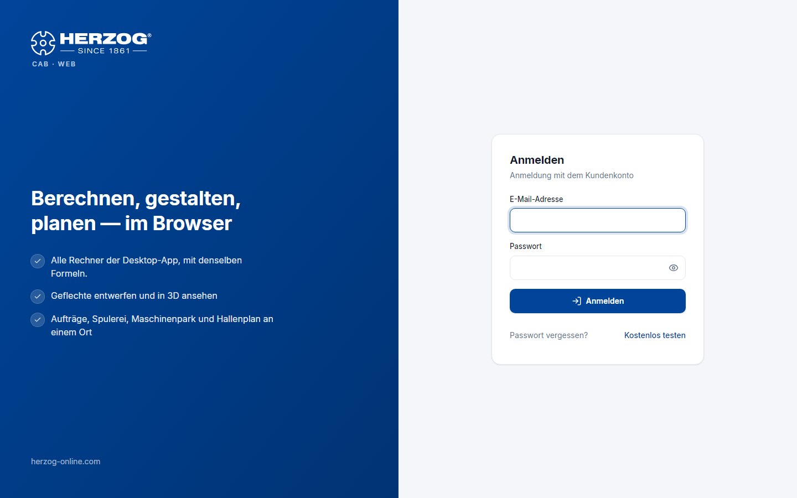

# Anmelden und Konto wählen

!!! abstract "Referenz — Die Anmeldeseite der Web-App: E-Mail-Adresse, Passwort, Code aus der Authenticator-App, Kontowahl und Abmelden"

## Wofür Sie diesen Bereich nutzen

Die Web-App verlangt vor dem Einstieg eine Anmeldung mit Ihrem Benutzer aus
dem [Kundenkonto](../setup/account.md) — dieselben Zugangsdaten wie im
Lizenzportal und in der Desktop-App. Mit der Anmeldung belegen Sie einen
**Platz** Ihres Abos. Er wird beim Abmelden oder nach 15 Minuten ohne
Aktivität wieder frei. Arbeiten Sie zugleich im Programm, belegen Sie zwei
Plätze.

## Der Bildschirm im Überblick

Links stellt eine Markenfläche die Web-App kurz vor, rechts steht das
Formular **Anmeldung mit dem Kundenkonto**. Am Smartphone liegt das Formular
unter der Markenfläche.

## Bedienelemente im Detail

| Element | Bedeutung |
|---|---|
| **E-Mail-Adresse** | Ihr Anmeldename im Kundenkonto. |
| **Passwort** | Ihr Konto-Passwort. |
| **Code** | Erscheint nach dem ersten Klick auf **Anmelden**, wenn für Ihren Benutzer der [zweite Faktor](../portal/security.md) eingerichtet ist. Sechs Ziffern aus der Authenticator-App, danach **Bestätigen**. |
| **Anmelden** | Meldet Sie an und öffnet die [Startseite](start.md). |
| **Passwort vergessen?** | Führt zur Seite *Passwort vergessen* des Lizenzportals — dort fordern Sie einen Link zum Setzen eines neuen Passworts an. |
| **Kostenlos testen** | Führt zur [Registrierung für die Testphase](trial.md) (nur sichtbar, wenn die Selbstregistrierung freigeschaltet ist). |

### Meldungen

| Meldung | Bedeutung |
|---|---|
| *E-Mail-Adresse oder Passwort stimmen nicht.* | Zugangsdaten prüfen; Passwort über **Passwort vergessen?** zurücksetzen. |
| *Bitte den Code aus der Authenticator-App eingeben.* | Kein Fehler — der zweite Faktor ist eingerichtet. |
| *Alle Plätze dieses Kontos sind gerade belegt. Belegt: n von m Plätzen.* | Alle Plätze des Kontos sind gerade belegt, im Programm oder im Browser. Warten Sie, bis ein Kollege Herzog CAB beendet, sich abmeldet oder 15 Minuten inaktiv war. Oder ein Administrator [bestellt weitere Plätze](subscription.md). |
| *Dieser Benutzer ist deaktiviert.* | Ein Administrator hat den Benutzer im Lizenzportal deaktiviert. |
| *Zu viele Fehlversuche.* | Der Lizenzserver bremst nach mehreren Fehlversuchen — einige Minuten warten. |

## Konto wählen

Gehört Ihr Benutzer zu **mehreren Konten**, erscheint nach der Anmeldung die
Seite **Konto wählen** mit einer Liste der Konten (Firma, Kundennummer) und
einem Suchfeld. Klicken Sie das gewünschte Konto an. Später wechseln Sie das
Konto im [Benutzermenü](interface.md#benutzermenu) über die Auswahl
**Konto**.

!!! info "Herzog-Mitarbeiter"
    Mitarbeiter von Herzog arbeiten in einem internen Konto. Kundenkonten
    sind für sie nicht wählbar — für Kundendaten legt der Kunde selbst einen
    Benutzer an.

## Kein Zugang zur Web-App

Hat Ihr Konto kein Abo mit Web-App oder ist die Testphase abgelaufen, zeigt
die Web-App nach der Anmeldung die Seite **Kein Zugang zur Webapp** mit dem
Hinweis *„Für das Konto &lt;Firma&gt; ist Herzog CAB Web nicht freigeschaltet oder
die Testphase ist abgelaufen."* Von dort gelangen Sie zu
[Abo und Bestellung](subscription.md) oder melden sich ab. Ihre Daten bleiben
erhalten.

## Abmelden

* Über das **Abmelden**-Symbol unten in der Seitenleiste neben Ihrem
  Namen, oder
* über **Abmelden** im [Benutzermenü](interface.md#benutzermenu) der
  Kopfzeile.

Beim Abmelden wird Ihr Platz sofort frei. Ohne Abmeldung endet die
Sitzung nach längerer Inaktivität von selbst.

## Verwandte Seiten

* [Kundenkonto und Einladung](../setup/account.md) — Einladung annehmen, Passwort setzen
* [Passwort und zweiter Faktor](../portal/security.md)
* [Testphase und Registrierung](trial.md)
* [Login-Probleme](../help/login-problems.md)
