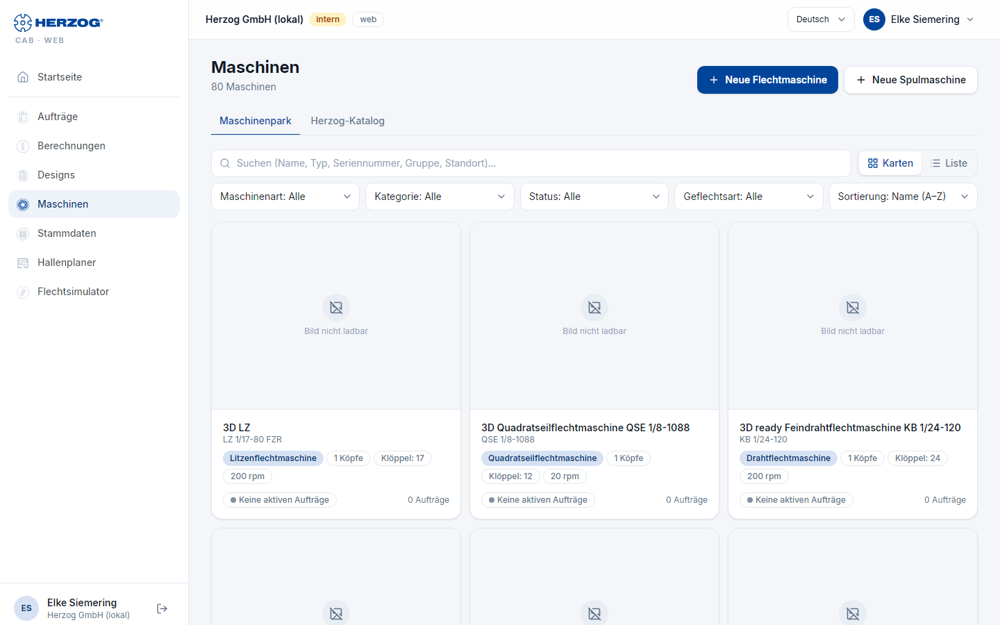
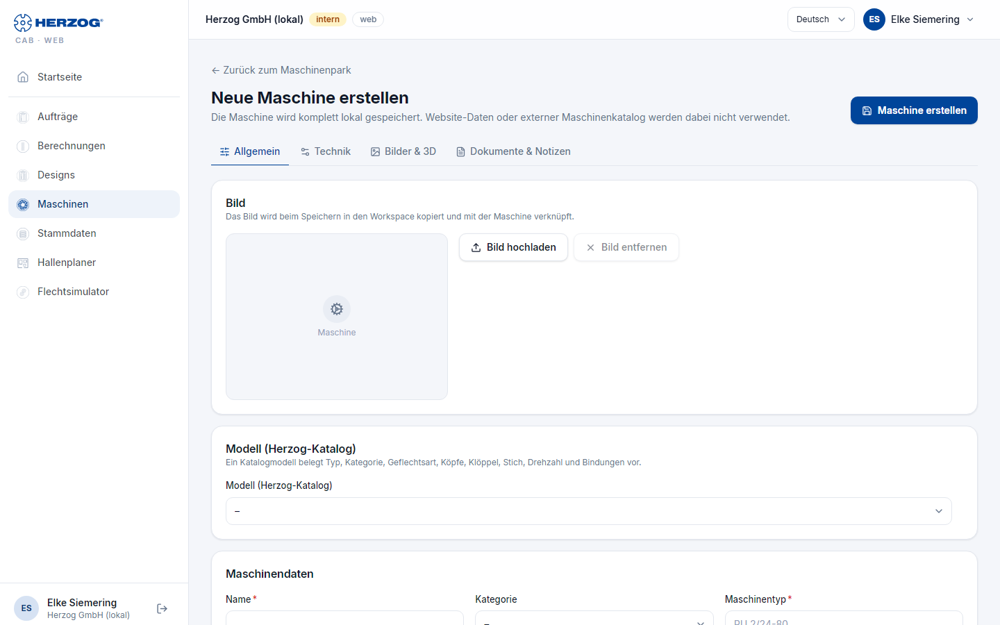

# Maschinen (Web-App)

!!! abstract "Referenz — Das Modul Maschinen der Web-App: Maschinenpark mit Karten- und Listenansicht und die Maschinenseite"

## Wofür Sie diesen Bereich nutzen

Unter **Maschinen** pflegen Sie die Maschinen Ihres Werks — die Stammdaten,
mit denen Aufträge, Designer und Hallenplaner arbeiten. Die Herzog-Modelle
als Vorlage stehen im eigenen Bereich [Herzog-Katalog](catalog.md); von dort
legen Sie eine Maschine direkt an. Die Bedeutung der Maschinendaten steht in
der Referenz der Desktop-App ([Flechtmaschinen](../master-data/braiding-machines.md),
[Spulmaschinen](../master-data/winding-machines.md),
[Maschinenpark](../machine-park/index.md)); hier geht es um die Bedienung
im Browser.

## Maschinenpark

| Element | Bedeutung |
|---|---|
| **Neue Flechtmaschine** / **Neue Spulmaschine** | Öffnen die Maschinenseite für eine neue Maschine. |
| **Suchen** | Filtert nach Name, Typ, Seriennummer, Gruppe oder Standort. |
| **Ansicht**: **Karten** / **Liste** | Karten mit Bild und Kennwerten oder eine Tabelle. |
| Filter | **Maschinenart** (Flecht-/Spulmaschinen), **Kategorie**, **Status**, **Gruppe**, **Geflechtsart**, **Standort**; die Trefferzahl steht daneben (*n von m Maschinen*). |
| **Sortierung** | Reihenfolge der Liste. |
| Karte / Zeile | Name, Typ, Kategorie, Standort, Status, Kennwerte (Köpfe, Klöppel, Drehzahl bzw. Spulstellen und UpM) und die Zahl der laufenden **Aufträge**. Ein Klick öffnet die Maschinenseite. |

## Maschinenseite

Die Maschinenseite ist in vier Reiter gegliedert; **Speichern** sitzt oben
rechts, daneben **Löschen** und **[Versionen](versions.md)** mit den
früheren Fassungen der Maschine. **← Zurück zum Maschinenpark** führt zur
Liste. Zum Ändern brauchen Sie das Recht *Stammdaten bearbeiten* — sonst
ist die Seite nur lesbar und nennt das fehlende Recht.

| Reiter | Inhalt |
|---|---|
| **Allgemein** | Bild (**Bild hochladen** / **Bild entfernen**), **Modell (Herzog-Katalog)** — ein Katalogmodell belegt Typ, Kategorie, Geflechtsart, Köpfe, Klöppel, Stich, Drehzahl und Bindungen vor —, Maschinendaten (**Name**, **Baureihe**, **Kategorie**, **Maschinentyp**, **Seriennummer**, **Gruppe**, **Standort**, **Baujahr**, **Status**) und die laufenden Aufträge dieser Maschine. |
| **Technik** | Flechtmaschine: **Geflechtsart**, **Einschnitte Endflügelrad**, **Max. Klöppel pro Kopf**, **Köpfe**, **Stich**, **Klöppelart**, **Drehzahl**, **Ölmenge**, **Klöppel gesamt**, **Bindungen**, **Passende Spulen**, **Abmessungen** (Länge, Breite, Höhe — mit **Maße berechnen** überschlägig aus Köpfen, Klöppeln und Stich), **Aufwicklung**, **Abzugsoption** (frei oder aus den Vorschlägen des Katalogmodells; das Umschalten der Aufwicklung lässt einen gewählten Abzug stehen), **Meterzähler** und **Zubehör**. Spulmaschine: **Wickeltechnik** (Spulstellen, Spulendurchmesser, Spullänge, Drehzahl, Verlegung, Wickelart, Geschwindigkeitsführung, Fadenspannung, Steuerung, Antrieb, Verlegeschritt, Verlegebreite, Spulengewicht, **Einrichtzeit je Auftrag**, **Bestückungszeit je Spule**), Zähler, Überwachung, Materialien, automatischer Spulenwechsel (SPA), Fadenhandling, Litzenschlag (HLM) und **Zubehör**. Aufwickler, Abwickler und Gatter: ihre Bauart- und Maßangaben und **Zubehör**. |
| **Bilder & 3D** | **Box-Ansichten**: bis zu fünf Bilder (Vorderseite, Rückansicht, links, rechts, Draufsicht) für die Ersatz-Box in der 3D-Halle; **3D-Modell** (OBJ) nur für interne Konten, **Massstab**, **Drehung X/Y/Z**, **Ausrichtung vorne**. |
| **Dokumente & Notizen** | **Beschreibung**, **Dokumente** (Bedienungsanleitungen, Datenblätter, Abzugstabellen … über **Dokument hinzufügen**, mit **Öffnen** und **Dokument entfernen**) und **Notizen**. |

**Zubehör** steht bei allen Maschinenarten im Reiter **Technik** als Liste zum
Ankreuzen: die Vorschläge des Katalogmodells, gruppiert wie im
[Herzog-Katalog](catalog.md) (sofern er für Ihr Konto freigeschaltet ist),
dazu eigenes Zubehör — neben Katalogvorschlägen unter *Eigenes Zubehör*.
Neues tragen Sie in das Feld **Zubehör hinzufügen** ein und bestätigen mit
**Hinzufügen** oder der Eingabetaste; es erscheint gleich angekreuzt.
Gespeichert wird, was angekreuzt ist.

Bilder und Dokumente landen in der [Medienbibliothek](media.md) des Kontos.
**Löschen** entfernt die Maschine samt Bild, Dokumenten und 3D-Modell — mit
Sicherheitsabfrage. Die Maschine selbst kommt in den
[Papierkorb](versions.md#papierkorb); Bild, Dokumente und 3D-Modell sind
dagegen endgültig weg.

!!! tip "Spulzeit-Vorbelegung"
    **Einrichtzeit je Auftrag** und **Bestückungszeit je Spule** einer
    Spulmaschine sind die Vorgaben für die Spulzeit-Hochrechnung im
    [Spulauftrag](orders.md); dort lassen sie sich je Auftrag übersteuern.

## Maschine aus dem Herzog-Katalog

Statt eine Maschine von Hand anzulegen, übernehmen Sie ein Herzog-Modell: Im
[Herzog-Katalog](catalog.md) wählen Sie Zubehör, Abzug und Besetzung, tragen
Gruppe, Seriennummer und Namen ein und legen die Maschine mit
**Zu Flechtmaschinen hinzufügen** (bzw. **Zu Spulmaschinen hinzufügen** …)
direkt an — mit der Technik und dem Bild aus dem Katalog. Danach steht sie im
Maschinenpark; alles Weitere ergänzen Sie auf der Maschinenseite.

## Verwandte Seiten

* [Herzog-Katalog (Web-App)](catalog.md)
* [Maschinenpark (Desktop-App)](../machine-park/index.md)
* [Flechtmaschinen (Stammdaten)](../master-data/braiding-machines.md) · [Spulmaschinen (Stammdaten)](../master-data/winding-machines.md)
* [Hallenplaner (Web-App)](hall-planner.md) — Maschinen in der Halle platzieren
* [Medienbibliothek (Web-App)](media.md)
