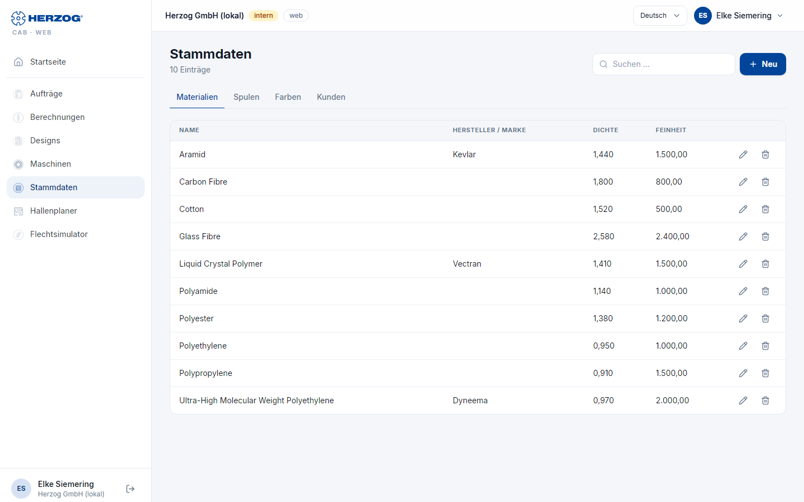

# Stammdaten (Web-App)

!!! abstract "Referenz — Das Modul Stammdaten der Web-App: Materialien, Spulen, Trommeln, Farben und Kunden als Reiter mit Liste und Formular"

## Wofür Sie diesen Bereich nutzen

Unter **Stammdaten** pflegen Sie die Grunddaten, auf die Aufträge, Rechner
und Designer zugreifen. Fünf Reiter: **Materialien**, **Spulen**,
**Trommeln**, **Farben**, **Kunden**. Maschinen haben ihr eigenes Modul ([Maschinen](machines.md)),
Grundrisse liegen im [Hallenplaner](hall-planner.md), Bilder und Dokumente in
der [Medienbibliothek](media.md), Designs unter [Designs](designer.md).

Die Bedeutung der Felder entspricht der Desktop-App — siehe
[Materialien](../master-data/materials.md), [Spulen](../master-data/bobbins.md),
[Trommeln](../master-data/drums.md), [Farben](../master-data/colors.md) und
[Kunden](../master-data/customers.md).

!!! info "Welche Reiter Sie sehen"
    Materialien, Spulen, Trommeln und Farben brauchen das Recht
    **Stammdaten anzeigen**, der Reiter Kunden das Recht **Aufträge
    anzeigen**. Mit *Herzog CAB Designer* gibt es nur **Farben** und
    **Kunden**.

## Der Bildschirm im Überblick

Jeder Reiter hat denselben Aufbau:

| Element | Bedeutung |
|---|---|
| **Neu** | Öffnet das leere Formular für einen neuen Eintrag. |
| **Aus Herzog-Katalog …** | Nur in den Reitern **Spulen** und **Trommeln** und mit dem Recht zum Bearbeiten: öffnet den [Herzog-Katalog](catalog.md) im passenden Reiter; dort übernehmen Sie Herzog-Spulen und -Trommeln. |
| **Suchen …** | Filtert die Liste live; die Trefferzahl steht daneben (*n Einträge*). |
| Liste | Tabelle mit den wichtigsten Spalten, am Smartphone Karten mit Titel, Unterzeile und zwei Kennwerten. |
| **Bearbeiten** / **Löschen** | Öffnet das Formular bzw. entfernt den Eintrag nach Sicherheitsabfrage (*Das lässt sich nicht rückgängig machen.*). |
| Formular | Öffnet sich als Dialog (**Speichern** / **Abbrechen**); Pflichtfelder sind markiert. Ein Eintrag, den gerade jemand anderes geändert hat, lässt sich erst nach dem Neuladen speichern. |

## Die Reiter im Detail

### Materialien

| Feld | Bedeutung |
|---|---|
| **Name** (Pflicht) | Bezeichnung des Materials. |
| **Hersteller / Marke** | Freitext. |
| **Dichte** (Pflicht) | in g/cm³, drei Nachkommastellen. |
| **Feinheit** und **Einheit der Feinheit** | Titer in tex, dtex, den, Nm oder Ne. |
| **Notiz** | Freitext. |

### Spulen

| Feld | Bedeutung |
|---|---|
| **Name** | Leer lassen: die Anzeige entsteht aus den Maßen. |
| **Aussendurchmesser**, **Kerndurchmesser**, **Wicklungslänge** (Pflicht) | in mm. |
| **Flügelrad-Durchmesser** | in mm. |
| **Volumen** | in cm³; wird aus den Maßen berechnet, wenn leer. |
| **Maschinentypen** (Pflicht) | Mehrfachauswahl wie in der Desktop-App: *Rundflechtmaschine*, *Quadratflechtmaschine*, *Horizontalflechtmaschine*, *Kohlenstofffaser-Flechtmaschine*, *Drahtflechtmaschine*, *Packungsflechtmaschine*. |

Ist die Liste leer, steht dort *Noch keine Spulen. Übernehmen Sie sie mit
"Aus Herzog-Katalog …".*

### Trommeln

| Feld | Bedeutung |
|---|---|
| **Bezeichnung** | Leer lassen: die Anzeige entsteht aus den Maßen. |
| **Artikelnummer** | Ihre eigene Nummer. |
| **Materialart** | *Holz*, *Stahl*, *Kunststoff* oder *Sonstiges*. |
| **Aussendurchmesser**, **Kerndurchmesser**, **Verlegeweite** (Pflicht) | in mm. |
| **Wickeldurchmesser** | in mm; leer lassen, wenn bis zur Flanschkante gewickelt wird. |
| **Trommelbreite** | in mm; leer lassen, wenn sie der Verlegeweite entspricht. |
| **Spulvolumen** | in cm³; wird beim Speichern aus den Maßen berechnet, wenn leer. |
| **Leergewicht** | in kg; ohne diese Zahl kein Gesamtgewicht der vollen Trommel. |
| **Pinolenbohrung**, **Mitnahme-Pin**, **Abstand Mitte zu Pin** | in mm, optional. |
| **Notiz** | Freitext. |

Die Liste zeigt Bezeichnung, Artikelnummer, Außen- und Kerndurchmesser,
Verlegeweite, Spulvolumen und Leergewicht. Ist sie leer, steht dort
*Noch keine Trommeln. Übernehmen Sie sie mit "Aus Herzog-Katalog …".*
Die Trommeln stehen in den Rechnern
[Produktlänge pro Trommel](../calculations/product/rope-length-on-drum.md)
und [Trommel- und Aufwicklerwahl](../calculations/product/drum-take-up-selection.md)
zur Auswahl.

### Farben

| Feld | Bedeutung |
|---|---|
| **Name** (Pflicht), **Code** | Bezeichnung und Kennung. |
| **Farbwert** (Pflicht) | Farbwähler. |
| **Palette**, **Pantone**, **Referenzsystem** | Zuordnung zu Palette und Referenzsystem. |
| **Notizen** | Freitext. |

Die Farben stehen im [Designer](designer.md) als Palette zur Verfügung.

### Kunden

| Feld | Bedeutung |
|---|---|
| **Kundennummer**, **Firma** (Pflicht), **Name**, **Ansprechpartner** | Grunddaten. |
| **Strasse**, **PLZ**, **Ort**, **Land** | Anschrift. |
| **Telefon**, **Mobil**, **E-Mail**, **Website** | Kontakt. |
| **Privatkunde** | Kennzeichen. |
| **Notizen** | Freitext. |

## Verwandte Seiten

* [Stammdaten (Desktop-App)](../master-data/index.md)
* [Maschinen (Web-App)](machines.md) · [Herzog-Katalog (Web-App)](catalog.md) · [Medienbibliothek (Web-App)](media.md)
* [Import aus dem Desktop](import.md) — Stammdaten aus der Desktop-App übernehmen
