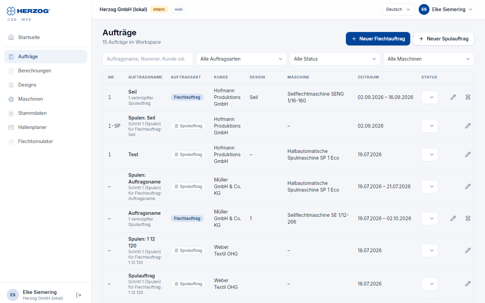
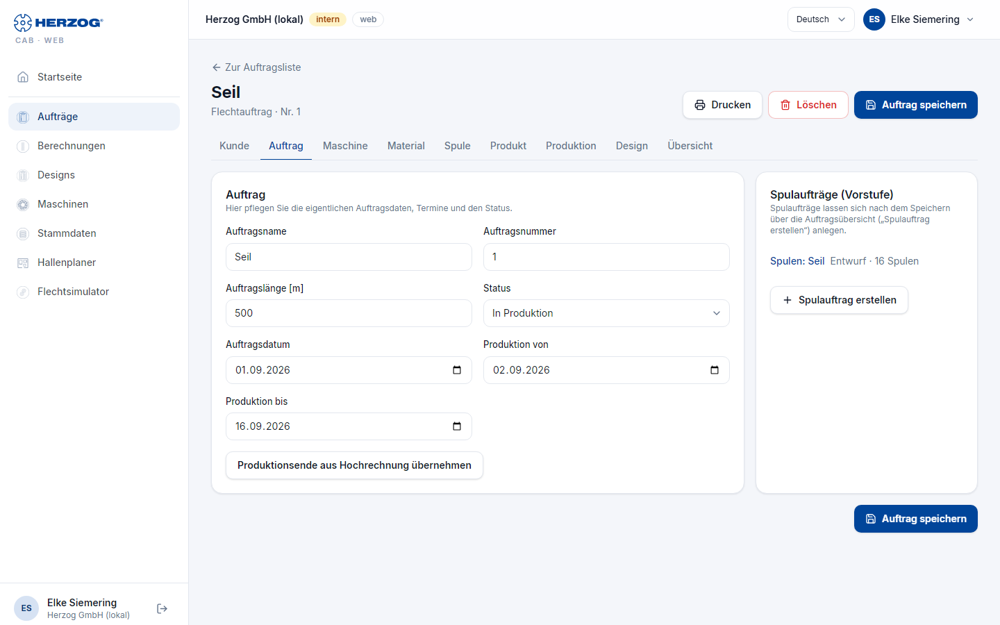
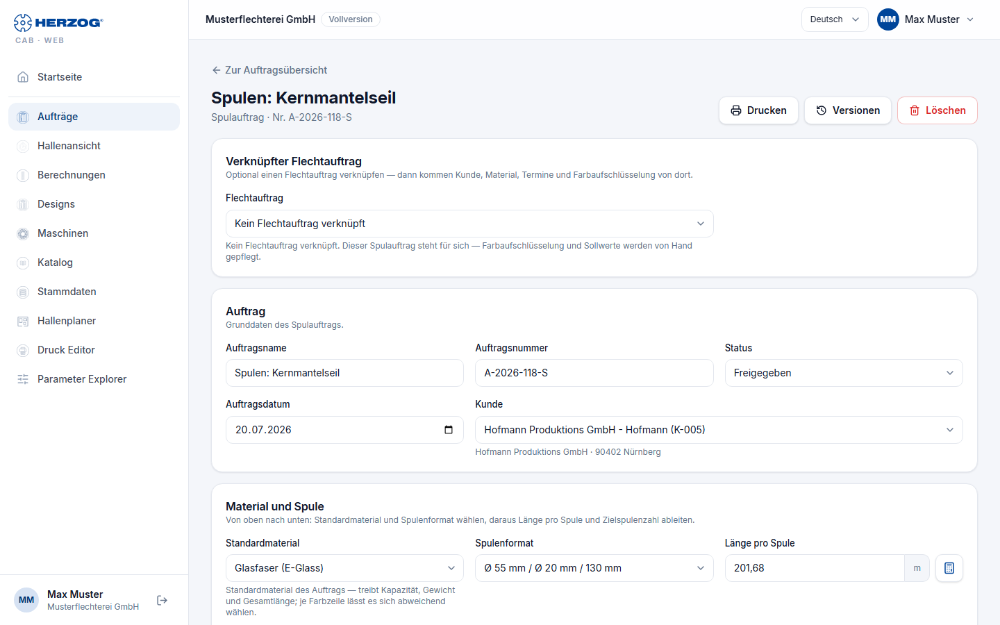

# Aufträge (Web-App)

!!! abstract "Referenz — Das Modul Aufträge der Web-App: Auftragsliste, Flechtauftrag-Editor, Spulauftrag-Editor und Druck"

## Wofür Sie diesen Bereich nutzen

Unter **Aufträge** verwalten Sie Flecht- und Spulaufträge Ihres Kontos —
dieselben Aufträge, die auch die Desktop-App kennt, wenn Sie den
Arbeitsbereich [importieren](import.md) oder per Cloud-Upload abgleichen.
Die Editoren entsprechen Feld für Feld denen der Desktop-App; diese Seite
beschreibt die Bedienung in der Web-App und verweist für die Bedeutung der
Felder auf die Referenzseiten der Desktop-App.

## Auftragsliste

| Element | Bedeutung |
|---|---|
| **Neuer Flechtauftrag** / **Neuer Spulauftrag** | Öffnen einen leeren Editor (rechts neben dem Seitentitel). |
| **Suche** | Filtert live nach Auftragsname, Nummer, Kunde oder Maschine. |
| **Auftragsart** | *Alle Auftragsarten*, *Flechtaufträge*, *Spulaufträge*. |
| **Status** | *Alle Status* oder ein Status: Entwurf, Freigegeben, In Produktion, Abgeschlossen. |
| **Maschine** | *Alle Maschinen* oder eine Maschine aus Ihrem Maschinenpark. |
| Trefferzahl | *n Aufträge im Workspace* bzw. *n von m Aufträgen sichtbar*. |

Die Tabelle zeigt **Nr.**, **Auftragsname**, **Auftragsart** (Chip
*Flechtauftrag* oder *Spulauftrag*), **Kunde**, **Design** (Name oder *–*),
**Maschine**, **Zeitraum** (Produktion von–bis) und **Status**. Den Status
ändern Sie direkt in der Zeile über die Auswahlliste — die Änderung wird
sofort gespeichert. Spulaufträge tragen den Zusatz *Schritt 1 (Spulen) für
Flechtauftrag: …*, Flechtaufträge nennen die Zahl ihrer verknüpften
Spulaufträge.

| Symbol in der Zeile | Wirkung |
|---|---|
| **Öffnen** (Stift) | Öffnet den Editor. |
| **Spulauftrag erstellen** (Spule) | Nur bei Flechtaufträgen mit Schreibrecht: legt einen verknüpften Spulauftrag an, vorbelegt mit Kunde, Material, Spulenformat, Termin und Sollwerten. |
| **Löschen** (Papierkorb) | Mit Schreibrecht; Sicherheitsabfrage. Hat ein Flechtauftrag verknüpfte Spulaufträge, bleiben diese bestehen und verlieren nur die Verknüpfung. |

Auf schmalen Bildschirmen erscheint die Liste als Karten. Ein Zeitraumfilter
und **Duplizieren** gibt es — anders als in der Desktop-App — in der Web-App
nicht.

## Flechtauftrag-Editor

Der Editor hat dieselben neun Reiter wie der
[Flechtauftrag-Editor der Desktop-App](../orders/braiding-order.md):
**Kunde**, **Auftrag**, **Maschine**, **Material**, **Spule**, **Produkt**,
**Produktion**, **Design**, **Übersicht**. Die Bedeutung jedes Felds steht
dort — hier nur die Besonderheiten der Web-App:

* Die Kopfzeile zeigt Auftragsname und Nummer, den Vermerk *ungespeichert*
  bei offenen Änderungen sowie **Zur Auftragsliste**, **Drucken**,
  **Löschen** und **Auftrag speichern**.
* **Kunde**, **Maschine**, **Material** und **Spule** wählen Sie aus den
  Stammdaten des Kontos; die Schaltflächen **Kunden öffnen**,
  **Flechtmaschinen öffnen**, **Materialverwaltung öffnen** und
  **Spule-Verwaltung öffnen** springen in die jeweilige Pflege. Nicht mehr
  vorhandene Einträge stehen als *… (nicht mehr vorhanden)* im Feld.
* Die **Rechner-Symbole** neben den Feldern der Reiter Produkt und
  Produktion öffnen den jeweiligen Rechner als Dialog, vorbelegt mit den
  Auftragswerten; **Übernehmen** schreibt das Ergebnis zurück. Am Feld
  Flechtwinkel öffnet das Symbol wie am Desktop *Flechtwinkel über Abzug*.
* **Produktion von / bis** und **Produktionsende aus Hochrechnung
  übernehmen** arbeiten wie am Desktop mit 8 Produktionsstunden je
  Arbeitstag.
* Der Reiter **Design** zeigt das verknüpfte Design mit Vorschau und der
  Klöppel-Tabelle; **Design öffnen** wechselt in den [Designer](designer.md),
  **Neues Design** legt ein neues an.
* Die Karte **Spulaufträge (Vorstufe)** neben dem Reiter *Auftrag* listet
  die verknüpften Spulaufträge mit Status und Spulenzahl; **Spulauftrag
  erstellen** legt nach dem Speichern einen neuen an.

## Spulauftrag-Editor

Der Spulauftrag ist eine Scroll-Seite mit den Karten **Verknüpfter
Flechtauftrag**, **Auftrag** (Grunddaten, Kunde), **Material und Spule**
(Standardmaterial, Spulenformat, Länge pro Spule, Zielspulenzahl,
Gesamtlänge), **Farbaufschlüsselung**, **Wickelparameter** (einklappbar)
und **Maschinen und Zeitplan** (Spulmaschinen, Verteilung, Spulzeit,
Produktionszeitraum) — dieselbe Reihenfolge wie in der Desktop-App. Die
Felder erklärt der [Spulauftrag-Editor der Desktop-App](../orders/winding-order.md).

Besonderheiten der Web-App:

* Beim Verknüpfen eines Flechtauftrags fragt ein Dialog, ob Kunde,
  Material, Spulenformat, Produktionstermin und Sollwerte übernommen werden
  sollen (**Übernehmen** oder **Nur verknüpfen**).
* Warnungen erscheinen als Hinweisboxen: abweichende Spulenzahl, fehlende
  Wickelzeit, oder wenn das Spul-Ende nach dem Flechtbeginn des verknüpften
  Auftrags liegt.
* Der Rechner **Spulzeit-Details** ist in der Web-App nicht enthalten; die
  Spulzeit-Hochrechnung selbst ist vorhanden.

## Drucken

**Drucken** in der Kopfzeile öffnet die [Druckseite](print.md) mit der
Standardvorlage für Flecht- bzw. Spulaufträge.

## Verwandte Seiten

* [Flechtauftrag-Editor (Desktop-App)](../orders/braiding-order.md) — Bedeutung aller Felder
* [Spulauftrag-Editor (Desktop-App)](../orders/winding-order.md)
* [Vom Kundenauftrag zum Maschinenzettel](../tasks/order-to-machine-sheet.md) — der Ablauf
* [Drucken (Web-App)](print.md)
