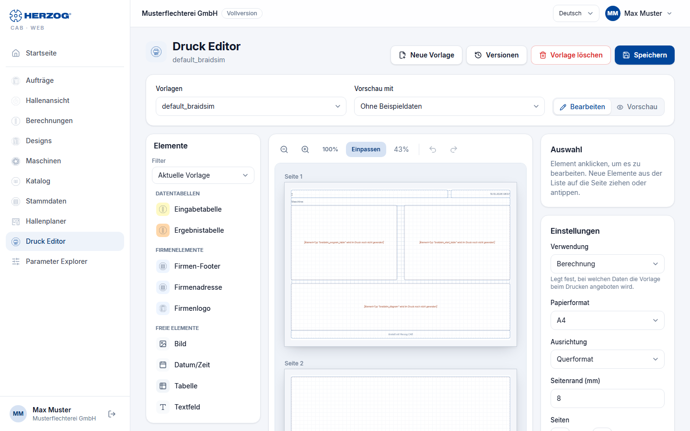

# Druck Editor (Web-App)

!!! abstract "Referenz — Der Druck Editor der Web-App: Druckvorlagen im Browser anlegen, bearbeiten, speichern und löschen"

## Wofür Sie diesen Bereich nutzen

Im **Druck Editor** gestalten Sie die Druckvorlagen, mit denen die
[Druckseite](print.md) Aufträge, Spulaufträge, Designs und Berechnungen
ausgibt — dieselben Vorlagen wie im
[Druck-Editor der Desktop-App](../print-templates/index.md). Aufbau und
Elemente entsprechen dem Programm; die Bedeutung der einzelnen Elemente und
Platzhalter steht unter
[Elemente und Platzhalter](../print-templates/elements.md). Diese Seite
beschreibt die Bedienung im Browser und die Unterschiede.

Sie öffnen den Editor über **Druck Editor** in der Seitenleiste, über die
Kachel **Druck Editor** auf der [Startseite](start.md) oder auf der
Druckseite über **Vorlage bearbeiten** — dann ist die dort gewählte
Vorlage gleich geladen.

!!! info "Rechte"
    Den Editor sehen Sie mit dem Recht **Druckvorlagen anzeigen**. Ändern,
    speichern und löschen können Sie nur mit **Druckvorlagen bearbeiten**;
    ohne dieses Recht steht oben *Mit Ihrer Rolle können Sie
    Druckvorlagen ansehen, aber nicht ändern.* Siehe [Rollen](roles.md).

## Der Bildschirm im Überblick

| Bereich | Inhalt |
|---|---|
| **Kopfzeile** | Titel **Druck Editor**, darunter der Name der Vorlage (bzw. *Neue Vorlage*), bei Änderungen mit dem Zusatz *ungespeichert*. Rechts **Neue Vorlage**, **Versionen**, **Vorlage löschen** und **Speichern**. |
| **Vorlagen** | Alle Druckvorlagen Ihres Kontos und die mitgelieferten Standardvorlagen, nach Namen sortiert. Mitgelieferte Vorlagen ohne eigene Fassung tragen den Zusatz *(mitgeliefert)*. |
| **Vorschau mit** | Beispieldaten für die Vorschau (siehe [unten](#vorschau-mit-beispieldaten)). |
| **Bearbeiten** / **Vorschau** | Umschalter zwischen der Arbeitsfläche und der Druckansicht. |
| **Elemente** (links) | Die Bausteine der Vorlage, gruppiert wie im Programm, mit **Filter**. Auf Tablet und Smartphone steht die Liste als waagerecht rollende Leiste über der Seite. |
| Seite (Mitte) | Die Seiten der Vorlage mit Raster; die Elemente zeigen ihren echten Druckinhalt. Darüber die Zoom-Leiste. |
| **Auswahl** (rechts) | Das markierte Element und seine Schaltflächen. |
| **Einstellungen** (rechts) | Verwendung, Papierformat, Ausrichtung, Seitenrand und Seitenzahl der Vorlage. |

## Vorlagen verwalten

| Schaltfläche | Wirkung |
|---|---|
| **Neue Vorlage** | Beginnt eine leere Vorlage. |
| **Speichern** | Öffnet den Dialog *Printout-Vorlage speichern* mit dem Feld **Name der Vorlage**. Derselbe Name wie die geladene Vorlage überschreibt sie; *ein anderer Name legt eine neue Vorlage an.* Die Meldung *Vorlage gespeichert.* bestätigt. |
| **Versionen** | Nur bei Vorlagen Ihres Kontos: frühere Fassungen der Vorlage ansehen und wiederherstellen, siehe [Versionen und Papierkorb](versions.md). |
| **Vorlage löschen** | Nur bei Vorlagen Ihres Kontos: löscht die Vorlage nach Rückfrage. Sie kommt in den [Papierkorb](versions.md#papierkorb). |

Hat jemand anderes die Vorlage geändert, seit Sie sie geladen haben,
speichert der Editor nicht und meldet *Die Vorlage wurde inzwischen von
jemand anderem geändert. Unter „Versionen" sind beide Fassungen zu sehen.*

!!! info "Mitgelieferte Standardvorlagen ändern"
    Die mitgelieferten Standardvorlagen lassen sich ebenfalls ändern.
    Speichern Sie unter demselben Namen, bekommt Ihr Konto eine eigene
    Fassung, die beim Drucken vorgeht. Löschen Sie diese Fassung wieder,
    gilt die mitgelieferte (*Danach gilt wieder die mitgelieferte
    Fassung.*).

Wechseln Sie mit ungespeicherten Änderungen die Vorlage oder beginnen eine
neue, fragt der Editor nach (**Verwerfen** oder **Abbrechen**); beim
Verlassen der Seite warnt der Browser.

## Elemente platzieren

* **Ziehen** – ein Element aus der Liste auf die Seite ziehen; eine grüne
  bzw. rote Vorschau zeigt, ob es dort Platz hat.
* **Anklicken oder antippen** – das Element landet auf der gerade
  sichtbaren Seite.

Der **Filter** über der Liste wirkt wie im Programm (*Aktuelle Vorlage*,
*Alle anzeigen*, *Berechnung*, *Design*, *Auftrag*) — siehe
[Editor-Aufbau](../print-templates/editor.md#element-palette-links). Ist auf
den vorhandenen Seiten kein freier Platz mehr, fragt der Editor, ob eine
**neue Seite angelegt** und das Element dort platziert werden soll.

## Auf der Seite arbeiten

| Aktion | Wirkung |
|---|---|
| Element ziehen | Verschiebt es; beim Loslassen rastet es ein, auch auf einer anderen Seite. Ein Schatten zeigt vorher, wo es landet. |
| Griff unten rechts | Ändert die Größe. |
| Knöpfe oben rechts am Element | **Minimieren**, **Maximieren**, **Löschen**. |
| Doppelklick | Öffnet den Bearbeiten-Dialog des Elements. |
| Rechtsklick | Kontextmenü mit **Bearbeiten**, **Kopieren**, **Löschen**. |
| ++ctrl++ + Mausrad | Zoomt die Seite. |

Die Zoom-Leiste über der Seite bietet **Verkleinern**, **Vergrößern**,
**100%**, **Einpassen** (Vorgabe: die Seite passt in die Breite) und die
Prozentanzeige, im Modus **Bearbeiten** außerdem **Rückgängig** und
**Wiederholen**.

### Bereich „Auswahl"

Zeigt das markierte Element mit Seite und Größe (z. B. *Seite 1 · 120 × 54
mm*) und die Schaltflächen **Element bearbeiten** (bei Elementen mit
Dialog), **Minimieren**, **Maximieren**, **Kopieren** und **Löschen**. Nach
**Kopieren** erscheint **Einfügen**; die Kopie landet auf der sichtbaren
Seite. Ohne Auswahl steht dort *Element anklicken, um es zu bearbeiten.
Neue Elemente aus der Liste auf die Seite ziehen oder antippen.*

### Bereich „Einstellungen"

| Einstellung | Bedeutung |
|---|---|
| **Verwendung** | *Berechnung*, *Design* oder *Auftrag* — legt fest, bei welchen Daten die Vorlage beim Drucken angeboten wird. |
| **Papierformat** | *A4* oder *A3*. |
| **Ausrichtung** | *Hochformat* oder *Querformat*. |
| **Seitenrand (mm)** | 0 bis 50 mm. |
| **Seiten** | **−** / **+** entfernt bzw. fügt eine Seite hinzu. Liegen auf den entfernten Seiten Elemente, fragt der Editor, ob sie auf die letzte verbleibende Seite **verschoben** oder **gelöscht** werden sollen. |

### Tastenkürzel

| Taste | Wirkung |
|---|---|
| ++del++ oder ++backspace++ | Markiertes Element löschen |
| ++ctrl+c++ / ++ctrl+v++ | Element kopieren / einfügen |
| ++ctrl+z++ | Rückgängig |
| ++ctrl+y++ oder ++ctrl+shift+z++ | Wiederholen |
| ++esc++ | Auswahl aufheben |

## Elemente bearbeiten

Die Bearbeiten-Dialoge (*Textfeld bearbeiten*, *Besetzung bearbeiten*,
*Bild bearbeiten*, *Firmenlogo bearbeiten*, *Datum und Uhrzeit
bearbeiten*, Tabellen und Datentabellen) enthalten dieselben Einstellungen
wie im Programm — siehe
[Elemente und Platzhalter](../print-templates/elements.md). Besonderheiten
im Browser:

* **Textfeld** – Sie bearbeiten den Text als Klartext; Schrift, Größe,
  Fett, Kursiv, Ausrichtung und Textfarbe gelten für das ganze Feld.
  Platzhalter wie `{order.number}` fügen Sie über die Suche im Dialog ein.
  Ein im Programm formatierter Text (z. B. einzelne Wörter fett) bleibt
  erhalten, solange Sie ihn im Browser nicht ändern.
* **Bild** – Bilder kommen aus den Druckbildern Ihres Kontos in der
  [Medienbibliothek](media.md) (**Bild auswählen**); dazu die **Drehung
  (°)**.

## Vorschau mit Beispieldaten

Im Modus **Vorschau** zeigt der Editor die Seiten so, wie sie gedruckt
werden. Über **Vorschau mit** füllen Sie die Platzhalter mit echten Daten
Ihres Kontos — passend zur **Verwendung** der Vorlage: bei *Berechnung*
einen Rechner, bei *Auftrag* einen Auftrag, sonst ein Design. *Ohne
Beispieldaten* bleiben die Platzhalter leer.

## Unterschiede zur Desktop-App

* **Zusätzlich im Browser:** Rückgängig und Wiederholen, die Vorschau mit
  wählbaren Beispieldaten und die Druckansicht im Editor.
* **Textfelder** nur als Klartext mit einer Schrift für das ganze Feld
  (siehe oben).

!!! info "Vorlagen aus dem Browser im Programm (ab Programmversion 2.1.0)"
    Vorlagen, die Sie im Druck Editor der Web-App anlegen oder ändern,
    kommen ab Programmversion 2.1.0 auch ins Programm zurück; bis dahin
    liefen Druckvorlagen nur vom Programm in die Web-App. Löschen Sie in der
    Web-App die angepasste Fassung einer Standard-Druckvorlage, gilt im
    Programm wieder die mitgelieferte. Voraussetzung ist, dass das Programm
    sein Arbeitsverzeichnis mit der Cloud abgleicht und Änderungen aus der
    Web-App übernimmt — die Schalter dafür stehen unter
    [Einstellungen > Lizenz](../admin/settings/license.md), Karte
    *Cloud (app.herzog-cab.com)*.

## Verwandte Seiten

* [Drucken (Web-App)](print.md) — Vorlagen anwenden, drucken, PDF
* [Druck-Editor (Desktop-App)](../print-templates/index.md) · [Elemente und Platzhalter](../print-templates/elements.md)
* [Medienbibliothek (Web-App)](media.md) — Bilder für Druckvorlagen
* [Firma (Web-App)](company.md) — Firmendaten und Logo für Briefkopf und Fußzeile
* [Rollen (Web-App)](roles.md) — Druckvorlagen anzeigen und bearbeiten
