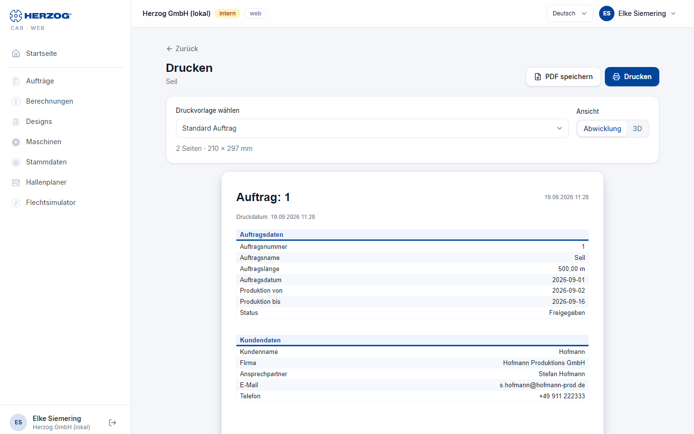

# Drucken (Web-App)

!!! abstract "Referenz — Die Druckseite der Web-App: Aufträge, Spulaufträge, Designs und Berechnungen mit Druckvorlagen als Seite oder PDF"

## Wofür Sie diesen Bereich nutzen

Die Web-App druckt mit denselben **Druckvorlagen** wie die Desktop-App —
mitgeliefert oder aus Ihrem Arbeitsbereich importiert. Die Druckseite baut
die Vorlage im Browser auf, zeigt die Vorschau und gibt sie über den
Druckdialog des Browsers aus oder speichert sie als PDF. Einen Editor für
Druckvorlagen gibt es in der Web-App nicht; Vorlagen gestalten Sie im
[Druck-Editor der Desktop-App](../print-templates/index.md) und übernehmen
sie per [Import](import.md) oder Cloud-Upload.

Sie erreichen die Druckseite über **Drucken** im
[Flechtauftrag und Spulauftrag](orders.md), im [Designer](designer.md) und
auf jeder [Rechnerseite](calculations.md).

## Der Bildschirm im Überblick

| Element | Bedeutung |
|---|---|
| **Zurück** | Zurück zum Auftrag, Design bzw. Rechner. |
| **Druckvorlage wählen** | Alle passenden Vorlagen des Arbeitsbereichs; vorbelegt ist die Standardvorlage für Flechtauftrag, Spulauftrag, Design bzw. Berechnung. Gibt es noch keine Vorlagen, sagt die Seite das — importieren Sie den Arbeitsbereich der Desktop-App. |
| **Ansicht** (nur Design) | **Abwicklung** oder **3D** — welches Bild des Designs auf der Vorlage erscheint. |
| Vorschau | Die Seiten der Vorlage mit den Daten des Auftrags bzw. Designs (*n Seiten*). |
| **Drucken** | Öffnet den Druckdialog des Browsers — Drucker oder *Als PDF speichern*. |
| **PDF speichern** | Erzeugt direkt eine PDF-Datei und lädt sie herunter. |

Platzhalter für Firmendaten und Logo füllt die Web-App aus
[Firma](company.md); Klöppeltabellen, Farbaufschlüsselung und Parameter
kommen aus dem Auftrag bzw. Design.

!!! tip "Druckbild stimmt nicht?"
    Prüfen Sie im Druckdialog des Browsers Papierformat (A4) und Ränder und
    schalten Sie *Kopf- und Fußzeilen* des Browsers ab. **PDF speichern**
    umgeht diese Einstellungen.

## Verwandte Seiten

* [Auftrag drucken und QR-Code (Desktop-App)](../orders/print.md)
* [Druck-Editor (Desktop-App)](../print-templates/index.md) — Vorlagen gestalten
* [Firma (Web-App)](company.md) — Firmendaten für Briefkopf und Fußzeile
* [Druckprobleme](../help/print-problems.md)
