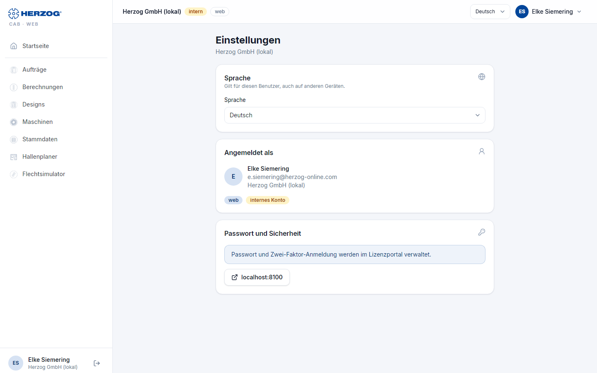

# Einstellungen (Web-App)

!!! abstract "Referenz — Die Seite „Einstellungen" im Benutzermenü der Web-App: Sprache, angemeldeter Benutzer, Hinweis zu Passwort und Sicherheit"

## Wofür Sie diesen Bereich nutzen

Die Web-App hat bewusst wenige Einstellungen: Das meiste — Benutzer, Rollen,
Bausteine, Firmendaten — liegt im [Kundenkonto](account.md) bzw. im
[Lizenzportal](../portal/index.md). Hier stellen Sie Ihre **Sprache** ein
und sehen, als wer Sie angemeldet sind.

Sie öffnen die Seite über *Benutzermenü > Einstellungen*.

## Der Bildschirm im Überblick

| Karte | Inhalt |
|---|---|
| **Sprache** | Deutsch, Englisch, Polnisch, Spanisch, Italienisch oder Chinesisch. Die Wahl gilt für Ihren Benutzer, auch auf anderen Geräten. Dieselbe Auswahl steht in der Kopfzeile. |
| **Angemeldet als** | Name, E-Mail-Adresse und Konto (bei internen Konten der Vermerk *internes Konto*). |
| **Passwort und Sicherheit** | Hinweis: *Passwort und Zwei-Faktor-Anmeldung werden im Lizenzportal verwaltet.* — siehe [Passwort und zweiter Faktor](../portal/security.md). |

!!! info "Unterschied zur Desktop-App"
    Schriftgröße, Design (hell/dunkel), Diagnose, Speicherorte,
    Designer-Vorgaben und Webserver gibt es nur in der
    [Desktop-App](../admin/settings/index.md). Die Web-App folgt der
    Schriftgröße und dem Zoom des Browsers.

## Verwandte Seiten

* [Oberfläche der Web-App](interface.md) — Sprachauswahl in der Kopfzeile
* [Konto und Benutzer](account.md)
* [Passwort und zweiter Faktor (Lizenzportal)](../portal/security.md)
