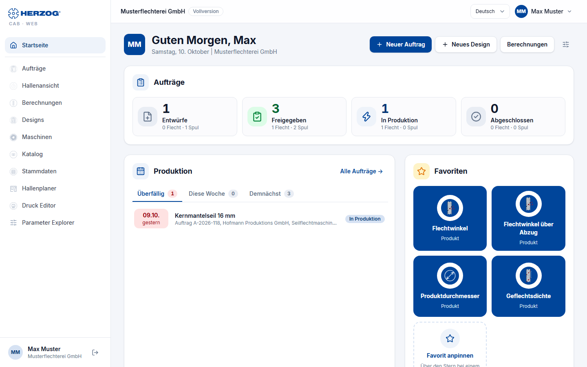

# Startseite

!!! abstract "Referenz — Die Startseite der Web-App: Begrüßung mit Schnellaktionen, Aufträge, Produktion, Favoriten, zuletzt Geöffnetes, Überblick und Schnellzugriff"

## Wofür Sie diesen Bereich nutzen

Die Startseite begrüßt Sie nach der Anmeldung und zeigt, was ansteht: Ihre
Aufträge nach Status, die Produktionen der nächsten zwei Wochen, Ihre
Lieblingsrechner und das, woran zuletzt gearbeitet wurde. Von hier springen
Sie in jedes Modul. Sie erreichen die Startseite jederzeit über
**Startseite** in der Seitenleiste, das Herzog-Logo oder **Start** in der
unteren Leiste am Smartphone.

## Der Bildschirm im Überblick

Oben steht die **Kopfzeile** mit Begrüßung und Schnellaktionen. Darunter
folgen die Karten **Aufträge**, **Produktion**, **Favoriten**, **Zuletzt
geöffnet** und **Überblick**, ganz unten über die volle Breite
**Schnellzugriff** und **Berechnungen**. Die Seite nutzt die ganze Breite
des Fensters. Wie die Karten stehen, hängt von der Breite des
Inhaltsbereichs ab (ohne Seitenleiste):

| Breite | Anordnung |
|---|---|
| ab etwa 1950 px (großer Monitor) | **Drei Spalten:** links die breitere Spalte mit **Produktion**, in der Mitte **Aufträge** und **Favoriten**, rechts **Zuletzt geöffnet** und **Überblick**. |
| ab etwa 1050 px (Laptop, Monitor) | **Aufträge** oben über die volle Breite, darunter **zwei Spalten**: **Produktion** links, **Favoriten** und **Zuletzt geöffnet** rechts. **Überblick** steht darunter über die volle Breite. |
| schmaler (Tablet, Smartphone) | Alle Karten **untereinander**. |

Die letzte Karte jeder Spalte reicht bis zum unteren Rand der längsten
Spalte, so enden die Spalten bündig. Welche Karten Sie sehen, richtet sich
nach Ihren [Rechten](roles.md). Mit dem Baustein *Herzog CAB Designer*
fehlen die Karten zu Aufträgen und Berechnungen.

## Bedienelemente im Detail

### Kopfzeile

| Element | Bedeutung |
|---|---|
| Kürzel und Begrüßung | Ihre Initialen auf blauem Grund und ein Gruß nach Tageszeit: *Guten Morgen, &lt;Vorname&gt;* (bis 11 Uhr), *Guten Tag, &lt;Vorname&gt;* (bis 18 Uhr), danach *Guten Abend, &lt;Vorname&gt;*. Ohne hinterlegten Namen steht *Willkommen*. Darunter Wochentag, Datum und Ihre Firma. |
| **Neuer Auftrag** | Öffnet einen neuen [Flechtauftrag](orders.md). Nur mit dem Recht *Aufträge bearbeiten*. |
| **Neues Design** | Öffnet den [Designer](designer.md) mit einem neuen Design. Nur mit dem Recht *Designer bearbeiten*. |
| **Berechnungen** | Öffnet die [Rechnerübersicht](calculations.md). Nur mit dem Recht *Berechnungen ausführen*. |
| **Startseite anpassen** (Regler-Symbol) | Öffnet den Dialog zum Ein- und Ausblenden der Bereiche (siehe [unten](#startseite-anpassen)). |

Die erste der Schnellaktionen, die Sie nutzen dürfen, ist blau
hervorgehoben.

### Aufträge

Vier Zähler zeigen, wie viele Aufträge im Arbeitsbereich in welchem Status
sind: **Entwürfe**, **Freigegeben**, **In Produktion** und
**Abgeschlossen**. Gibt es Spulaufträge, steht unter jeder Zahl die
Aufteilung *n Flecht · m Spul*. Ein Klick auf einen Zähler öffnet die
[Auftragsliste](orders.md), schon nach diesem Status gefiltert. In einer
breiten Karte stehen die Zähler nebeneinander, sonst zwei mal zwei.

### Produktion

Die Karte listet alle nicht abgeschlossenen Aufträge, deren
Produktionsbeginn (*Produktion von*) in den nächsten 14 Tagen liegt oder
schon vorbei ist. Drei Reiter teilen sie auf; die Zahl im Reiter nennt die
Einträge:

| Reiter | Inhalt |
|---|---|
| **Überfällig** | Der Produktionsbeginn liegt in der Vergangenheit. Die Zahl ist rot, sobald es welche gibt. |
| **Diese Woche** | Von heute bis einschließlich Sonntag. |
| **Demnächst** | Danach bis zum Ende der 14 Tage. |

Beim Öffnen ist der erste Reiter mit Einträgen gewählt, meist
**Überfällig**.

Jede Zeile beginnt mit dem Datum und einer relativen Angabe (*heute*,
*morgen*, *in 3 Tagen*, *gestern*, *vor 2 Tagen*); überfällige Daten sind
rot, heutige blau hinterlegt. Daneben stehen der Auftragsname (sonst die
Auftragsnummer) und darunter Auftragsart, Kunde und Maschine, rechts der
Status. Ist die Karte breit genug (ab etwa 900 px), wird die Liste zur
**Tabelle** mit den Spalten **Fällig**, **Auftrag**, **Kunde**,
**Maschine**, **Material** und **Status**. Ein Klick auf eine Zeile öffnet
den Auftrag.

Die Karte zeigt acht Zeilen. Ist sie höher, weil die Nachbarspalte länger
ist, füllt sie den freien Platz mit weiteren Zeilen. Unten steht der
Zeitraum (*Bis &lt;Datum&gt;, ohne abgeschlossene Aufträge*) und, wenn nicht
alles hineinpasst, *n weitere*. **Alle Aufträge →** oben rechts öffnet die
[Auftragsliste](orders.md).

### Favoriten

Ihre Lieblingsrechner als blaue Kacheln mit Bild, Name und Gruppe. Ein
Klick öffnet den Rechner. Die letzte Kachel *Favorit anpinnen* erinnert
daran, wie neue dazukommen: über den Stern bei einem Rechner in den
[Berechnungen](calculations.md). Die Favoriten gehören zu Ihrem Benutzer
und gelten auf jedem Gerät. Die Karte erscheint nur mit dem Recht
*Berechnungen ausführen*.

### Zuletzt geöffnet

Eine gemeinsame Liste, nach Zeit sortiert, mit höchstens acht Einträgen:

* Ihre **letzten Berechnungen** mit dem Ergebnis rechts. Ein Klick öffnet
  den Rechner mit den damaligen Eingaben.
* Die **Aufträge** und **Designs**, die im Konto zuletzt geändert wurden,
  gleich von wem. Ein Klick öffnet den Auftrag bzw. das Design im
  Designer.

Jede Zeile zeigt ein Symbol (Berechnungen mit ihrem Bild aus der
Rechnerübersicht), den Namen, die Art (*Berechnung*, *Auftrag*,
*Spulauftrag* oder *Design*) und rechts den Zeitpunkt. Mit den Reitern
**Alle**, **Berechnungen**, **Aufträge** und **Designs** zeigen Sie nur
eine Art. Es erscheinen nur die Arten, für die Sie Rechte haben.

### Überblick

Vier Zahlen zum Bestand des Arbeitsbereichs: **Aufträge**, **Designs**,
**Maschinen** und **Kunden**. Ein Klick öffnet das jeweilige Modul. In der
[Testphase](trial.md) steht neben der Zahl die Grenze (zum Beispiel
*1 / 2*), rot, sobald sie erreicht ist, und darüber der Hinweis *In der
Testphase sind diese Bereiche mengenbegrenzt. Mit einem Abo entfallen alle
Grenzen.*

### Schnellzugriff

Kacheln mit kurzer Beschreibung für die Module, je nach Recht
**Aufträge** (*Flecht- und Spulaufträge*), **Hallenansicht**,
**Berechnungen** (mit der Zahl der Rechner und Gruppen), **Designer**,
**Maschinenpark**, **Herzog-Katalog**, **Hallenplaner**, **Druck Editor**
(*Druckvorlagen für Aufträge, Designs und Berechnungen*), **Stammdaten**
und **Import aus dem Desktop**, dazu immer **Konto und Benutzer**.

### Berechnungen

Je Gruppe (Material, Produkt, Hohlgeflecht, Produktion, Spulerei) eine
Karte mit den einzelnen Rechnern. Ein Klick öffnet die
[Rechnerseite](calculations.md) direkt.

### Startseite anpassen

Das Regler-Symbol in der Kopfzeile öffnet den Dialog **Startseite
anpassen** mit allen Bereichen, die Sie sehen dürfen.

| Element | Wirkung |
|---|---|
| Häkchen je Bereich | Ohne Häkchen wird der Bereich ausgeblendet. |
| **Nach oben** / **Nach unten** | Ändert die Reihenfolge. Sie gilt innerhalb jeder Spalte und auf schmalen Bildschirmen für die ganze Seite. |
| **Zurücksetzen** | Zeigt wieder alle Bereiche in der vorgegebenen Reihenfolge. |
| **Übernehmen** / **Abbrechen** | Speichert die Auswahl bzw. verwirft sie. |

Die Auswahl gehört zu Ihrem Benutzer und gilt auf jedem Gerät. Sind alle
Bereiche ausgeblendet, zeigt die Seite *Alle Bereiche der Startseite sind
ausgeblendet.* mit der Schaltfläche **Startseite anpassen**.

!!! info "Unterschied zur Desktop-App"
    Die [Startseite der Desktop-App](../basics/home.md) (Version 2.1.0) ist
    anders aufgebaut: Sie zeigt höchstens fünf anstehende Produktionen ohne
    Reiter, die letzten Berechnungen, Aufträge und Designs in drei Spalten
    und als Favoriten beliebige Einträge der Navigation. In der Web-App sind
    Favoriten immer Rechner. Update-Hinweis und Workspace-Status gibt es in
    der Web-App nicht, weil sie immer aktuell ist und ihre Daten im Konto
    liegen.

## Verwandte Seiten

* [Oberfläche der Web-App](interface.md)
* [Aufträge](orders.md) · [Berechnungen](calculations.md) · [Designs und Designer](designer.md) · [Maschinen](machines.md) · [Stammdaten](master-data.md) · [Hallenplaner](hall-planner.md)
* [Startseite (Home) der Desktop-App](../basics/home.md)
