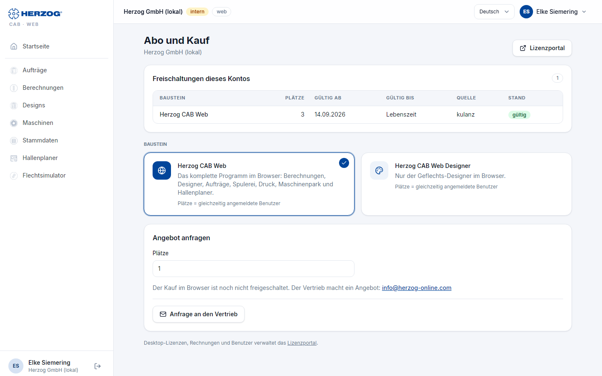

# Abo und Bestellung (Web-App)

!!! abstract "Referenz — Die Seite „Abo und Bestellung" im Benutzermenü der Web-App: Freischaltungen des Kontos, Testphase, Jahresabo bestellen oder verlängern, Anfrage an den Vertrieb"

## Wofür Sie diesen Bereich nutzen

Hier sehen Sie, was für Ihr Konto freigeschaltet ist und bis wann. Sie
bestellen hier das Jahresabo, kaufen Plätze dazu oder verlängern das Abo.
Während der [Testphase](trial.md) zeigt die Seite außerdem die
Restlaufzeit. Die Seite ist auch dann erreichbar, wenn die Testphase
abgelaufen und die übrige Web-App gesperrt ist.

Sie öffnen die Seite über *Benutzermenü > Abo und Bestellung*, über den
Chip *Testphase: noch n Tage* in der Kopfzeile oder von der Seite *Kein
Zugang zur Webapp*.

## Das Jahresabo in Kürze

* **Nur Jahresabo.** Herzog CAB gibt es als Abo für ein Jahr, berechnet
  je Platz. Eine monatliche Laufzeit gibt es nicht.
* **Zwei Abos.** *Herzog CAB* umfasst das komplette Programm. *Herzog CAB
  Designer* umfasst nur den Geflechts-Designer.
* **Ein Kontingent für Programm und Browser.** Ein Platz gilt wahlweise
  für das Programm auf dem Rechner oder für die Web-App. Beliebig viele
  Mitarbeiter teilen sich die Plätze, nur nicht gleichzeitig. Wer im
  Programm und im Browser zugleich arbeitet, belegt zwei Plätze.
* **Ein gemeinsamer Stichtag.** Alle Abo-Plätze eines Kontos enden am
  selben Tag. Plätze, die Sie später dazukaufen, laufen anteilig bis zu
  diesem Tag. Danach verlängern Sie alles gemeinsam.
* **Bestellung mit Rechnung.** Die Rechnung schickt Ihnen die Herzog GmbH.
  Freigeschaltet wird nach dem Zahlungseingang.

## Der Bildschirm im Überblick

<!-- VERALTET seit 24.09.2026: abo.png zeigt noch Laufzeit monatlich/jährlich und die Stripe-Kasse. Neu erzeugen mit: python _tools/web_screenshots.py shots nur:abo -->

!!! info "Bild vom früheren Stand"
    Das Bild zeigt noch die frühere Seite mit Laufzeitwahl und Kasse.
    Ein aktuelles Bild folgt. Maßgeblich ist die Beschreibung auf dieser
    Seite.

Von oben nach unten: Hinweise, die Freischaltungen des Kontos, eine offene
Bestellung (falls vorhanden), die beiden Abos, der Bereich **Bestellen**,
die **Anfrage an den Vertrieb** und Ihre bisherigen Bestellungen. Oben
rechts öffnet **Lizenzportal** das [Lizenzportal](../portal/index.md).

## Bedienelemente im Detail

### Hinweise oben

| Hinweis | Bedeutung |
|---|---|
| *Testphase: noch n Tage (bis &lt;Datum&gt;). Mit einem Abo entfällt die Mengenbegrenzung.* | Sie sind in der Testphase. |
| *Die Testphase ist am &lt;Datum&gt; abgelaufen. Mit einem Abo geht es sofort weiter, alle Daten bleiben erhalten.* | Die Testphase ist vorbei. Die Web-App ist bis zum Abo gesperrt. Die Daten bleiben. |
| *Die E-Mail-Adresse ist noch nicht bestätigt.* und **Mail noch einmal schicken** | Nach der Selbstregistrierung. Öffnen Sie den Link aus der Willkommensmail. Die Schaltfläche schickt die Mail erneut. |
| *Vielen Dank! Sobald Stripe die Zahlung bestätigt …* / *Die Zahlung wurde abgebrochen …* | Rückmeldung nach einer Zahlung per Karte. Nur, wenn die Kartenzahlung angeboten wird. |

### Freischaltungen dieses Kontos

Die Tabelle zeigt alles, was für das Konto freigeschaltet ist.

| Spalte | Inhalt |
|---|---|
| **Baustein** | Name, darunter der Umfang: *Programm und Web* (Abo), *nur Programm* (unbefristete Lizenz) oder *nur Web* (früherer Web-Baustein). |
| **Plätze** | Zahl der Personen, die gleichzeitig arbeiten dürfen. |
| **Gültig ab** / **Gültig bis** | Laufzeit. Bei unbefristeten Lizenzen steht *Lebenszeit*. |
| **Quelle** | Woher die Freischaltung stammt, zum Beispiel *Bestellung*, *Testversion*, *Kauf* oder *Kulanz*. *Abo (Stripe)* steht bei einem früheren Abo, das im Browser über Stripe abgeschlossen wurde. |
| **Stand** | *gültig*, *abgelaufen* oder *beendet*. |

Hat das Konto ein laufendes Abo, steht unter der Tabelle der Stichtag:
*Ihre Abo-Plätze laufen bis &lt;Datum&gt;.*

### Offene Bestellung

Je Konto ist höchstens eine Bestellung offen. Solange sie offen ist,
steht sie hier statt des Bereichs **Bestellen**. Die Karte zeigt Nummer,
Art, Stand, die Positionen und die Beträge.

| Stand | Was als Nächstes passiert |
|---|---|
| *wird geprüft* | Ist Ihr Konto noch nicht als Herzog-Kunde hinterlegt, prüft Herzog die erste Bestellung kurz. Sie hören per E-Mail von uns, meist am selben Werktag. |
| *wartet auf Zahlung* | Auf Rechnung: Die Herzog GmbH schickt die Rechnung. Nach dem Zahlungseingang schalten wir frei. Per Karte: Sie bezahlen mit **Jetzt bezahlen**. |

Bei einer Verlängerung auf Rechnung laufen Ihre Plätze bis zum
Zahlungseingang weiter. Wie lange längstens, steht auf der Karte.

| Schaltfläche | Wirkung |
|---|---|
| **Jetzt bezahlen** | Nur bei Zahlung per Karte. Öffnet die Kartenzahlung. Danach sind die Plätze sofort freigeschaltet. |
| **Stornieren** | Storniert die Bestellung nach einer Rückfrage. Möglich, solange noch keine Rechnung unterwegs ist: während der Prüfung oder solange die Kartenzahlung aussteht. Sonst antworten Sie auf die Bestellmail. |

### Jahresabo

Ein Hinweis erklärt das gemeinsame Kontingent (siehe
[oben](#das-jahresabo-in-kurze)). Darunter stehen zwei Karten:

| Karte | Umfang |
|---|---|
| **Herzog CAB** | Das komplette Programm, auf dem Rechner und im Browser: Berechnungen, Designer, Aufträge, Spulerei, Druck, Maschinenpark und Hallenplaner. |
| **Herzog CAB Designer** | Nur der Geflechts-Designer, auf dem Rechner und im Browser. |

Jede Karte zeigt den Preis je Platz und Jahr (netto) oder *Preis auf
Anfrage*. Ein Klick wählt das Abo für die Bestellung aus. Ein Abo mit
*Preis auf Anfrage* bestellen Sie über die Anfrage an den Vertrieb.

### Bestellen

Bestellen können nur die **Administratoren** Ihres Kontos. Alle anderen
sehen hier einen Hinweis.

Oben wählen Sie, was Sie bestellen:

| Auswahl | Wann sichtbar | Wirkung |
|---|---|---|
| **Abo bestellen** | Noch kein laufendes Abo. | Das Abo läuft ein Jahr ab dem Zahlungseingang. |
| **Weitere Plätze** | Abo läuft. | Die neuen Plätze laufen anteilig bis zum Stichtag. So wird alles gemeinsam verlängert. |
| **Abo verlängern** | Abo läuft. | Alle Abo-Plätze laufen ein Jahr weiter, gerechnet ab dem Stichtag. |

Bei **Abo bestellen** und **Weitere Plätze** geben Sie die **Anzahl der
Plätze** an (1 bis 100). Darunter steht, was die Bestellung kostet: je
Position Baustein, Plätze, Zeitraum und Betrag netto, dann Summe netto,
Umsatzsteuer und Gesamtbetrag.

**Rechnungsdaten**

| Feld | Bedeutung |
|---|---|
| **Firma** | Pflichtfeld. Steht auf der Rechnung. |
| **Ihre Bestellnummer (optional)** | Ihr eigenes Zeichen für die Bestellung. |
| **Rechnungsanschrift** | Pflicht bei der ersten Bestellung. Sind Sie schon Herzog-Kunde, lassen Sie das Feld leer, wenn die Anschrift aus unseren Unterlagen gilt. |
| **Land (Kürzel)** | Pflichtfeld, zum Beispiel *DE*. Bestimmt die Umsatzsteuer. |
| **USt-IdNr. (EU außerhalb Deutschlands)** | Für Firmen in der EU außerhalb Deutschlands. |
| **Nachricht an Herzog (optional)** | Freier Text zur Bestellung. |

Umsatzsteuer: In Deutschland 19 %. Für Firmen in der EU mit USt-IdNr. und
außerhalb der EU fällt keine an.

**Zahlung**

| Zahlweg | Wirkung |
|---|---|
| **Rechnung** | Die Herzog GmbH schickt die Rechnung. Freigeschaltet wird nach dem Zahlungseingang. |
| **Karte** | Nur sichtbar, wenn die Kartenzahlung eingerichtet ist. Die Plätze sind nach der Zahlung sofort freigeschaltet. Die Rechnung kommt auch hier von der Herzog GmbH. |

Zum Schluss setzen Sie den Haken *Ich bestelle verbindlich und
zahlungspflichtig für diese Firma.* und klicken auf **Zahlungspflichtig
bestellen**. Die Bestellung erscheint dann als offene Bestellung oben auf
der Seite.

### Anfrage an den Vertrieb

Für alles, was sich nicht direkt bestellen lässt. Beispiele: ein anderes
Abo statt des bisherigen oder weniger Plätze verlängern.

| Element | Wirkung |
|---|---|
| **Anfrage an den Vertrieb** | Öffnet das Feld **Nachricht**. Nur für Administratoren. |
| **Nachricht** | Ihr Wunsch, gewünschte Laufzeit, Rückfragen. |
| **Anfrage schicken** / **Abbrechen** | Schickt die Anfrage oder schließt das Feld. Die Antwort kommt per E-Mail. Die Anfrage erscheint auch im [Lizenzportal](../portal/licenses.md#anfragen). |
| *Oder per E-Mail* | Adresse des Vertriebs für eine normale E-Mail. |

### Ihre Bestellungen

Sobald es Bestellungen gibt, listet eine Tabelle sie auf: **Nr.**,
**Datum**, **Umfang** (Art und Positionen), **Betrag** (brutto, darunter
der Zahlweg) und **Stand**. Liegt eine Rechnung vor, steht die
Rechnungsnummer unter dem Stand.

!!! info "Programm herunterladen, Rechner und Benutzer"
    Den Download des Programms, die Rechner und die Benutzer finden Sie im
    [Lizenzportal](../portal/index.md). Dort können Sie unter *Bestellen*
    auch dasselbe Abo bestellen.

## Verwandte Seiten

* [Testphase und Registrierung](trial.md)
* [Konto und Benutzer](account.md)
* [Lizenzportal](../portal/index.md)
* [Kundenkonto und Einladung](../setup/account.md)
