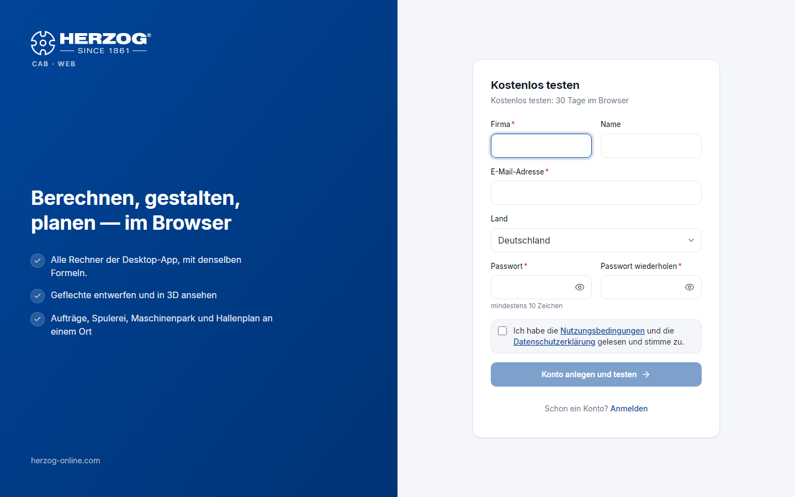

# Testphase und Registrierung (Web-App)

!!! info "Konzept — Herzog CAB 30 Tage kostenlos testen: Testversion anfragen, Grenzen der Testphase, der Weg zum Abo und die Selbstregistrierung"

## Zwei Wege in die Testphase

| Weg | Für wen |
|---|---|
| **Testversion bei Herzog anfragen:** Herzog schaltet den Baustein *Herzog CAB Testversion* frei | Der Regelfall, für Interessenten und für bestehende Kunden. Herzog legt ein Kundenkonto an oder nutzt Ihr vorhandenes und lädt Sie per E-Mail ein, siehe [Kundenkonto und Einladung](../setup/account.md#so-kommen-sie-ins-konto). Die Testversion gilt 30 Tage für das ganze Konto, auf dem Rechner und im Browser. |
| **Selbstregistrierung** über **Kostenlos testen** auf der [Anmeldeseite](login.md) | Nur, wenn Herzog die Selbstregistrierung freigeschaltet hat; sonst fehlt die Schaltfläche. Legt ein neues Konto mit Ihnen als Administrator an. Das Konto bekommt den Baustein *Herzog CAB Web Testphase* (30 Tage, nur im Browser). |

!!! tip "Testversion anfragen"
    Steht auf der Anmeldeseite keine Schaltfläche **Kostenlos testen**,
    fragen Sie die Testversion bei Herzog an: bei Ihrem
    Herzog-Ansprechpartner oder über die Adressen unter
    [Support kontaktieren](../help/support.md).

## Selbstregistrierung

!!! info "Nur wenn freigeschaltet"
    Dieser Abschnitt gilt nur, wenn Herzog die Selbstregistrierung
    freigeschaltet hat. Sonst fragen Sie die Testversion bei Herzog an.

| Feld | Bedeutung |
|---|---|
| **Firma** | Name Ihrer Firma — wird zum Namen des Kontos. |
| **Name** | Ihr Name. |
| **E-Mail-Adresse** | Ihr Anmeldename; an diese Adresse geht die Bestätigungsmail. |
| **Land** | Sitz der Firma. |
| **Passwort** / **Passwort wiederholen** | Mindestens 10 Zeichen. |
| Nutzungsbedingungen und Datenschutzerklärung | Zustimmung per Kästchen. |
| **Konto anlegen und testen** | Legt das Konto an und meldet Sie an. |

Danach:

1. Sie erhalten eine **Willkommensmail** mit einem Bestätigungslink. Bis Sie
   ihn öffnen, zeigt die Kopfzeile *E-Mail bestätigen*; die Web-App ist
   trotzdem sofort nutzbar.
2. Der Link führt zur Seite **E-Mail bestätigen** (*Die E-Mail-Adresse ist
   bestätigt.*) und von dort zur Anwendung. Kam keine Mail an, schicken Sie
   sie unter [Abo und Bestellung](subscription.md) erneut.
3. Ihr Konto hat den Baustein **Herzog CAB Web Testphase** mit **einem
   Platz** für **30 Tage**. In der Testphase ist nur **ein Benutzer**
   möglich. Weitere Benutzer laden Sie nach dem Abo im
   [Lizenzportal](../portal/users.md) ein.

!!! info "Begrenzung der Registrierungen"
    Von einer Internetadresse aus sind höchstens drei Registrierungen pro
    Tag möglich.

## Was in der Testphase gilt

* **Voller Funktionsumfang** der Web-App: alle Rechner, Designer mit allen
  Geflechtsarten, Aufträge, Maschinen, Hallenplaner, Druck, Import.
* **Mengenbegrenzung:** Einige Datenarten sind begrenzt, siehe die Tabelle
  unten.
* **Restlaufzeit:** Der Chip *Testphase: noch n Tage* in der Kopfzeile führt
  zu [Abo und Bestellung](subscription.md).
* **Nach Ablauf** sperrt die Web-App den Zugang (*Kein Zugang zur Webapp*).
  Ihre Daten bleiben erhalten und stehen nach dem Abo sofort wieder zur
  Verfügung.

### Mengenbegrenzung

| Bereich | Höchstens |
|---|---|
| Designs | 2 |
| Maschinen (Flecht-, Spul- und Aufwickelmaschinen zusammen) | 2 |
| Aufträge (Spulaufträge eingeschlossen) | 4 |
| Kunden | 3 |
| Benutzer | so viele, wie die Testversion Plätze hat; nach der Selbstregistrierung einer |
| Berechnungen | 100 je Berechnungsart |

Materialien, Spulen, Trommeln, Farben, Hallenpläne und Druckvorlagen sind
nicht begrenzt. Die Startseite zeigt den Stand, zum Beispiel *1 / 2*. Ist
eine Grenze erreicht, meldet die Web-App das. Auch der ZIP-Import und der
Abgleich aus der Desktop-App halten die Grenzen ein.

## Der Weg zum Abo

Unter [Abo und Bestellung](subscription.md) bestellen Sie das Jahresabo.
Ein Platz gilt dann wahlweise für die Web-App oder für das Programm auf dem
Rechner. Freigeschaltet wird nach dem Zahlungseingang. Mit der
Freischaltung entfällt die Mengenbegrenzung. Alle in der Testphase
angelegten Daten bleiben.

!!! info "Testversion der Desktop-App"
    Die Testversion der Desktop-App hat dieselben Grenzen. Siehe
    [Testversion und Kontingente](../basics/trial-quotas.md).

## Verwandte Seiten

* [Anmelden und Konto wählen](login.md)
* [Abo und Bestellung](subscription.md)
* [Kundenkonto und Einladung](../setup/account.md)
