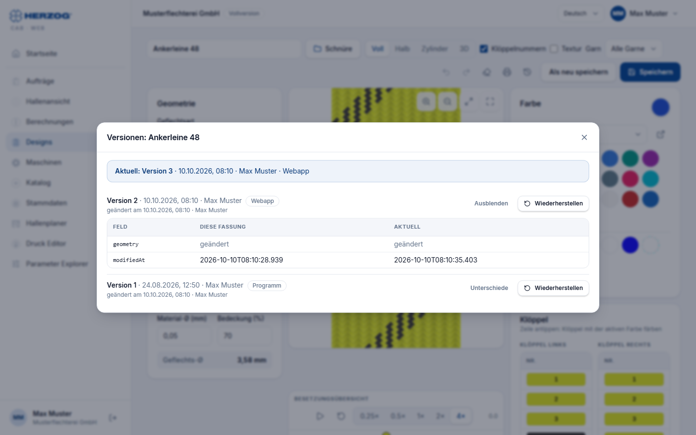
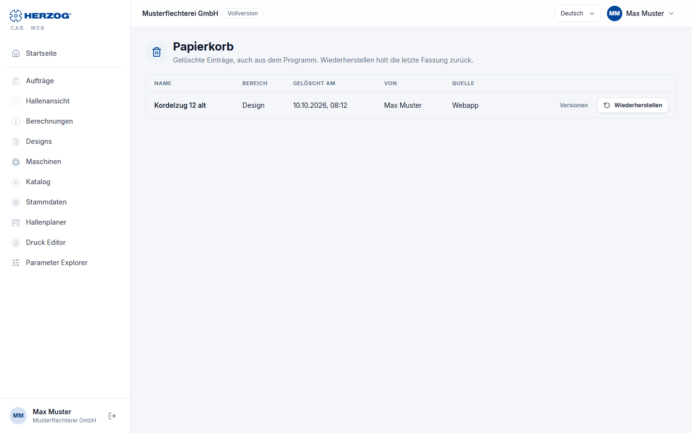

# Versionen und Papierkorb

!!! abstract "Referenz — Frühere Fassungen eines Eintrags ansehen und wiederherstellen, gelöschte Einträge aus dem Papierkorb zurückholen"

## Wofür Sie diesen Bereich nutzen

Jedes Mal, wenn ein Eintrag im Arbeitsbereich Ihres Kontos gespeichert oder
gelöscht wird, legt Herzog CAB die bisherige Fassung ab. So sehen Sie, wer
wann etwas geändert hat, und holen eine versehentlich geänderte oder
gelöschte Fassung zurück. Das gilt für alle Wege, auf denen Daten in den
Arbeitsbereich kommen:

* Speichern und Löschen in der Web-App,
* der [Cloud-Abgleich](../admin/settings/license.md) der Desktop-App,
* der [Import aus dem Desktop](import.md).

Hat der Cloud-Abgleich eine Änderung aus der Web-App mit der Fassung des
Desktops überschrieben, finden Sie die Fassung aus der Web-App deshalb
unter **Versionen** wieder.

Versionen gibt es für **Designs**, **Flecht- und Spulaufträge**,
**Maschinen**, die Stammdaten **Materialien**, **Spulen**, **Trommeln**,
**Farben** und **Kunden**, **Hallenpläne** (Grundrisse und Belegungen) und
**Druckvorlagen**. Dateien der [Medienbibliothek](media.md) (Bilder,
Dokumente, 3D-Modelle), Einstellungen, Benutzer und Rollen haben keine
Versionen.

## Wo der Knopf „Versionen" steht

Der Knopf erscheint, sobald ein Eintrag einmal gespeichert ist. In
Werkzeugleisten steht nur das Symbol (eine Uhr mit Pfeil); der Name
erscheint beim Zeigen darauf.

| Bereich | Ort |
|---|---|
| [Designer](designer.md) | Symbol in der Werkzeugleiste, neben **Drucken**. |
| [Flechtauftrag und Spulauftrag](orders.md) | Knopf in der Kopfzeile, neben **Drucken**. |
| [Maschine](machines.md) | Knopf oben rechts, neben **Löschen** und **Speichern**. |
| [Stammdaten](master-data.md) (Materialien, Spulen, Trommeln, Farben, Kunden) | Knopf unten links im Dialog *… bearbeiten*. |
| [Hallenplaner](hall-planner.md) | Symbol in der Kopfzeile des Editors, neben **Speichern**: im Modus *Grundriss* für den Grundriss, im Modus *Belegung* für die gewählte Belegung. |
| [Druck Editor](print-editor.md) | Knopf in der Kopfzeile, nur bei Vorlagen Ihres Kontos und mit dem Recht *Druckvorlagen bearbeiten*. Mitgelieferte Standardvorlagen haben erst Versionen, wenn Ihr Konto eine eigene Fassung gespeichert hat. |

Ansehen darf die Versionen jeder, der den Eintrag sehen darf.

## Der Dialog „Versionen"

Der Dialog heißt *Versionen: &lt;Name des Eintrags&gt;*.

| Element | Bedeutung |
|---|---|
| Kasten oben | Die aktuelle Fassung: *Aktuell: Version n*, wann und von wem sie gespeichert wurde und woher sie kam (*Webapp* oder *Programm*). Bei einem gelöschten Eintrag steht dort *Gelöscht am &lt;Datum&gt;* mit der Person und dem Knopf **Eintrag wiederherstellen**. |
| Liste der Fassungen | Alle abgelegten Fassungen, die neueste oben. Je Fassung: *Version n*, wann und von wem sie gespeichert wurde, die Quelle als Chip (*Webapp* oder *Programm*) und darunter, wann und von wem sie ersetzt wurde: *geändert*, *gelöscht* oder *durch Wiederherstellen ersetzt*. |
| **Unterschiede** / **Ausblenden** | Klappt unter der Fassung eine Tabelle auf: **Feld**, **Diese Fassung**, **Aktuell**. Sie nennt nur die Felder, die sich von der aktuellen Fassung unterscheiden, mit ihrem internen Namen. Einfache Werte stehen im Klartext; bei Listen und verschachtelten Angaben steht *geändert*, bei fehlenden Feldern *fehlt*. Sind beide gleich, steht dort *Inhaltlich gleich wie die aktuelle Fassung.* |
| **Wiederherstellen** | Macht diese Fassung wieder zur aktuellen (siehe unten). Nur mit dem Recht zum Bearbeiten. |

Gibt es noch keine früheren Fassungen, steht dort *Noch keine früheren
Fassungen. Ab jetzt legt jede Speicherung die vorige Fassung hier ab.* Das
ist bei Einträgen so, die seit Einführung der Versionen am 05.10.2026 nicht
mehr gespeichert wurden. Speichert jemand einen Eintrag, ohne etwas zu
ändern, entsteht keine neue Fassung.

## Eine Version wiederherstellen

1. Öffnen Sie den Eintrag und klicken Sie auf **Versionen**.
2. Prüfen Sie bei Bedarf mit **Unterschiede**, was die Fassung anders hat.
3. Klicken Sie bei der gewünschten Fassung auf **Wiederherstellen**.
4. Bestätigen Sie die Rückfrage *Version n vom &lt;Datum&gt; wird zur
   aktuellen Fassung. Die jetzige Fassung bleibt im Verlauf.* mit
   **Wiederherstellen**.

Die Web-App meldet *Wiederhergestellt.*, lädt die Seite neu und zeigt den
Eintrag in der alten Fassung. Im Stammdaten-Dialog schließt sich stattdessen
der Dialog. Gespeichert wird die Fassung als neue Version mit der Quelle
*Webapp*. Die Fassung, die sie ersetzt, steht danach selbst in der Liste.
Ein Wiederherstellen lässt sich also ebenso rückgängig machen.

Auf der Maschinenseite merkt die Web-App ungespeicherte Eingaben nicht vor.
Die Rückfrage weist dort darauf hin, dass beim Neuladen nicht Gespeichertes
verloren geht.

Arbeitet die Desktop-App mit dem Cloud-Abgleich und ist der Rückweg
eingeschaltet, kommt die wiederhergestellte Fassung wie jede andere
Änderung aus der Web-App ins Arbeitsverzeichnis.

### Wer wiederherstellen darf

Wiederherstellen darf, wer den Eintrag auch bearbeiten darf
([Rollen](roles.md)):

| Einträge | Recht |
|---|---|
| Designs | *Designer bearbeiten* |
| Aufträge und Kunden | *Aufträge bearbeiten* |
| Materialien, Spulen, Trommeln, Farben, Maschinen | *Stammdaten bearbeiten* |
| Grundrisse und Belegungen | *Hallenplaner bearbeiten* |
| Druckvorlagen | *Druckvorlagen bearbeiten* |

Ohne dieses Recht sehen Sie die Versionen nur.

### Meldungen

| Meldung | Bedeutung |
|---|---|
| *Dieser Editor hat ungespeicherte Änderungen. Bitte speichern oder verwerfen Sie sie, bevor Sie eine Version wiederherstellen.* | Der Editor hat offene Änderungen. Solange sie da sind, fehlt der Knopf **Wiederherstellen**. |
| *Inzwischen hat jemand anderes gespeichert. Der Verlauf wird neu geladen.* | Ein Kollege oder der Cloud-Abgleich hat den Eintrag gerade gespeichert. Prüfen Sie die neu geladene Liste und stellen Sie dann erneut wieder her. |

## Papierkorb

Gelöschte Einträge verschwinden nicht sofort, sondern kommen in den
**Papierkorb**. Sie öffnen ihn über *Benutzermenü > Papierkorb*. Er zeigt
die gelöschten Einträge aller Bereiche, die Sie sehen dürfen, die neueste
Löschung oben. Auch was die Desktop-App über den Cloud-Abgleich löscht,
landet hier.

| Element | Bedeutung |
|---|---|
| **Alle** / Bereiche | Filter nach Bereich, zum Beispiel *Design*, *Auftrag*, *Material*, *Maschine*, *Hallenplan*, *Belegung* oder *Druckvorlage*. Erscheint, sobald Einträge aus mehr als einem Bereich im Papierkorb liegen. |
| **Name** | Name des gelöschten Eintrags. |
| **Bereich** | Woher der Eintrag stammt. |
| **Gelöscht am** / **Von** | Zeitpunkt der Löschung und wer gelöscht hat. |
| **Quelle** | *Webapp* oder *Programm* (über den Cloud-Abgleich). |
| **Versionen** | Öffnet den [Dialog „Versionen"](#der-dialog-versionen) des gelöschten Eintrags. Dort holen Sie auch eine ältere Fassung zurück. |
| **Wiederherstellen** | Holt den Eintrag in seiner letzten Fassung zurück, nach der Rückfrage *Der Eintrag kommt in seiner letzten Fassung zurück.* Danach steht er wieder in seiner Liste, und die Web-App meldet *&lt;Name&gt; ist wieder da.* Nur mit dem Recht zum Bearbeiten (siehe [oben](#wer-wiederherstellen-darf)). |

Am Smartphone erscheinen die Einträge als Karten mit denselben Knöpfen. Ist
nichts gelöscht, steht dort *Der Papierkorb ist leer.* Je Bereich zeigt der
Papierkorb die 200 zuletzt gelöschten Einträge.

!!! warning "Was nicht im Papierkorb landet"
    Dateien der [Medienbibliothek](media.md) löscht die Web-App endgültig.
    Das betrifft auch Bild, Dokumente und 3D-Modell einer Maschine: Sie
    werden beim Löschen der Maschine mit entfernt. Holen Sie die Maschine
    aus dem Papierkorb zurück, kommen nur ihre Daten wieder.

!!! info "Testphase"
    Ein wiederhergestellter Eintrag zählt wie ein neu angelegter. Ist die
    [Grenze der Testphase](trial.md) für diesen Bereich erreicht, lässt er
    sich erst nach dem Löschen eines anderen Eintrags oder mit einem Abo
    zurückholen.

## Wie lange Versionen aufbewahrt werden

* **Versionen:** 90 Tage. Je Eintrag bleiben die **letzten 20 Fassungen**
  auch länger erhalten. Ältere Fassungen entfernt der Server einmal am Tag.
* **Papierkorb:** Gelöschte Einträge bleiben im Papierkorb, bis jemand sie
  wiederherstellt. Endgültig löschen lässt sich dort nichts.

!!! info "Unterschied zur Desktop-App"
    Die Desktop-App hat keinen Dialog *Versionen* und keinen Papierkorb.
    Arbeitet sie mit dem Cloud-Abgleich, landen ihre Speicherungen und
    Löschungen trotzdem hier, mit der Quelle *Programm*. Ohne Cloud-Abgleich
    entstehen für die Daten im Arbeitsverzeichnis keine Versionen.

## Verwandte Seiten

* [Oberfläche der Web-App](interface.md) — Benutzermenü und Versionskonflikte
* [Rollen](roles.md) — Rechte zum Bearbeiten
* [Lizenz und Cloud](../admin/settings/license.md) — Cloud-Abgleich der Desktop-App
* [Bekannte Einschränkungen](../help/limitations.md#cloud-abgleich-der-desktop-hat-vorrang)
