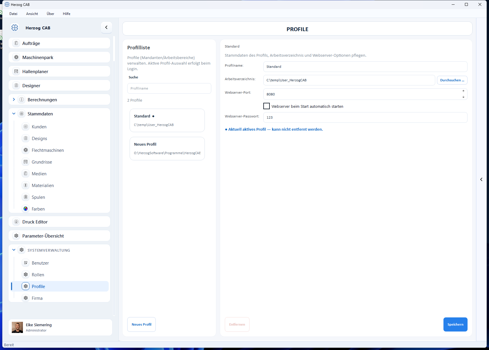

# Workspace-Konzept

Herzog CAB trennt **Daten** und **Konfiguration** über zwei Begriffe:

* Ein **Workspace** (Arbeitsverzeichnis / Arbeitsbereich) ist der Daten-Ordner
  mit allen Stammdaten, Aufträgen, Designs und Druckvorlagen.
* Ein **Profil** (Mandant) verbindet einen Namen mit einem Arbeitsverzeichnis
  und den zugehörigen Webserver-Optionen. Welches Profil aktiv ist, wählen Sie
  beim Login.

## Warum Profile?

Mit mehreren Profilen können Sie z. B.

* mehrere **Mandanten** oder Werke getrennt halten (jeweils eigener Datenordner),
* einen **Test-** und einen **Produktiv-Arbeitsbereich** parallel betreiben,
* oder einen **gemeinsamen Workspace** auf einem Netzlaufwerk von mehreren
  Arbeitsplätzen nutzen.

## Profil-Einstellungen

Pro Profil legen Sie fest:

| Einstellung | Bedeutung |
|---|---|
| **Profilname** | Anzeigename des Profils. |
| **Arbeitsverzeichnis** | Daten-Ordner des Workspace (siehe [Workspace-Pfad ändern](change-path.md)). |
| **Webserver-Port** | Port des eingebauten Webservers (Standard 8080). |
| **Webserver beim Start automatisch starten** | Server beim Profilstart hochfahren. |
| **Webserver-Passwort** | Zugriffsschutz für die mobile Sicht. |

Das **aktuell aktive Profil** ist in der Liste markiert und kann nicht entfernt
werden.

→ Verwaltung über **Systemverwaltung → Profile** oder
**Datei → Einstellungen → Allgemein → Profile verwalten…**
